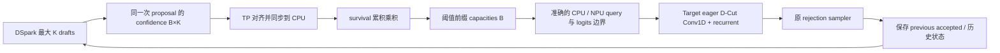

# Qwen3.6 DSpark eager survival 验证分支

服务器按顺序执行的命令、算子重装步骤和日志读法见 [910B4 验证顺序](server_validation.md)。

## 版本与范围

- 分支：`dspark_adaptive_claude`
- 起点：`b5180b821fe2c8672d6b6f82e2cd0adcc47c0943`
- vLLM：v0.28.0，MRV2。
- 验证服务器：Ascend 910B4，8×32GB；仅使用分配的 4 张开发卡，模型固定 TP=4。
- 与 `main_dspark_adaptive_verify_dev` 使用不同 worktree；不合并后者的 FULL 实验补丁。
- 第一版用于 eager 正确性验证。算子数值门槛与 TP=4 整网对照均已在 910B4 通过
  （2026-09-21）。覆盖范围见下方“已验证与未验证”，不要外推。

## 使用方式

在安装本分支插件及算子的独立 Ascend 测试环境中，用原来可运行的
Qwen3.6 + DSpark 命令，加入以下设置（模型路径使用你实际的 checkpoint）：

```bash
# 先将 ASCEND_RT_VISIBLE_DEVICES 设置为实际分配的四张卡的 ID，逗号分隔。
: "${ASCEND_RT_VISIBLE_DEVICES:?请先指定分配的四张开发卡}"
export VLLM_USE_V2_MODEL_RUNNER=1
export VLLM_ASCEND_DSPARK_EAGER_SURVIVAL_THRESHOLD=0.4

vllm serve /path/to/Qwen3.6-27B \
  --enforce-eager \
  --tensor-parallel-size 4 \
  --dtype bfloat16 \
  --speculative-config '{
    "method": "dspark",
    "model": "/path/to/DSpark",
    "num_speculative_tokens": 7,
    "enable_adaptive_verification": true,
    "enforce_eager": true
  }'
```

这里 0.4 是测试示例，不是上游默认值。模型验证固定 TP=4、同步调度；TP 的
confidence 以 TP rank 0 广播对齐，四个 rank 必须使用相同的裁剪长度与请求顺序。
TP=4 是本阶段必测配置，整网对照已上机通过。当前 guard 限制
PP=PCP=DCP=1、无 LoRA/DBO、K 在 1..15。模型测试使用 BF16、禁用 prefix cache
以减少初始变量；prefix cache、异步调度和多卡并非本次已验证能力。

阈值设置为 0 保留全部可用 drafts（仍受 logits 容量上限约束），适合验证新
GDN 路径与固定 K 的等价性。阈值设置为 1 通常会大幅裁剪，但 confidence=1
及缺失 confidence 的保守回退可以保留 drafts。

另有一条 lane B：`VLLM_ASCEND_DSPARK_EAGER_UPSTREAM_AV=1` 跑真正的上游
`AdaptiveVerificationManager`——cost-argmax 预算加 device 端 survival top-k，
也就是入图阶段会复用的两条路径。eager 没有图 capture 可以给成本定价，所以
构造时注入一条合成的凸成本曲线；预算因此是布局信号，不是性能信号。两条 lane
互斥，同时设置直接报错。两条都共用同一套准入门槛与 ragged decode 管路。

两个环境变量都不设置时，manager factory 原样调用上游逻辑；这**不意味着**
当前 GDN 已支持上游成本预算/FULL。上游原有 capability 限制仍然存在：GDN 是
SSM backend，默认 opt out `supports_device_cpu_query_lens_mismatch`，所以
`enable_adaptive_verification=true` 且未选 lane 时上游 factory 会直接拒绝启动。

## 数据流与语义



- `survival[r,i] = prod(confidence[r,0:i+1])`，保留满足阈值的连续前缀。
- 不使用 cost table、stale confidence 或双缓冲；同步 D2H 是有意接受的测试开销。
- confidence 通过 persistent slot 对齐；slot 新建时失效，只消费一次；缺失或
  不可信时保留可用 drafts。请求重排后 capacities 按 req_id 查回。
- confidence head 在 prefill 期间会吐出非有限行（prefix cache 与异步调度会让它
  变得常见）。这样的行不承载可用概率：按行判定后标记为不可信，回退到"保留可用
  drafts"这条保守路径，计数并在 warn 行里报出来，不中断推理。有限但越界的值
  单独计数——那不是 prefill 现象，会是新缺陷，必须单独可见。
- 裁剪是策略，不是正确性。confidence 错配或全部回退只会降低裁剪质量，
  rejection sampler 仍然正确，greedy 输出仍由 target 决定。
- 全局 logits 限制仍生效，超限时用 survival 稳定排序分配预算，保证前缀语义。
- `query_start_loc`、`cu_num_logits` 的 host/device 视图完全一致。
- `num_scheduled_tokens` / `num_draft_tokens_per_req` 按上游语义保留 scheduler
  上界，用于请求分类；实际 query/logits 边界来自 manager，不能互相替代。
- previous accepted 选择历史 state，本轮 query length 决定更新次数。即使
  本轮没有 draft 的普通 decode，也保留历史 selector，走固定候选行的 spec 路径。
- 不修改 scheduler、rejection sampler 或 drafter 最大 K geometry。

## 实现选择

1. `eager_policy.py` 是纯 CPU 策略，`eager_verification.py` 适配上游 manager
   生命周期与 runner 调用；正式成本策略不被替换。
2. 配置 patch 只移除显式阈值 lane 的“eager 无图成本表”限制，不提升 GDN 的
   `AttentionCGSupport`。Target/Drafter manager 均强制 NONE。
3. Conv1D 和 recurrent 在本 eager lane 中分别调用
   `npu_dcut_causal_conv1d`、`npu_dcut_recurrent_gated_delta_rule`。固定验证和
   非 speculative 路径保留 baseline 算子。
4. 两个独立算子目录与上游快照 `645e05ac71960cc6bf01faca8aba7037dd752002`
   一致，不修改 kernel 算法。仅适配构建列表、Torch 注册和 Python 调用。
   recurrent 保留 `[B,K+1]` 状态索引宽度，按 qsl 执行本轮 queries，按
   accepted-1 选择历史状态；没有移植 D-Cut 的裁剪 policy。
5. D-Cut Conv1D 的 host tiling 复用通用 Conv1D 源码，而那份推断在 token 数
   恰好等于 request 数时会忽略 `query_start_loc`，把“一个长请求 + 空行”读成
   每行一个 token。`CAUSAL_CONV1D_QUERY_START_LOC_DEFINES_LAYOUT` 只在 D-Cut
   的编译单元里置 1，让 qsl 成为唯一权威；通用算子的推断不变，kernel 无改动。
   这是算子 host 侧的修复，必须重装算子包才生效，见
   [910B4 测试清单](server_validation.md) 第 0 步。
6. `build()` 走 `_get_gdn_local_metadata`，两个前处理
   （`_remove_spec_graph_padding_queries` 与
   `_treat_single_token_prefills_with_state_as_decodes`）在那里执行。
   先前拆分 build 时留下一个同名死方法，删去死方法时把这两个调用一起带走了；
   后者是无条件的，单 token 有状态 prompt chunk 会被误当 prefill，eager 也受影响。
   现在按 batch 记忆化一次，各 KV cache group 仍各自持有自己的 block table。
   `tests/ut/ops/test_gdn_attn_builder.py` 有对应的结构与行为回归测试。

## 编译及验证

在已有匹配 CANN、torch_npu、vLLM 0.28.0 的 Ascend 开发环境中，从**新分支**
根目录执行源码构建。沿用该 910B4 机器已验证的 SOC_VERSION 与 CANN 环境，
不要直接复制其他芯片的构建配置：

```bash
: "${SOC_VERSION:?请设置与本机910B4及CANN匹配的编译目标}"
COMPILE_CUSTOM_KERNELS=1 pip install -v -e . --no-deps --no-build-isolation
```

`setup.py` 会执行 `csrc/build_aclnn.sh`；两个 D-Cut 算子已加入 A2/A3 构建列表
（保留移入算子的 950 源码/列表，但该硬件不属于本阶段验收范围）。

**本次必须重新编译。** D-Cut Conv1D 的 host tiling 有修复（见“实现选择”第 5
条），已安装的旧算子包不含它。重启 worker，确认加载正确的插件和算子，
避免旧二进制导致 Python 新、算子旧。不要在现有服务使用的环境中覆盖安装。

### CPU 合同测试

```bash
uv run --no-project --python 3.12 --with numpy --with torch --with pytest \
  pytest --noconftest -o addopts='' \
  tests/ut/spec_decode/test_eager_survival_verification.py \
  tests/ut/ops/test_dcut_cpu_reference.py -q
```

测试使用真实 CPU torch 执行 manager 方法，mock vLLM 设备基础设施；GDN model
state 的 selector 测试提取实际 prepare_attn 方法执行。原先验证通用 Conv1D
布局修复的 C++ probe 已随该修复撤回；CPU 测试不代表 CANN 算子精度通过。

独立 NumPy golden 与其手算/跨轮测试复用原工作区未跟踪的 `dcut_reference.py`
及 `test_dcut_cpu_reference.py` 快照，原文件未修改。

本地验证记录（2026-09-20，macOS，Python 3.12 / CPU PyTorch）：上述 42 项
测试通过。未运行完整仓库 UT。

算子门槛记录（2026-09-21，910B4 单卡）：`test_eager_gdn_varlen.py` 5/5 通过，
含 `[8,0,0,0,0,0,0,0]` 的空行布局与 recurrent 的多轮变长状态。前提是按下面
“编译”一节重装了算子包；旧二进制不含 host tiling 的 layout 修复。

### NPU 算子门槛

单算子不加载 27B 模型，仍可用开发卡中的任意一张运行；在单独 shell 中
将 `ASCEND_RT_VISIBLE_DEVICES` 设置为该卡 ID。模型测试前恢复四卡可见设置。

```bash
pytest -sv tests/e2e/nightly/single_node/ops/singlecard_ops/test_eager_gdn_varlen.py
```

- D-Cut Conv1D：独立数学 golden；T=B、空行、变长、previous accepted > current length。
- recurrent：独立数学 golden；多轮 8→3/1/4→1/4/0，比较真实输出和完整状态。
- 算子测试必须先通过，再检查模型接受率；不能只拿同算子 eager 输出作 golden。
- `[8,0,0,0,0,0,0,0]` 需要重装算子包后才通过；已于 2026-09-21 在 910B4 验证。

### 零长度行边界的实际场景

`lengths=[8,0,0,0,0,0,0,0]` 表示 8 个请求槽位中只有第一个有效，总 token 数
恰好也是 8。固定请求轴的 FULL/PIECEWISE 图、批次收缩后保留的空槽位，或
把 GDN spec 子批补齐到固定请求容量时，都可能形成这种布局。普通连续存储的
ragged eager batch 若只包含真实请求，每行至少一个 anchor，则 T=B 只能是
所有请求都执行一个 token，没有长请求加空行歧义。零 draft 是长度 1，空行才是 0。
本分支保持 eager；该 padding 测试为后续入图验收保留，不代表 eager 必然产生空行。

### 已验证与未验证

2026-09-21，910B4 四卡，Qwen3.6-27B + DSpark，K=7，BF16，TP=4，greedy，
`max_num_seqs=4`，48 token，关闭 prefix cache 与异步调度。四条 lane 全部与
fixed-K baseline 逐 token 相等，且每条裁剪 lane 都确实裁了：

| lane | kept | last_caps | 覆盖的路径 |
| --- | --- | --- | --- |
| `threshold:0.0` | 100% | `[7,7,7]` | 新 GDN 变长路径与 fixed-K 的等价性 |
| `threshold:0.4` | 69.3% | `[2,7,7,3]` | CPU 策略下的 ragged 批 |
| `threshold:1.0` | 0% | `[0,0,0,0]` | 全裁光，零 draft decode 仍走 spec 路径 |
| `upstream` | 52.1% | `[1,6,5,3]` | 上游 cost-argmax 预算 + device 端 survival top-k |

`verify_tokens = admitted + reqs` 在四条里都成立，`scheduled = reqs × K` 也都对得上。

**未验证**，不要当作已支持：更高并发（`_max_total_logits` 的全局预算上限在
4 个请求下不会触发）、更长上下文、随机采样（逐 token 相等只是 greedy 下的判据，
采样需要另做分布验证）、以及任何性能结论（每步三次阻塞 D2H）。

prefix caching 与异步调度：整网门槛是关闭它们跑的，但两者都不被 guard 拦，
并且已在 serve 下实跑过。已知影响只有一条——它们让 prefill 突发变频繁，因此
confidence 的非有限行变多，走上面那条"不可信则保留"的回退。异步调度还会让
confidence 与 drafts 的配对不再严格同步（上游正是为此设计了 stale 双缓冲），
同样只降低裁剪质量，不影响输出。

### 整网门槛

模型级验证走真实引擎，不用 pytest：

```bash
# 必须选择实际分配的四张开发卡；脚本会检查可见设备配置。
: "${ASCEND_RT_VISIBLE_DEVICES:?请先指定分配的四张开发卡}"
export VLLM_TEST_QWEN36_MODEL=/path/to/Qwen3.6-27B
export VLLM_TEST_DSPARK_MODEL=/path/to/DSpark
python examples/dspark_eager_adaptive_verify.py
```

TP=4、四请求 greedy，依次对比 fixed K 与 `threshold:0/0.4/1`、`upstream`，
各自在独立进程中顺序创建 engine，共用同一组四张开发卡。lane 未真正生效时
脚本报错，不会把“baseline 等于自己”算成通过。输出不同应定位首个层级差异，
不能直接降低判据。随机采样需要另外做分布验证，同 seed 逐 token 一致不作为
跨裁剪策略的唯一判据。

裁剪决策以 warning 聚合打印，搜索 `[DSPARK-EAGER-AV`，无需调 DEBUG；
间隔由 `VLLM_ASCEND_DSPARK_EAGER_AV_LOG_INTERVAL` 控制（默认 50 步）。
`kept=100%` 表示这一轮没有裁剪，输出相等不能证明变长路径被走到。
两个 lane 每步各付一次阻塞 D2H，不用于宣称性能收益。

## 后续阶段

先完成上述 eager 门槛，然后接回上游成本预算：独立处理成本初始化、stale/live
confidence、设备端 reallocation 与精确 GDN metadata。再处理 PIECEWISE/FULL
契约和 padding；FULL 问题不在本分支第一阶段的验收承诺中。
