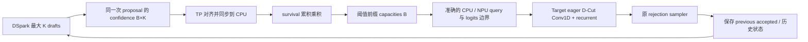

# Qwen3.6 DSpark eager survival 验证分支

## 版本与范围

- 分支：`dspark_adaptive_eager_b5180b`
- 起点：`b5180b821fe2c8672d6b6f82e2cd0adcc47c0943`
- vLLM：v0.28.0，MRV2。
- 验证服务器：Ascend 910B4，8×32GB；仅使用分配的 4 张开发卡，模型固定 TP=4。
- 与 `main_dspark_adaptive_verify_dev` 使用不同 worktree；不合并后者的 FULL 实验补丁。
- 第一版用于 eager 正确性验证，NPU 编译与数值验收尚未完成，不宣称已解决模型精度。

## 使用方式

在安装本分支插件及算子的独立 Ascend 测试环境中，用原来可运行的
Qwen3.6 + DSpark 命令，加入以下设置（模型路径使用你实际的 checkpoint）：

```bash
# 先将 ASCEND_RT_VISIBLE_DEVICES 设置为实际分配的四张卡的 ID，逗号分隔。
: "${ASCEND_RT_VISIBLE_DEVICES:?请先指定分配的四张开发卡}"
export VLLM_USE_V2_MODEL_RUNNER=1
export VLLM_ASCEND_DSPARK_EAGER_SURVIVAL_THRESHOLD=0.4

vllm serve /path/to/Qwen3.6-27B \
  --enforce-eager \
  --tensor-parallel-size 4 \
  --dtype bfloat16 \
  --speculative-config '{
    "method": "dspark",
    "model": "/path/to/DSpark",
    "num_speculative_tokens": 7,
    "enable_adaptive_verification": true,
    "enforce_eager": true
  }'
```

这里 0.4 是测试示例，不是上游默认值。模型验证固定 TP=4、同步调度；TP 的
confidence 以 TP rank 0 广播对齐，四个 rank 必须使用相同的裁剪长度与请求顺序。
TP=4 是本阶段必测配置，尚未上机验收。当前 guard 限制
PP=PCP=DCP=1、无 LoRA/DBO、K 在 1..15。模型测试使用 BF16、禁用 prefix cache
以减少初始变量；prefix cache、异步调度和多卡并非本次已验证能力。

不设置阈值环境变量时，manager factory 原样调用上游逻辑；这**不意味着**
当前 GDN 已支持上游成本预算/FULL。上游原有 capability 限制仍然存在。
阈值设置为 0 保留全部可用 drafts（仍受 logits 容量上限约束），适合验证新
GDN 路径与固定 K 的等价性。阈值设置为 1 通常会大幅裁剪，但 confidence=1
及缺失 confidence 的保守回退可以保留 drafts。

## 数据流与语义



- `survival[r,i] = prod(confidence[r,0:i+1])`，保留满足阈值的连续前缀。
- 不使用 cost table、stale confidence 或双缓冲；同步 D2H 是有意接受的测试开销。
- confidence 通过 persistent slot 对齐；slot 新建时失效，只消费一次；缺失时
  保留可用 drafts，非法值直接报错。请求重排后 capacities 按 req_id 查回。
- 全局 logits 限制仍生效，超限时用 survival 稳定排序分配预算，保证前缀语义。
- `query_start_loc`、`cu_num_logits` 的 host/device 视图完全一致。
- `num_scheduled_tokens` / `num_draft_tokens_per_req` 按上游语义保留 scheduler
  上界，用于请求分类；实际 query/logits 边界来自 manager，不能互相替代。
- previous accepted 选择历史 state，本轮 query length 决定更新次数。即使
  本轮没有 draft 的普通 decode，也保留历史 selector，走固定候选行的 spec 路径。
- 不修改 scheduler、rejection sampler 或 drafter 最大 K geometry。

## 实现选择

1. `eager_policy.py` 是纯 CPU 策略，`eager_verification.py` 适配上游 manager
   生命周期与 runner 调用；正式成本策略不被替换。
2. 配置 patch 只移除显式阈值 lane 的“eager 无图成本表”限制，不提升 GDN 的
   `AttentionCGSupport`。Target/Drafter manager 均强制 NONE。
3. Conv1D 和 recurrent 在本 eager lane 中分别调用
   `npu_dcut_causal_conv1d`、`npu_dcut_recurrent_gated_delta_rule`。固定验证和
   非 speculative 路径保留 baseline 算子。通用 Conv1D host tiling 已恢复 baseline。
4. 两个独立算子目录与上游快照 `645e05ac71960cc6bf01faca8aba7037dd752002`
   一致，不修改 host/kernel 算法。仅适配构建列表、Torch 注册和 Python 调用。
   recurrent 保留 `[B,K+1]` 状态索引宽度，按 qsl 执行本轮 queries，按
   accepted-1 选择历史状态；没有移植 D-Cut 的裁剪 policy。
5. D-Cut Conv1D 的 host tiling 引用通用 Conv1D 源码，因此独立算子名称不保证
   自动解决 `T=B` 的长请求加空行布局。保留 `[8,0,0,0,0,0,0,0]` 的 NPU
   golden 检查，不跳过、不放宽误差。该边界仍待已安装二进制实测。
6. baseline GDN builder 有两个同名 build，前一个已被 Python 后定义覆盖；删去
   这段不可达方法以通过 lint，不把其中 FULL 修复混入当前 eager 范围。

## 编译及验证

在已有匹配 CANN、torch_npu、vLLM 0.28.0 的 Ascend 开发环境中，从**新分支**
根目录执行源码构建。沿用该 910B4 机器已验证的 SOC_VERSION 与 CANN 环境，
不要直接复制其他芯片的构建配置：

```bash
: "${SOC_VERSION:?请设置与本机910B4及CANN匹配的编译目标}"
COMPILE_CUSTOM_KERNELS=1 pip install -v -e . --no-deps --no-build-isolation
```

`setup.py` 会执行 `csrc/build_aclnn.sh`；两个 D-Cut 算子已加入 A2/A3 构建列表
（保留移入算子的 950 源码/列表，但该硬件不属于本阶段验收范围）。Conv1D 的
host tiling 保留 baseline。若服务器已经安装两个匹配的 D-Cut 算子及其 Torch
注册扩展，可直接复用，不要求重新编译。否则再执行上面的构建。重启 worker，确认加载正确的插件和算子，
避免旧二进制导致 Python 新、算子旧。不要在现有服务使用的环境中覆盖安装。

### CPU 合同测试

```bash
uv run --no-project --python 3.12 --with numpy --with torch --with pytest \
  pytest --noconftest -o addopts='' \
  tests/ut/spec_decode/test_eager_survival_verification.py \
  tests/ut/ops/test_dcut_cpu_reference.py -q
```

测试使用真实 CPU torch 执行 manager 方法，mock vLLM 设备基础设施；GDN model
state 的 selector 测试提取实际 prepare_attn 方法执行。原先验证通用 Conv1D
布局修复的 C++ probe 已随该修复撤回；CPU 测试不代表 CANN 算子精度通过。

独立 NumPy golden 与其手算/跨轮测试复用原工作区未跟踪的 `dcut_reference.py`
及 `test_dcut_cpu_reference.py` 快照，原文件未修改。

本地验证记录（2026-09-20，macOS，Python 3.12 / CPU PyTorch）：上述 37 项
测试通过；Ruff 0.14.0 check/format、diff whitespace、shell 语法和仓库的
logger/package/symbolic-meta 检查通过。未运行完整 UT、CANN 构建及 NPU 测试；
以下门槛必须在 Ascend 机器上另行执行。

### NPU 算子门槛

单算子不加载 27B 模型，仍可用开发卡中的任意一张运行；在单独 shell 中
将 `ASCEND_RT_VISIBLE_DEVICES` 设置为该卡 ID。模型测试前恢复四卡可见设置。

```bash
pytest -sv tests/e2e/nightly/single_node/ops/singlecard_ops/test_eager_gdn_varlen.py
```

- D-Cut Conv1D：独立数学 golden；T=B、空行、变长、previous accepted > current length。
- recurrent：独立数学 golden；多轮 8→3/1/4→1/4/0，比较真实输出和完整状态。
- 算子测试必须先通过，再检查模型接受率；不能只拿同算子 eager 输出作 golden。

### 零长度行边界的实际场景

`lengths=[8,0,0,0,0,0,0,0]` 表示 8 个请求槽位中只有第一个有效，总 token 数
恰好也是 8。固定请求轴的 FULL/PIECEWISE 图、批次收缩后保留的空槽位，或
把 GDN spec 子批补齐到固定请求容量时，都可能形成这种布局。普通连续存储的
ragged eager batch 若只包含真实请求，每行至少一个 anchor，则 T=B 只能是
所有请求都执行一个 token，没有长请求加空行歧义。零 draft 是长度 1，空行才是 0。
本分支保持 eager；该 padding 测试为后续入图验收保留，不代表 eager 必然产生空行。

### 模型门槛

```bash
# 必须选择实际分配的四张开发卡；测试会检查可见设备配置。
: "${ASCEND_RT_VISIBLE_DEVICES:?请先指定分配的四张开发卡}"
export VLLM_TEST_QWEN36_MODEL=/path/to/Qwen3.6-27B
export VLLM_TEST_DSPARK_MODEL=/path/to/DSpark
pytest -sv tests/e2e/nightly/single_node/spec_decode/test_qwen36_dspark_eager_survival.py
```

TP=4、四请求 greedy 对比 fixed K 与阈值 0 / 0.4 / 1，各自在独立进程中
顺序创建 engine，共用同一组四张开发卡。不要用 pytest-xdist 并发运行这些用例。
输出不同应定位首个层级差异，不能直接降低测试标准。随机采样需要另外做分布
验证，同 seed 逐 token 一致不作为跨裁剪策略的唯一判据。

需要观察 capacities 时设置 `VLLM_LOGGING_LEVEL=DEBUG`，搜索 `DSpark eager AV`。
保留阈值、每请求 capacity、平均 verification length、accepted length、logits
及有效 conv/SSM state 的对照。该同步测试实现不用于宣称性能收益。

## 后续阶段

先完成上述 eager 门槛，然后接回上游成本预算：独立处理成本初始化、stale/live
confidence、设备端 reallocation 与精确 GDN metadata。再处理 PIECEWISE/FULL
契约和 padding；FULL 问题不在本分支第一阶段的验收承诺中。
