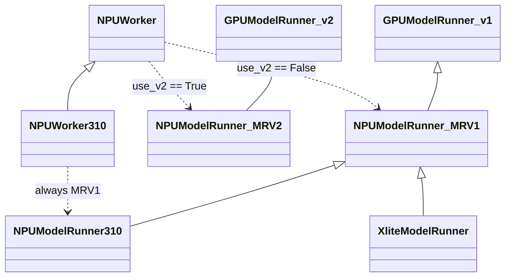
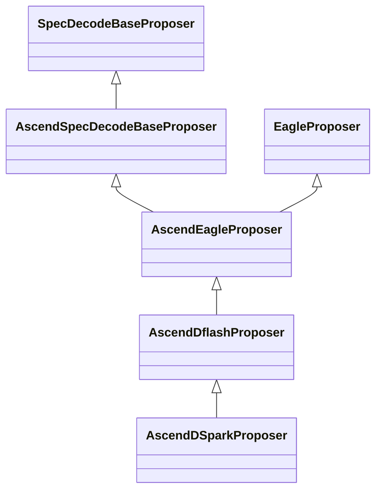
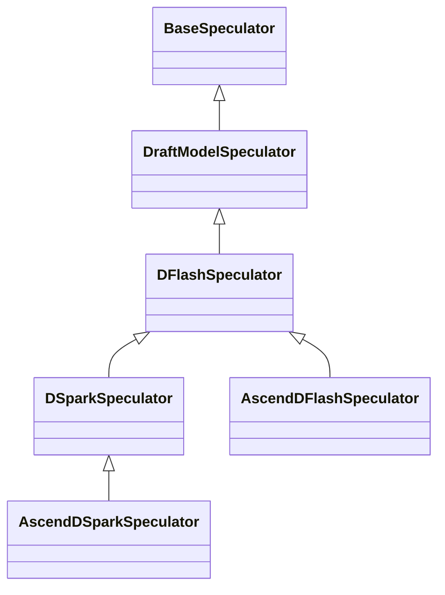
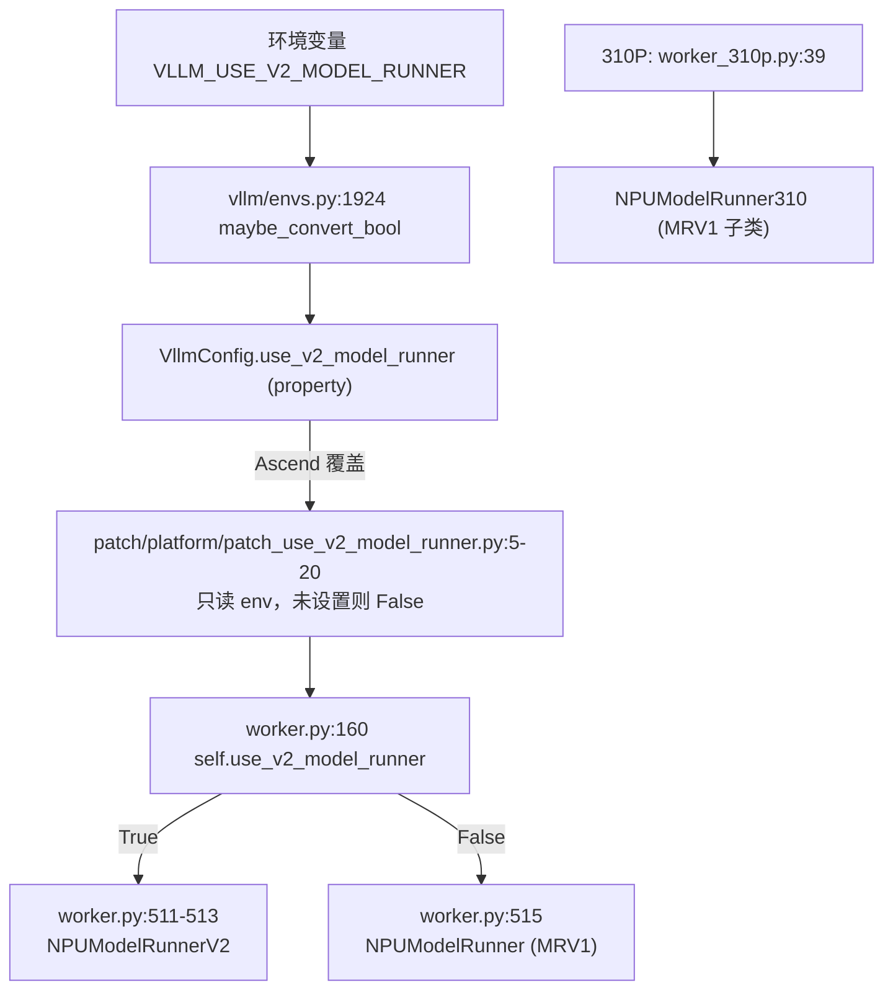
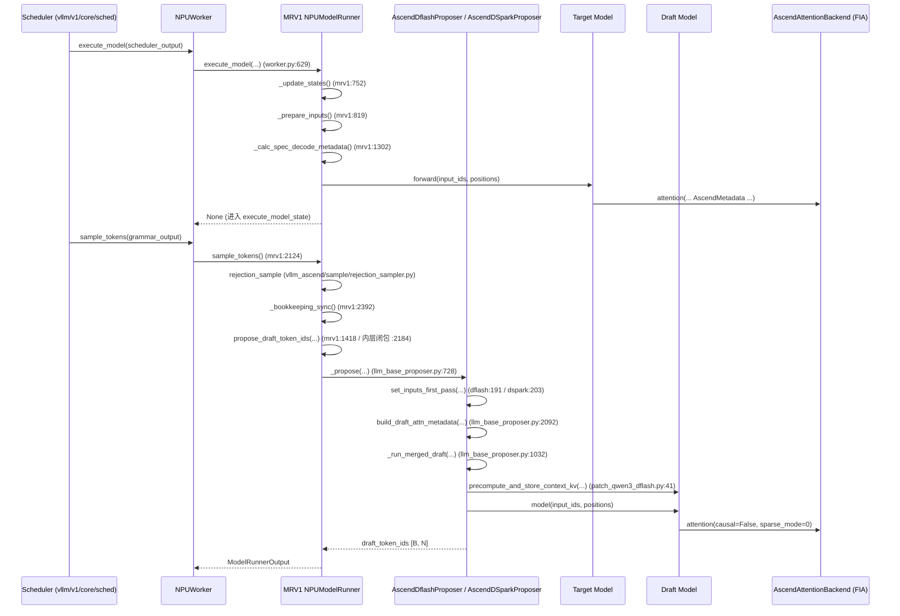
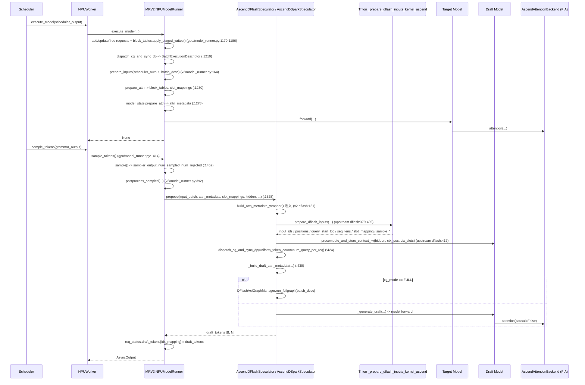
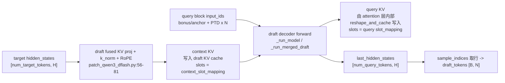
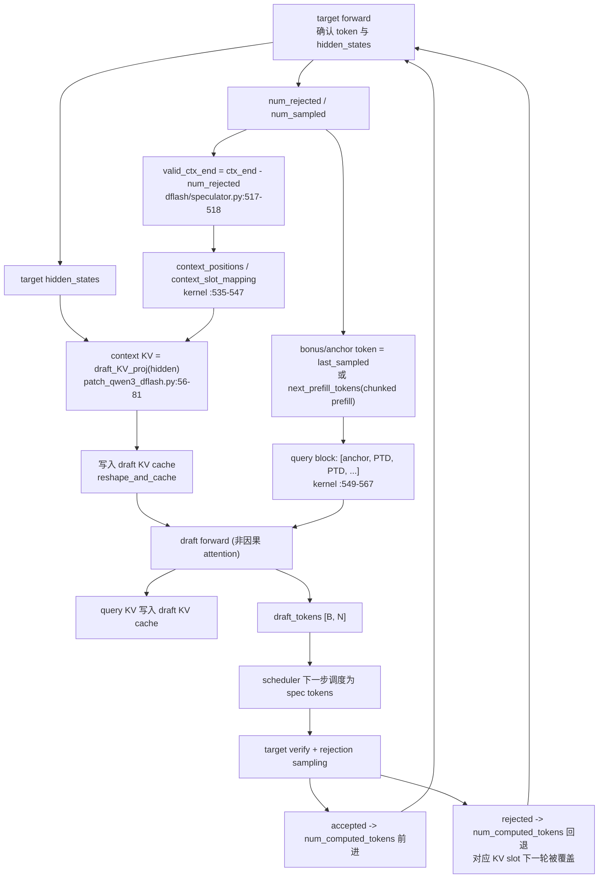
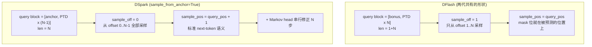

# vLLM-Ascend MRV1/MRV2 与 DFlash/DSpark 910 实现对比

> **本文档全部结论仅适用于下面第 1 节声明的 commit / 分支 / 版本。**
> 换一个 commit（尤其是 vLLM 主干），下面的类名、行号、字段和支持矩阵都可能失效。

标记约定：

| 标记 | 含义 |
| --- | --- |
| 【代码事实】 | 可在给出的文件 + 行号直接读到 |
| 【运行时推断】 | 由静态调用链推断的运行期行为，未实机验证 |
| 【待验证】 | 静态代码无法确认，需要实机运行 / profiling |
| 【版本差异】 | 当前版本与历史版本或上游不同 |
| 【不支持】 | 当前代码没有该组合，或显式抛错 |

---

## 1. 分析范围与版本信息

### 1.1 仓库与版本

分析在 2026-08-06 于本地工作区完成，全部结论基于以下快照：

| 项 | 值 |
| --- | --- |
| 工作区根 | `/Users/cxu169/dev_xc/codes/vllm-workspace` |
| vLLM-Ascend 路径 | `<workspace>/vllm-ascend` |
| vLLM-Ascend 分析起点分支 | `feature/310_qwen3_dflash_dspark` |
| vLLM-Ascend 本文档写作分支 | `docs/mrv1-mrv2-dflash-dspark-910-analysis` |
| vLLM-Ascend HEAD | `d0268166a8e931b5161e2edb651ffb94b276314b` |
| `git describe --tags --always` | `v0.19.1rc1-1322-gd0268166a` |
| vLLM-Ascend remote | `origin = https://github.com/ChunnX/vllm-ascend.git`（个人 fork，非上游） |
| vLLM 路径 | `<workspace>/vllm` |
| vLLM 分支 | `vllm-ascend-verified` |
| vLLM HEAD | `d02df748bf9efd99022f1a062597dc3cb3808485` |
| vLLM `git describe` | `v0.23.1rc0-1451-gd02df748b` |
| vLLM remote | `origin = https://github.com/ChunnX/vllm.git`（个人 fork） |
| 工作区未提交修改 | 两个仓库 `git status --short` 均为空（分析开始时工作树干净） |

vLLM-Ascend HEAD 前三个提交（本次分析直接相关）：

```
d0268166a [Test][310P] Add DFlash and DSpark parallel-drafting coverage
57b6c95f1 [Feature][310P] Support DFlash and DSpark parallel drafting
9fbb5be25 [Feature][310P] Add non-causal draft attention for DFlash and DSpark
```

### 1.2 运行环境限制（影响可验证性）

- `python3 -c "import vllm"` → 加载到一个**没有 `__version__` 的占位模块，`__file__` 为 `None`**；`import vllm_ascend` → `ModuleNotFoundError`；`import torch` → `ModuleNotFoundError`。
- 平台为 macOS（darwin），**没有 CANN / torch_npu / NPU 硬件，也没有安装 pytest**。

结论：**本文档是纯静态源码分析**。工作区里只有 `vllm/` 与 `vllm-ascend/` 各一份源码副本，不存在多副本混用问题；但也**没有任何单元测试或 E2E 被实际执行**（见第 22.4 节，禁止把未执行当成通过）。

### 1.3 一个必须先澄清的命名问题

- **MRV1 / MRV2 与 vLLM 的 Engine V0/V1 无关。** 二者都跑在 vLLM **V1 Engine**（`vllm/v1/...`）之上，都由 `vllm.v1.core.sched.scheduler.Scheduler` 驱动，都返回 `vllm.v1.outputs.ModelRunnerOutput`。MRV1/MRV2 指的是 **Model Runner 这一层的两代实现**。
- **`manager_bs` / `kernel_bs` 在本仓库里不是 batch size，是 block size**（KV cache 管理块大小 vs kernel 分页大小）。详见第 8.4 节。

---

## 2. 核心结论摘要

1. **MRV1 = `vllm_ascend/worker/model_runner_v1.py:270` 的 `NPUModelRunner`（4873 行），继承 `vllm.v1.worker.gpu_model_runner.GPUModelRunner`（上游 7893 行）。MRV2 = `vllm_ascend/worker/v2/model_runner.py:59` 的 `NPUModelRunner`（514 行），继承 `vllm.v1.worker.gpu.model_runner.GPUModelRunner`（上游 1677 行）。两个类同名，不同模块。** 【代码事实】

2. **MRV2 不是 MRV1 的重构，而是换了上游基类。** MRV1 是 vLLM 老 `gpu_model_runner.py` 的 Ascend 大改版（4873 行本地代码）；MRV2 只在上游新 `gpu/model_runner.py` 上覆写 5 个方法（`initialize_kv_cache` / `profile_run` / `prepare_inputs` / `postprocess` / `postprocess_sampled`）+ 3 个 Ascend 辅助方法。绝大部分逻辑下沉到上游。 【代码事实】

3. **选择开关：`vllm_config.use_v2_model_runner`，读取处 `vllm_ascend/worker/worker.py:160`，实例化处 `worker.py:509-515`。** 【代码事实】

4. **vLLM-Ascend 把上游的 `use_v2_model_runner` 属性整个替换掉了**（`vllm_ascend/patch/platform/patch_use_v2_model_runner.py:5-20`），改成"只看 `VLLM_USE_V2_MODEL_RUNNER` 环境变量，未设置就是 `False`"。这意味着上游 GPU 上"DSpark 强制走 V2""DFlash 多 KV group 强制走 V2"这两条规则（`vllm/vllm/config/vllm.py:564-573`）**在 Ascend 上不生效**——在 Ascend 上跑 MRV2 必须显式 `VLLM_USE_V2_MODEL_RUNNER=1`，否则默认落到 MRV1。 【代码事实】【版本差异】

5. **310P 上 MRV2 不可达。** `NPUWorker310.init_device` 无条件实例化 `NPUModelRunner310`（`vllm_ascend/_310p/worker_310p.py:39`），而 `NPUModelRunner310` 继承的是 MRV1（`vllm_ascend/_310p/model_runner_310p.py:68`）。因此 **MRV2 相关的一切结论只对 910（A2/A3）成立**。 【代码事实】

6. **DFlash 与 DSpark 在两个 Runner 上是两套完全独立的实现**，不共享代码：
   - MRV1：`AscendDflashProposer`（`vllm_ascend/spec_decode/dflash_proposer.py:21`）、`AscendDSparkProposer`（`dspark_proposer.py:19`，继承前者），由 `vllm_ascend/spec_decode/__init__.py:35` 的 `get_spec_decode_method` 分发。
   - MRV2：`AscendDFlashSpeculator`（`vllm_ascend/worker/v2/spec_decode/dflash/speculator.py:25`）、`AscendDSparkSpeculator`（`dspark/speculator.py:35`），由 `vllm_ascend/worker/v2/spec_decode/__init__.py:23` 的 `init_speculator` 分发。MRV2 两个类都是**上游 vLLM 类的薄封装**（各 282 / 157 行，主体在 `vllm/v1/worker/gpu/spec_decode/dflash|dspark/speculator.py`）。 【代码事实】

7. **DFlash 的 bonus 和 DSpark 的 anchor 不是同一个概念，但共享同一段 Tensor 布局代码。** 二者都是"每个 request 的 query 块第 0 号位置"，都填入 target 上一步确认的 token id；区别是：DFlash 的第 0 号位**不产出预测**（`sample_off = 1`），DSpark 的第 0 号位**就是第一个预测点**（`sample_off = 0`，且 `sample_pos = query_pos + 1`）。因此 DFlash 每 request 发 `1+N` 个 query，DSpark 发 `N` 个。见 `vllm/vllm/v1/worker/gpu/spec_decode/dflash/speculator.py:569-580` 与 `vllm/vllm/v1/worker/gpu/spec_decode/dspark/speculator.py:10-17`。 【代码事实】

8. **"bonus" 在本代码库有两个互不相干的含义**：(a) DFlash draft 输入布局里的 anchor 位 token；(b) verify 阶段全部 draft 被接受时 target 额外采出的那一个 token（`bonus_logits_indices`，`vllm_ascend/sample/rejection_sampler.py:188-208`）。文档/代码评审时必须区分。 【代码事实】

9. **DFlash/DSpark 都不做 EAGLE 式的 token 左移。** 左移逻辑在 `vllm_ascend/spec_decode/llm_base_proposer.py:1333-1338`（MRV1）与 `vllm/vllm/v1/worker/gpu/spec_decode/autoregressive/speculator.py:550-555`（MRV2），而 DFlash/DSpark 覆写了整个 `set_inputs_first_pass` / 走独立的 `prepare_dflash_inputs`，直接重建一个 query 块。 【代码事实】

10. **context KV = 用 target 的 hidden state、经 draft 模型自己的 KV 投影算出来的 K/V，写进 draft 自己的 KV cache 分组。** 不是 target 的 KV，也不是 draft 重新前向出来的 KV。实现在 `vllm_ascend/patch/worker/patch_qwen3_dflash.py:41-101`（覆写上游 `DFlashQwen3Model.precompute_and_store_context_kv`）。 【代码事实】

11. **Graph 支持是四象限里差别最大的一格**：MRV1 DSpark 被硬编码为 eager（`vllm_ascend/spec_decode/dspark_proposer.py:73` `self.use_cuda_graph = False`）；MRV1 DFlash 支持 FULL 图；MRV2 DFlash/DSpark 共用 `DFlashAclGraphManager`，模式被收敛为 `FULL_DECODE_ONLY` 或 `NONE`，**PIECEWISE 对 draft 明确不支持**（`vllm/vllm/v1/worker/gpu/spec_decode/dflash/speculator.py:122-126`）。 【代码事实】

12. **MRV1 每步在 Python 侧重建 draft attention metadata 并做多次 `copy_` / `fill_`**（`llm_base_proposer.py:1054-1090`）；**MRV2 把输入准备整体压进一个 Triton kernel**（`prepare_dflash_inputs`），并把 query slot mapping 直接写进 runner 共享的 `BlockTables.slot_mappings`，省掉一层拷贝。这是"MRV2 更 graph-friendly"的具体所指。 【代码事实】性能收益本身 →【待验证】

13. **910 上 DFlash/DSpark 的 draft attention 走 FIA（`torch_npu.npu_fused_infer_attention_score`），非因果由 `sparse_mode = 0` + `attn_mask = None` 表达**（`vllm_ascend/attention/attention_v1.py:872`、`vllm_ascend/attention/attention_mask.py:68-80`）。310P 才需要 `torch.ops._C_ascend.npu_custom_fused_infer_attention_v310` 这条自定义路线。 【代码事实】

14. **MRV1 与 MRV2 的 DSpark 读的是两个不同的 hf_config 键**：MRV1 读 `dspark_bonus_anchor`（`dspark_proposer.py:40`），MRV2 读 `sample_from_anchor`（上游 `dspark/speculator.py:46-48`）。默认值下二者等价（都是 anchor-first），但一个显式写了 `sample_from_anchor: false` 的 checkpoint 在 MRV1 上会被忽略。 【代码事实】+【待验证】（是否有真实 checkpoint 触发）

15. **MRV1 DSpark 显式拒绝 probabilistic draft 采样**（`dspark_proposer.py:35-39` 抛 `ValueError`）；MRV2 DSpark 支持（上游 `dspark/speculator.py:123-143` 的 `gumbel_sample` 分支 + `_d2t_scatter_index`）。 【代码事实】

---

## 3. 名词和类名映射

| 简称 | 真实实体 | 位置 |
| --- | --- | --- |
| MRV1 | `NPUModelRunner` | `vllm_ascend/worker/model_runner_v1.py:270` |
| MRV1 基类 | `GPUModelRunner` | `vllm/vllm/v1/worker/gpu_model_runner.py`（7893 行） |
| MRV1 310P 变体 | `NPUModelRunner310` | `vllm_ascend/_310p/model_runner_310p.py:68` |
| MRV1 xLite 变体 | `XliteModelRunner` | `vllm_ascend/xlite/xlite_model_runner.py:25` |
| MRV2 | `NPUModelRunner` | `vllm_ascend/worker/v2/model_runner.py:59` |
| MRV2 基类 | `GPUModelRunner` | `vllm/vllm/v1/worker/gpu/model_runner.py:125`（1677 行） |
| Worker | `NPUWorker` | `vllm_ascend/worker/worker.py` |
| Worker（310P） | `NPUWorker310` | `vllm_ascend/_310p/worker_310p.py:32` |
| DFlash（MRV1） | `AscendDflashProposer` | `vllm_ascend/spec_decode/dflash_proposer.py:21` |
| DSpark（MRV1） | `AscendDSparkProposer` | `vllm_ascend/spec_decode/dspark_proposer.py:19` |
| MRV1 proposer 基类 | `AscendSpecDecodeBaseProposer` | `vllm_ascend/spec_decode/llm_base_proposer.py:118`（2153 行） |
| DFlash（MRV2） | `AscendDFlashSpeculator` | `vllm_ascend/worker/v2/spec_decode/dflash/speculator.py:25` |
| DSpark（MRV2） | `AscendDSparkSpeculator` | `vllm_ascend/worker/v2/spec_decode/dspark/speculator.py:35` |
| MRV2 上游 DFlash | `DFlashSpeculator` | `vllm/vllm/v1/worker/gpu/spec_decode/dflash/speculator.py:31` |
| MRV2 上游 DSpark | `DSparkSpeculator` | `vllm/vllm/v1/worker/gpu/spec_decode/dspark/speculator.py:37` |
| Draft | draft 模型前向，产出 `num_speculative_tokens` 个候选 | MRV1 `_run_merged_draft`；MRV2 `_generate_draft` |
| Verify | target 前向 + rejection sampling | MRV1 `vllm_ascend/sample/rejection_sampler.py`；MRV2 `vllm/v1/worker/gpu/spec_decode/rejection_sampler.py` |
| Bonus（draft 布局） | DFlash query 块 offset 0 的 token，值 = target 上一步确认 token，**不作为采样点** | `dflash/speculator.py:520-525, 552-553` |
| Bonus（verify） | 全部 draft 命中时 target 额外采出的一个 token | `vllm_ascend/sample/rejection_sampler.py:188-208` |
| Anchor | DSpark query 块 offset 0 的 token，值同上，但**是第一个采样点** | `dspark/speculator.py:10-17`；kernel `SAMPLE_FROM_ANCHOR` 分支 |
| Context KV | 由 target hidden state 经 draft 的 KV 投影算出、写入 draft KV cache 的 K/V | `vllm_ascend/patch/worker/patch_qwen3_dflash.py:41-101` |
| `manager_bs` | **KV cache 管理块大小** `kv_cache_spec.block_size`（不是 batch size） | `vllm_ascend/worker/utils.py:101` |
| `kernel_bs` | **kernel 分页块大小** `kernel_block_sizes[gid][0]`（不是 batch size） | `vllm_ascend/worker/utils.py:100` |
| PTD / mask token | 并行 drafting 的占位 token id | `vllm/v1/worker/gpu/spec_decode/utils.py:55+` `get_parallel_drafting_token_id` |

---

## 4. MRV1 与 MRV2 架构总览

### 4.1 类继承关系



图中节点对应的真实类与位置：

| 图中节点 | 真实类名 | 文件:行 | 行数 |
| --- | --- | --- | --- |
| `GPUModelRunner_v1` | `GPUModelRunner` | `vllm/v1/worker/gpu_model_runner.py` | 7893 |
| `GPUModelRunner_v2` | `GPUModelRunner` | `vllm/v1/worker/gpu/model_runner.py:125` | 1677 |
| `NPUModelRunner_MRV1` | `NPUModelRunner` | `vllm_ascend/worker/model_runner_v1.py:270` | 4873 |
| `NPUModelRunner_MRV2` | `NPUModelRunner` | `vllm_ascend/worker/v2/model_runner.py:59` | 514 |
| `NPUModelRunner310` | `NPUModelRunner310` | `vllm_ascend/_310p/model_runner_310p.py:68` | — |
| `XliteModelRunner` | `XliteModelRunner` | `vllm_ascend/xlite/xlite_model_runner.py:25` | — |
| `NPUWorker` | `NPUWorker` | `vllm_ascend/worker/worker.py` | — |
| `NPUWorker310` | `NPUWorker310` | `vllm_ascend/_310p/worker_310p.py:32` | — |

### 4.2 投机解码类继承关系

**MRV1（proposer 体系）**



| 类 | 文件:行 |
| --- | --- |
| `SpecDecodeBaseProposer` | vLLM 上游 |
| `EagleProposer` | `vllm/v1/spec_decode/eagle.py` |
| `AscendSpecDecodeBaseProposer` | `vllm_ascend/spec_decode/llm_base_proposer.py:118` |
| `AscendEagleProposer` | `vllm_ascend/spec_decode/eagle_proposer.py:10` |
| `AscendDflashProposer` | `vllm_ascend/spec_decode/dflash_proposer.py:21` |
| `AscendDSparkProposer` | `vllm_ascend/spec_decode/dspark_proposer.py:19` |

**MRV2（speculator 体系）**



| 类 | 文件:行 |
| --- | --- |
| `BaseSpeculator` | `vllm/v1/worker/gpu/spec_decode/speculator.py:29` |
| `DraftModelSpeculator` | `vllm/v1/worker/gpu/spec_decode/speculator.py:69` |
| `DFlashSpeculator` | `vllm/v1/worker/gpu/spec_decode/dflash/speculator.py:31` |
| `DSparkSpeculator` | `vllm/v1/worker/gpu/spec_decode/dspark/speculator.py:37` |
| `AscendDFlashSpeculator` | `vllm_ascend/worker/v2/spec_decode/dflash/speculator.py:25` |
| `AscendDSparkSpeculator` | `vllm_ascend/worker/v2/spec_decode/dspark/speculator.py:35` |

> 注意对称性：**两代实现都让 DSpark 继承 DFlash**。这不是巧合——DSpark 复用了 DFlash 的 context-KV 预填 + 单块 query 前向机制，只改了采样布局与采样方式（上游 `dspark/speculator.py:3-23` 的 docstring 明确写了这一点）。 【代码事实】

---

## 5. MRV1 与 MRV2 代码级差异总表

### 表 1：MRV1/MRV2 总体差异

| 维度 | MRV1 | MRV2 | 工程影响 |
| --- | --- | --- | --- |
| Ascend 侧类 | `model_runner_v1.py:270 NPUModelRunner`（4873 行） | `worker/v2/model_runner.py:59 NPUModelRunner`（514 行） | MRV1 的改动面在 vllm-ascend 内；MRV2 的改动大多要动上游或加 patch |
| 上游基类 | `vllm/v1/worker/gpu_model_runner.py`（7893 行） | `vllm/v1/worker/gpu/model_runner.py:125`（1677 行） | 两条上游代码路径，bug 不共享 |
| 覆写方法数 | 数十个（含 `execute_model`/`_prepare_inputs`/`_calc_spec_decode_metadata`/`_bookkeeping_sync`/`capture_model`…） | 5 个（`initialize_kv_cache` / `profile_run` / `prepare_inputs` / `postprocess` / `postprocess_sampled`）+ `_copy_num_computed_tokens_to_cpu` / `_update_seq_lens_cpu` / `_pad_query_start_loc_for_fia` / `eplb_warmup` | MRV2 靠 monkey-patch（`patch/worker/patch_v2/*`）而非继承注入 Ascend 行为 |
| Ascend 化手段 | 继承 + 覆写 | 继承 + `patch/worker/patch_v2/patch_triton.py`（19 处函数替换）+ `patch_attn_utils.py` + `patch_dflash_speculator.py` + `build_attn_metadata_wrapper()` 上下文管理器 | MRV2 的替换发生在 import 期与调用期两层，排查时要同时看两处 |
| Batch 容器 | `InputBatch`（`vllm_ascend/worker/npu_input_batch.py`）+ runner 自持大量 buffer | `AscendInputBatch` / `AscendInputBuffers`（`worker/v2/input_batch.py:33,68`） | MRV2 的 batch 是 dataclass，字段固定；MRV1 是可变对象 + runner 属性混合 |
| forward context | `set_ascend_forward_context`（`vllm_ascend/ascend_forward_context.py`），含 `is_first_layer` / `prefetch_mlp_*` / `model_instance` / `is_draft_model` | 上游 `set_forward_context` + `NPUPlatform.set_additional_forward_context`（`platform.py:952` 起，`use_v2_model_runner` 为 False 时直接 `return {}`） | MRV2 的 forward context 字段更少，MoE prefetch 类优化不可用 |
| 动态 EPLB | 支持 | **显式不支持**：`worker/v2/model_runner.py:67-68` 抛 `NotImplementedError` | 【不支持】 |
| PCP（prefill context parallel） | **不支持**：`platform.py:339-345` 在 `not use_v2_model_runner` 时抛错 | 支持（`maybe_build_ascend_pcp_manager`，`worker/v2/model_runner.py:138`） | 能力方向相反 |
| 310P | 可用（`NPUModelRunner310`） | **不可达**（`worker_310p.py:39` 硬编码 MRV1） | 【不支持】 |
| seq_lens CPU 镜像 | runner 自持 `optimistic_seq_lens_cpu` 等 | 上游已废弃 `seq_lens_cpu`，Ascend 用独立 stream + event 把 `num_computed_tokens` 拷回 CPU 再重建（`worker/v2/model_runner.py:411-443`） | MRV2 为了 NPU attention backend 仍需 CPU seq_lens，额外引入一次 D2H + 一个 `Event.synchronize()` |

### 表 2：Runner 生命周期

| 阶段 | MRV1 入口 | MRV2 入口 | 差异 |
| --- | --- | --- | --- |
| 实例化 | `worker.py:515` `NPUModelRunner(vllm_config, device)` | `worker.py:511-513` `from ...v2.model_runner import NPUModelRunner as NPUModelRunnerV2` 后实例化 | MRV2 是延迟 import，并先打一条 `logger.warning("npu model runner v2 is in developing…")` |
| `__init__` 包裹 | `_torch_cuda_wrapper()`（`model_runner_v1.py:280`） | `torch_cuda_wrapper()`（`worker/v2/model_runner.py:70`，来自 `worker/v2/utils.py`） | 两份同名不同实现的 wrapper |
| 模型加载 | `load_model()`（`model_runner_v1.py:3431`） | 继承上游 `gpu/model_runner.py:280` | MRV1 有大量 Ascend 量化 / 权重后处理分支 |
| KV cache 初始化 | `initialize_kv_cache`（`model_runner_v1.py:3555`）+ `initialize_kv_cache_tensors`（`:3616`） | `initialize_kv_cache`（`worker/v2/model_runner.py:132`）仅包一层 `graph_manager_wrapper`，实际分配被 patch 到 `worker/v2/attn_utils.py:262 _allocate_kv_cache` / `:436 _reshape_kv_cache_v2` | MRV2 的 Ascend KV 布局逻辑在 attn_utils，不在 runner |
| KV cache spec | `get_kv_cache_spec`（`model_runner_v1.py:4516`） | patch：`vllm.v1.worker.gpu.model_runner.get_kv_cache_spec = worker/v2/attn_utils.py:53 get_kv_cache_spec` | 同上 |
| Attention backend | 走 `AttentionGroup.create_metadata_builders` | 同，但 metadata 构造被 `build_attn_metadata_wrapper()` 临时替换（`worker/v2/attn_utils.py:516-523`） | MRV2 用上下文管理器替换模块级函数，只在 speculator 调用期间生效 |
| Spec decode 初始化 | `get_spec_decode_method`（`spec_decode/__init__.py:35`），产出 `self.drafter` | `init_speculator`（`worker/v2/spec_decode/__init__.py:23`），产出 `self.speculator`，且在 `__init__` 里先 `del self.speculator` 再重建（`worker/v2/model_runner.py:83,88-90`） | MRV2 必须先删掉上游建好的 speculator |
| Graph 初始化 | `capture_model`（`model_runner_v1.py:4718`）→ `GPUModelRunner.capture_model` | 继承上游 `gpu/model_runner.py:729`，但 `ModelCudaGraphManager` 在 `initialize_kv_cache` 期间被 `graph_manager_wrapper`（`worker/v2/model_runner.py:489-514`）换成 `ModelAclGraphManager` | MRV2 的图管理器替换点在 KV cache 初始化，不在 capture |
| Sampling 初始化 | `vllm_ascend/sample/sampler.py` + `patch_rejection_sampler.py` | `worker/v2/sample/*` 经 `patch_v2/patch_triton.py` 逐个函数替换 | MRV2 的 sampler Ascend 化是函数级替换（`gumbel_sample` / `apply_min_p` / `bincount` / …） |
| 通信/TP/DP | `_sync_metadata_across_dp` 等 runner 方法 | `dispatch_cg_and_sync_dp`（上游 `gpu/dp_utils.py`）+ `set_mc2_tokens_capacity` / `set_mc2_mask`（`worker/v2/model_runner.py:129-130`） | MRV2 的 DP 同步与 graph dispatch 合并成一个调用 |
| Persistent tensor | `_make_buffer(...)` 分散在 `__init__`（如 `model_runner_v1.py:288-302`） | `AscendInputBuffers`（`worker/v2/input_batch.py:33`）集中持有 | MRV2 buffer 归属更清晰 |

---

## 6. Model Runner 创建与选择流程

### 6.1 选择链路



关键代码（`vllm_ascend/worker/worker.py:508-515`）：

```python
# Init ModelRunner here, so that we have access to self.device.
if self.use_v2_model_runner:
    logger.warning("npu model runner v2 is in developing, some features doesn't work for now.")
    from vllm_ascend.worker.v2.model_runner import NPUModelRunner as NPUModelRunnerV2
    self.model_runner = NPUModelRunnerV2(self.vllm_config, self.device)
else:
    self.model_runner = NPUModelRunner(self.vllm_config, self.device)
```

### 6.2 上游 vs Ascend 的选择规则差异（重要）

上游 `vllm/vllm/config/vllm.py:554-596` 的 `use_v2_model_runner` 有一整套 fallback 逻辑：

```python
if self.speculative_config is not None and self.speculative_config.method == "dspark":
    return True                       # :564-568  DSpark 只有 V2 实现 → 强制 V2
if self._dflash_needs_multi_kv_group():
    return True                       # :572-573  混合 SWA/full 的 DFlash draft → 强制 V2
...
if not self._is_default_v2_model_runner_model(): return False
if not HAS_TRITON: ... return False
if unsupported := self._get_v2_model_runner_unsupported_features(): ... return False
return True
```

vLLM-Ascend 把整个 property 换掉（`vllm_ascend/patch/platform/patch_use_v2_model_runner.py:5-20`）：

```python
def _patched_use_v2_model_runner(self) -> bool:
    use_v2 = envs.VLLM_USE_V2_MODEL_RUNNER
    if use_v2 is not None:
        return use_v2
    return False

VllmConfig.use_v2_model_runner = property(_patched_use_v2_model_runner)
```

**后果（都属于【代码事实】+【运行时推断】）：**

1. 在 Ascend 上，`--speculative-config '{"method":"dspark",...}'` **不会**自动切到 MRV2；它会落到 MRV1 的 `AscendDSparkProposer`。这正是 vllm-ascend 单独实现了一套 MRV1 DSpark 的原因（commit `41ff81e1a [Feature] Add qwen/glm dspark for mrv1 (#11765)`）。
2. 上游 `_validate_v2_model_runner()`（`vllm/config/vllm.py:2221-2236`）只在 `use_v2_model_runner` 为 True 时被调用（`vllm.py:1461-1462`），因此在 Ascend 上只有显式 `VLLM_USE_V2_MODEL_RUNNER=1` 时那套"不支持特性"校验才会跑。
3. `_get_v2_model_runner_unsupported_features()`（`vllm/config/vllm.py:2132-2218`）里与投机解码相关的限制在 Ascend 上依然生效（只要开了 V2）：`ngram`/`ngram_gpu` 不支持；`method` 不在 `{eagle, eagle3, mtp, dflash, dspark}` 内不支持；`parallel_drafting=True` 且 method 不是 dflash/dspark 不支持。

### 6.3 DFlash/DSpark 的 method 识别

`vllm/vllm/config/speculative.py`：

| 行 | 逻辑 |
| --- | --- |
| `:309-310` | `"dflash"` / `"dspark"` 进入合法 method 列表 |
| `:886-893` | 从 draft 模型名推断 method（`"dflash" in model.lower()` → dflash；`"dspark" in ...` → dspark） |
| `:969-970` | `if self.method in ("dflash", "dspark"): self.parallel_drafting = True` |
| `:1017-1031` | DSpark 校验 `num_speculative_tokens >= dspark_block_size` |
| `:1336-1340` | `use_dflash()` / `use_dspark()` |

Ascend 额外补一个 patch（`vllm_ascend/patch/platform/patch_speculative_config.py:136-149`）：DSpark 时把 `ptd_token_id` 从 `dspark_noise_token_id` 或 `mask_token_id` 补齐，供 `get_parallel_drafting_token_id` 使用。 【代码事实】

---

## 7. `execute_model` 调用链对比

### 7.1 MRV1 时序图



### 7.2 MRV2 时序图



**MRV2 相对 MRV1 的关键差异节点（图中已加粗对应位置）：**

| 差异点 | MRV1 | MRV2 |
| --- | --- | --- |
| batch 组织时机 | `_update_states` + `_prepare_inputs` 两段 Python | `add_requests`/`update_requests` + 一次 `prepare_inputs` 返回不可变 `AscendInputBatch` |
| graph dispatch | draft 内部再 dispatch 一次（`llm_base_proposer.py:793-813`，dispatch 了两次） | 一次 `dispatch_cg_and_sync_dp` 同时决定 cg mode 与 DP padding |
| draft 输入构造 | Python 张量切片 + Triton kernel 混合 | 单个 Triton kernel 全包 |
| draft slot mapping | proposer 自持 buffer，再 `copy_` 进 `common_attn_metadata.slot_mapping` | 直接写 `BlockTables.slot_mappings[gid]`（graph 捕获读的就是这块地址） |
| draft metadata | `build_draft_attn_metadata` + 多步 `attn_update_stack_num_spec_norm` | 单次 `_build_draft_attn_metadata`（并行 drafting 本来就只有一步） |

---

## 8. 输入和 Batch 管理差异

### 8.1 Batch 容器对比

| 概念 | MRV1 | MRV2 |
| --- | --- | --- |
| Scheduler 输出 | `vllm.v1.core.sched.output.SchedulerOutput`（相同） | 同 |
| 持久 batch | `InputBatch`（`vllm_ascend/worker/npu_input_batch.py`），可变对象，runner 持有 `self.input_batch` | `AscendInputBatch`（`worker/v2/input_batch.py:68`，`@dataclass`），**每步新建、只读** |
| 持久 buffer | runner 属性（`self.input_ids` / `self.positions` / `self.query_start_loc` / `self.seq_lens` …），`_make_buffer` 创建 | `AscendInputBuffers`（`worker/v2/input_batch.py:33`），继承上游 `InputBuffers` |
| request 状态 | `self.requests: dict[str, CachedRequestState]` | `AscendRequestState`（`worker/v2/states.py`），SoA 布局，字段是 `[max_num_reqs]` 的 GPU/CPU 张量对 |
| batch 排序 | runner 内部维护 | `sort_batch_req_ids(num_tokens_per_req, self.decode_query_len)`（`worker/v2/model_runner.py:179`，上游函数） |
| req → slot 映射 | `req_id_to_index` dict | `idx_mapping`（GPU int32 张量）+ `idx_mapping_np`（`worker/v2/model_runner.py:201-204`） |

MRV2 的 `AscendInputBuffers` 相对上游只加了两处 Ascend 私货（`worker/v2/input_batch.py:44-63`）：

```python
del self.query_start_loc
# NOTE: For FULL mode we change +1 to +2 to reserve extra space for padding.
self.query_start_loc = torch.zeros(max_num_reqs + 2, dtype=torch.int32, device=device)
self.seq_lens_cpu = torch.zeros(max_num_reqs, dtype=torch.int32, device="cpu")
self.seq_lens_np = self.seq_lens_cpu.numpy()   # 共享内存
```

`+2` 是为了 `_pad_query_start_loc_for_fia` 插入一个 dummy request（见 8.5）。MRV1 里有一模一样的 `+2` 注释（`model_runner_v1.py:288-292`）。 【代码事实】

### 8.2 表 3：输入字段

| 字段 | MRV1 | MRV2 | Shape / dtype / device | 生产者 | 消费者 |
| --- | --- | --- | --- | --- | --- |
| `input_ids` | `runner.input_ids`（buffer）；draft 侧 `proposer.input_ids` | `input_buffers.input_ids` → `input_batch.input_ids`（切片视图） | `[max_num_tokens]` int32, NPU | MRV1 `_prepare_inputs`；MRV2 `prepare_prefill_inputs` / `combine_sampled_and_draft_tokens`（`v2/model_runner.py:269,294`） | 模型 embedding |
| `positions` | `runner.positions` / `proposer.positions` | `input_buffers.positions` | `[max_num_tokens]` **int64**, NPU（draft 侧 DFlash MRV1 用 **int32**，`dflash_proposer.py:55-59`） | MRV1 `_prepare_inputs`；MRV2 `prepare_pos_seq_lens`（`v2/model_runner.py:280`） | RoPE / attention |
| `query_start_loc` | `runner.query_start_loc`（`_make_buffer(max_num_reqs+2)`，`mrv1:288`） | `input_buffers.query_start_loc`（`max_num_reqs+2`） | `[max_num_reqs+2]` int32；GPU + CPU 双份 | 同上 | attention metadata builder、FIA `actual_seq_lengths_q` |
| `seq_lens` | `runner.seq_lens` + `optimistic_seq_lens_cpu` | `input_buffers.seq_lens` + `seq_lens_cpu/np` | `[max_num_reqs]` int32 | MRV1 `_prepare_inputs`；MRV2 `prepare_pos_seq_lens` | FIA `actual_seq_kvlen` |
| `seq_lens_cpu_upper_bound` | `AscendCommonAttentionMetadata.seq_lens_cpu_upper_bound` | `input_batch.seq_lens_cpu_upper_bound`（`v2/model_runner.py:309-315`，numpy 计算，无 D2H） | `[num_reqs_padded]` int32, CPU | `num_computed_tokens_np + num_scheduled_tokens` | draft metadata（`speculator.py:229-237`） |
| `slot_mapping` | 每个 proposer 自持（`dflash_proposer.py:37,43`；`dspark_proposer.py:86,101-113`），再 copy 进 metadata | `BlockTables.slot_mappings`（`[num_groups, max_num_tokens]`，上游 `gpu/block_table.py:73`），DFlash 直接写入 | int32/int64（见 8.6） | MRV1 Triton/PyTorch expand；MRV2 `prepare_dflash_inputs` | `reshape_and_cache` / `do_kv_cache_update` |
| `block_table` | `input_batch.block_table[gid].get_device_tensor()` | `BlockTables.input_block_tables[gid]` | `[max_num_reqs, max_num_blocks]` int32 | KV cache manager → runner | slot 计算 + FIA |
| `idx_mapping` | 无（用 dict） | `input_batch.idx_mapping` | `[num_reqs]` int32, NPU | `v2/model_runner.py:201-204` | draft kernel（把 batch 位置映射回 request slot） |
| `num_scheduled_tokens` | `scheduler_output.num_scheduled_tokens` dict | `input_batch.num_scheduled_tokens`（np.int32 数组） | `[num_reqs]` np.int32, CPU | `v2/model_runner.py:183-184` | `prepare_dflash_inputs` 里算 BLOCK_SIZE（`dflash/speculator.py:653`） |
| `num_actual_tokens` | `common_attn_metadata.num_actual_tokens`；DFlash 覆写成 `num_query_total`（`dflash_proposer.py:266`） | `input_batch.num_tokens` / `num_tokens_padded` | int | | attention backend 切片 |
| `num_sampled` / `num_rejected` | MRV1 用 `num_rejected_tokens_gpu`（`llm_base_proposer.py:748`） | `sample()` 返回，直接传进 `propose()`（`gpu/model_runner.py:1452,1521-1522`） | `[num_reqs]` int32, NPU | rejection sampler | draft 输入 kernel（算 `valid_ctx_end`） |
| `last_sampled` | 由 `next_token_ids` 承载（`llm_base_proposer.py:1696` `prepare_next_token_ids_padded`） | `req_states.last_sampled_tokens`（`[max_num_reqs]`） | int32/int64, NPU | postprocess | draft kernel 取 bonus/anchor token |
| `next_prefill_tokens` | 无对应（MRV1 走 `backup_next_token_ids`，`llm_base_proposer.py:1718-1721`） | `req_states.next_prefill_tokens` | `[max_num_reqs]`, NPU | `postprocess` | chunked prefill 时接 bonus token（`dflash/speculator.py:523-525`） |
| `draft_tokens` | `proposer` 返回 → `_draft_token_ids` | `req_states.draft_tokens`（`[max_num_reqs, N]`） | int32, NPU | speculator | 下一步 scheduler / `combine_sampled_and_draft_tokens` |
| `sample_indices` / `sample_pos` / `sample_idx_mapping` | 无（MRV1 用 `token_indices_to_sample` 一个张量） | DFlash 专属三件套（`dflash/speculator.py:80-88`） | `[max_num_reqs * N]` int64/int64/int32, NPU | `prepare_dflash_inputs` | `_generate_draft` 取 hidden、gumbel 采样定位 |
| `attn_state` | `AscendCommonAttentionMetadata.attn_state` | `AscendInputBatch.attn_state`（`v2/input_batch.py:74`），由 `build_attn_state` 算（`v2/attn_utils.py:190`） | `AscendAttentionState` 枚举，Python 对象 | | FIA sparse mode / mask 选择 |

> 只用于 DFlash/DSpark 的字段：`context_positions`、`_context_slot_mappings`、`sample_indices/sample_pos/sample_idx_mapping/sample_col`、`parallel_drafting_token_id`、`num_query_per_req`、（DSpark MRV1）`_dspark_draft_buffer` / `_dspark_seed_buffer`。 【代码事实】

### 8.3 MRV2 的 `prepare_inputs` 覆写做了什么

`vllm_ascend/worker/v2/model_runner.py:164-370` 是 MRV2 里最长的一个方法，它相对上游只加了四件事：

1. `self._update_seq_lens_cpu(scheduler_output, req_ids)`（`:181`）——NPU attention backend 仍需要 CPU 侧 `seq_lens`，而上游 V2 已经把它删了。实现是：等 `num_computed_tokens_event.synchronize()`（`:432`），再逐 request 用 Python 循环填 `input_buffers.seq_lens_cpu`（`:440-443`）。**这是一个显式 host 同步点**。 【代码事实】
2. `attn_state = build_attn_state(...)`（`:194-200`）——Ascend FIA 需要的状态枚举。
3. `_pad_query_start_loc_for_fia(...)`（`:250-257`，仅 FULL 图）。
4. `update_cos_sin(input_batch.positions)`（`:368`）——MLA/SFA 的 cos/sin 预取。

### 8.4 `manager_bs` 与 `kernel_bs`（必须纠正的命名误解）

代码中确实存在 `manager_bs` 语义的量和一个名叫 `kernel_bs` 的局部变量，但**它们是 block size，不是 batch size**：

`vllm_ascend/worker/utils.py:99-102`：

```python
kernel_bs = kernel_block_sizes[group.kv_cache_group_id][0]
ratio = spec.block_size // kernel_bs
```

上游同名逻辑在 `vllm/vllm/v1/worker/utils.py:127-128`。含义：

| 名字 | 真实含义 | 来源 |
| --- | --- | --- |
| "manager block size" | `kv_cache_spec.block_size`，**KV cache 管理器分配/回收的逻辑块大小**，也是 scheduler `block_ids` 的单位 | `KVCacheSpec.block_size`，由 `--block-size` / 平台调整决定 |
| `kernel_bs` | `kernel_block_sizes[gid]`，**attention kernel 实际按页寻址的块大小** | `AttentionBackend.get_supported_kernel_block_sizes()`（如 `vllm_ascend/_310p/attention/attention_v1.py:103`） |
| `ratio` | `manager_block_size // kernel_bs`，一个逻辑块被切成几个 kernel 页（"virtual block splitting"） | 同上 |

**为什么会不同**：管理器希望块大 → 元数据少、block table 短；kernel 希望块符合自己的 tiling 约束。310P 的自定义 FIA 只支持 `FIA_BLOCK_SIZE = 128`（`vllm_ascend/_310p/attention/parallel_draft_attention.py:28`），所以 310P DFlash/DSpark 必须 `block_size=128`，并在 `resolve_310p_block_size(self)` 里把 kernel 侧强行钉到该值（`dflash_proposer.py:152`）。 【代码事实】

对 DFlash/DSpark 的影响：**slot 计算必须用 kernel 侧 block size**，否则 KV 写错位置。三处证据：

- MRV1 DFlash：`block_size=self.kernel_block_size`（`dflash_proposer.py:240`）。
- MRV1 DSpark：`block_size=kv_block_size = int(attn_group.kv_cache_spec.block_size)`（`dspark_proposer.py:265,281`）——注意 DSpark 这里用的是 **spec.block_size**（manager 侧），与 DFlash 的 `kernel_block_size` 不同。若某个 group 的 `ratio != 1`，两者会给出不同 slot。【待验证】：当前已知场景（Qwen3-8B DSpark 单 group、A2 上 `ratio == 1`）下二者相等，多 group / 虚拟分块场景需实机确认。
- MRV2：`self.block_tables.kernel_block_sizes[gid]`（`dflash/speculator.py:394`），明确用 kernel 侧。 【代码事实】

**若真正想表达"batch size"**：本仓库对应的是 `num_reqs`（真实 request 数）与 `num_reqs_padded` / `num_tokens_padded`（graph 分桶后的 padding 数）。DFlash 的 padding 关系是 `num_tokens_padded = num_reqs_padded * num_query_per_req`（`v2 dflash/speculator.py:34,46`），这是 uniform batch，所以能进 FULL 图。

### 8.5 `_pad_query_start_loc_for_fia`：Ascend 独有的 batch padding

`vllm_ascend/worker/v2/model_runner.py:450-486`（MRV1 有等价实现，`model_runner_v1.py` 内同名方法）。

原因：FIA 的 TND 布局要求 `hidden_states.shape[0] == actual_seq_lengths_q[-1]`。两种情况：

```python
if num_tokens_padded == num_reqs_padded * self.decode_query_len:
    # uniform：把 query_start_loc 按 decode_query_len 等差补齐到 num_reqs_padded
else:
    # mixed：插入一个 dummy request，query_start_loc[num_reqs+1] = num_tokens_padded
    num_reqs_padded = num_reqs_padded + 1
```

第二种情况会让 batch 里多出一个假 request，`vllm_ascend/attention/attention_v1.py:335-366` 里对应地把 `seq_lens_list` 补 `1`、`block_table` 补零行，并解释了为什么无害（读侧被 `hidden_states[:-pad_size]` 裁掉，写侧 `reshape_and_cache` 只切 `[:num_actual_tokens]`）。 【代码事实】

### 8.6 dtype 上的 Ascend 差异

| 张量 | 上游 MRV2 | Ascend MRV2 | 位置 |
| --- | --- | --- | --- |
| `_context_slot_mappings` | `torch.int64` | **`torch.int32`** | 上游 `dflash/speculator.py:184-189`；Ascend DFlash 重新分配 `v2/spec_decode/dflash/speculator.py:89-94`；Ascend DSpark 直接 `.to(torch.int32)`（`dspark/speculator.py:70`） |
| gumbel `pos` | int64 | 强制 `.to(tl.int32)`（"NPU umulhi only supports int32/uint32"） | `worker/v2/spec_decode/rejection_sampler_utils.py:68-70` |
| gumbel 随机数 | `tl_rand64`（fp64） | `tl.rand`（fp32） | 同上 `:72-73` |

> 这些是 910 上真实存在的数值/精度差异来源，接受率对不上时应优先排查。 【代码事实】

---

## 9. Attention Metadata 字段级对比

### 9.1 用到的 Metadata 类

| 层级 | MRV1 | MRV2 |
| --- | --- | --- |
| 公共层（跨 backend） | `AscendCommonAttentionMetadata`（`vllm_ascend/attention/utils.py:200`，继承上游 `CommonAttentionMetadata`） | 同一个类，但由 `vllm_ascend/worker/v2/attn_utils.py:96 build_attn_metadata` 构造 |
| 后端层（910 FIA） | `AscendMetadata`（`vllm_ascend/attention/attention_v1.py:151`），由 `AscendAttentionMetadataBuilder.build`（`:291`）产出 | 同一个类、同一个 builder |
| 构造入口（target） | `model_runner_v1.py` 内部 | `model_state.prepare_attn` → 上游 `build_attn_metadata`，Ascend 通过 patch/wrapper 换成自己的（`patch_v2/patch_dflash_speculator.py`、`attn_utils.py:516-523`） |
| 构造入口（draft） | `AscendSpecDecodeBaseProposer.build_draft_attn_metadata`（`llm_base_proposer.py:2092`） | `DraftModelSpeculator._build_draft_attn_metadata`（上游 `gpu/spec_decode/speculator.py:208`），DFlash 覆写签名（`dflash/speculator.py:276-297`） |

**关键点：910 上 MRV1 和 MRV2 最终喂给 FIA 的是同一个 `AscendMetadata`，走同一个 builder。差异全部发生在"谁、在什么时候、用什么值填 `AscendCommonAttentionMetadata`"。** 【代码事实】

### 9.2 表 4：Attention Metadata 字段

| 字段 | MRV1 来源 | MRV2 来源 | DFlash 用途 | DSpark 用途 | Shape / 含义 |
| --- | --- | --- | --- | --- | --- |
| `query_start_loc` | proposer 覆写为 `arange_dflash[:B+1] * num_query_per_req`（`dflash_proposer.py:249,255`） | kernel 写 `input_buffers.query_start_loc[req] = req*num_query_per_req`（`dflash/speculator.py:583`），metadata 里再取切片 | 每 request 恰好 `1+N` | 每 request 恰好 `N`（`dspark_proposer.py:297`） | `[num_reqs+1]` int32，GPU；CPU 版另算 |
| `query_start_loc_cpu` | `torch.from_numpy(token_arange_np[:B+1]).clone() * num_query_per_req`（`dflash_proposer.py:257-259`） | `torch.clamp(arange[:num_reqs_padded+1], max=num_reqs) * num_query_per_req`（`speculator.py:221-224`） | 同 | 同 | `[num_reqs_padded+1]` CPU；MRV2 额外 clamp 保证非递减 |
| `seq_lens` | `(cad.seq_lens - num_rejected) + num_query_per_req`（`dflash_proposer.py:251-256`） | kernel 写 `last_valid_pos + 1 + num_query_per_req`（`dflash/speculator.py:587`） | draft attention 能读到的绝对长度 = context + query | 同（`num_query_per_req = N`） | `[num_reqs]` int32 GPU |
| `seq_lens_cpu` | 由 `runner.optimistic_seq_lens_cpu` 或 metadata 传入 | `build_attn_metadata` 里 `torch.from_numpy(seq_lens_np)[:num_reqs]`；若为 None 用 `max_seq_len` 填满（`v2/attn_utils.py:128-132`） | FIA `seq_lens_list` | 同 | `[num_reqs]` CPU |
| `seq_lens_cpu_upper_bound` | `AscendCommonAttentionMetadata` 字段 | `draft_seq_lens_cpu_upper_bound = clamp(seq_lens_cpu_upper_bound[:num_reqs] + step, max=max_model_len)`（`speculator.py:229-237`） | 避免 D2H sync | 同 | `[num_reqs_padded]` CPU int32 |
| `slot_mapping` | `self._slot_mapping_buffer[:num_query_total]`（`dflash_proposer.py:248,269`） | `BlockTables.slot_mappings[gid]`，kernel 直写（`dflash/speculator.py:382`） | query token 的 KV 写入位置 | 每 gid 一份（`dspark_proposer.py:312`） | `[num_query_tokens]` |
| `block_table_tensor` | `input_batch.block_table[gid].get_device_tensor()[:num_reqs]` | `BlockTables.input_block_tables[gid][:num_reqs_padded]`（`speculator.py:225-227`） | 供 kernel 查 block id 算 slot | 同 | `[num_reqs, max_blocks]` |
| `num_actual_tokens` | 覆写为 `num_query_total`（`dflash_proposer.py:266`） | `num_tokens_padded`（`speculator.py:241`） | | | int |
| `max_query_len` | `num_query_per_req`（`dflash_proposer.py:267`） | `num_query_per_req`（`speculator.py:246`） | 1+N | N | int |
| `max_seq_len` | `cad.max_seq_len + num_query_per_req`（`dflash_proposer.py:268`） | `self.draft_max_seq_len = min(max_seq_len + num_query_per_req, max_model_len)`（`dflash/speculator.py:330-333`） | | | int，**MRV2 有 clamp，MRV1 没有** |
| `causal` | 硬编码 `False`（`dflash_proposer.py:270`） | `self._group_causal`：`bool` 或 `dict[gid,bool]`（`dflash/speculator.py:196,208-214`） | 决定 FIA `sparse_mode` | 同 | MRV2 支持**逐 KV group 因果性**，MRV1 不支持 |
| `attn_mask` | 硬编码 `None`（`dflash_proposer.py:271`） | 由 `get_attention_mask(causal, model_config)` 返回 `None`（`attention_mask.py:68-76`） | 非因果必须无 mask | 同 | |
| `attn_state` | `AscendAttentionState.ChunkedPrefill`（`dflash_proposer.py:272`） | 同（`input_batch.attn_state` 或 draft 侧写死） | | | 枚举 |
| `actual_seq_lengths_q` | `[num_query_per_req] * batch_size`（`dflash_proposer.py:261-262`） | 由 `query_start_loc_cpu` 差分算（`attention_v1.py:333`） | FIA TND 必需 | 同 | Python `list[int]`，**每步在 host 上重建** |
| `decode_token_per_req` | `num_query_per_req`（`dflash_proposer.py:263-264`） | 未显式设置（走默认 1） | | | int |
| `positions` | DSpark 才设 `cad.positions = self.positions`（`dspark_proposer.py:313`）；DFlash 不设 | `build_attn_metadata(positions=...)`（`v2/attn_utils.py:158`） | | DSpark backend 里要按 position 切片 | |
| `graph_pad_size` / `num_input_tokens` | proposer 设 `cad.num_input_tokens`（`llm_base_proposer.py:900`） | `build_attn_metadata` 参数（`v2/attn_utils.py:116-117`） | | | int |
| `num_prefills` / `num_decodes` | `AscendAttentionMetadataBuilder.build` 内算（`attention_v1.py:380-381`） | 同一 builder | | | int |
| `num_computed_tokens_cpu` | `AscendCommonAttentionMetadata` 字段 | `build_attn_metadata` 参数（`v2/attn_utils.py:113`） | | | `[num_reqs]` CPU |

### 9.3 Metadata 的重建成本与 host/device 归属

| 问题 | MRV1 | MRV2 |
| --- | --- | --- |
| 每步重建还是复用？ | **每步重建**，且 draft 侧还要额外 `copy_`/`fill_` 三个 group buffer（`llm_base_proposer.py:1054-1090`） | **每步重建**，但字段由 Triton kernel 一次写进持久 buffer；metadata 对象仍然每步新建（`speculator.py:238-254`） |
| 位于 CPU 还是 NPU？ | 混合：`query_start_loc`/`seq_lens`/`slot_mapping`/`block_table` 在 NPU；`query_start_loc_cpu`/`seq_lens_cpu`/`actual_seq_lengths_q`/`seq_lens_list` 在 CPU | 同样混合。Ascend 为此在 MRV2 里专门补了一条 D2H 通路（`v2/model_runner.py:411-423`） |
| 哪些是 Python 对象？ | `actual_seq_lengths_q`（list）、`seq_lens_list`（list）、`attn_state`（Enum）、`causal`（bool） | 同，外加 `causal` 可能是 `dict[int,bool]` |
| 哪些被 Graph 捕获？ | 被捕获的是 **buffer 地址**：`self.slot_mapping_group[0]`、`self.seq_lens_group[0]`、`self.query_start_loc_group[0]`（`llm_base_proposer.py:1082-1096`）。FULL 图 replay 时用 `_update_full_graph_params` 改写（`llm_base_proposer.py:1982`） | `input_buffers.*` + `BlockTables.slot_mappings`；FULL 图 replay 由 `DFlashAclGraphManager.run_fullgraph` + `update_full_graph_params` 处理（`v2/spec_decode/dflash/aclgraph.py:81`） |
| 哪些变化会触发重编译/重 capture？ | `num_input_tokens` 落到新的 cudagraph 分桶；`uniform_decode` 变化；`has_lora` 变化（`llm_base_proposer.py:793-813`） | `BatchExecutionDescriptor`（`num_reqs`, `num_tokens`, `cg_mode`, `num_active_loras`）的组合（`gpu/model_runner.py:1210-1219`） |
| MRV2 是否降低了 Python 侧 metadata 重建成本？ | — | **部分是**：draft 输入构造从"Python 切片 + kernel"变成"纯 kernel"，且 slot mapping 少一次 copy。但 `actual_seq_lengths_q` / `seq_lens_list` 仍是每步 host 侧 `.tolist()`（`attention_v1.py:333-334`），这条没变。**净收益需 profiling** 【待验证】 |

### 9.4 一个对 DFlash/DSpark 两代都成立的同步点

`vllm_ascend/attention/attention_v1.py:305-333`：

```python
if common_attn_metadata._seq_lens_cpu is not None:
    seq_lens = common_attn_metadata._seq_lens_cpu[:num_reqs]     # CPU
elif common_attn_metadata.seq_lens_cpu is not None:
    seq_lens = common_attn_metadata.seq_lens_cpu[:num_reqs]      # CPU
else:
    seq_lens = common_attn_metadata.seq_lens[:num_reqs].to("cpu")
...
elif self.speculative_config and self.speculative_config.parallel_drafting:
    seq_lens = common_attn_metadata.seq_lens                     # ← 强制换回 NPU 张量
...
actual_seq_lengths_q = query_start_loc_cpu[1:].tolist()
seq_lens_list = seq_lens.tolist()                                # ← D2H + host sync
```

`parallel_drafting` 在 `method in ("dflash","dspark")` 时被强制置 True（`vllm/vllm/config/speculative.py:969-970`），因此 **只要开了 DFlash 或 DSpark，`AscendAttentionMetadataBuilder.build` 每次被调用都会做一次 NPU→host 的 `.tolist()` 同步**，target 与 draft 两侧、MRV1 与 MRV2 都一样。 【代码事实】

这是 910 上 DFlash/DSpark 的一个**结构性同步点**，与 Runner 版本无关；做 profiling 时应优先测它（见第 20 节）。它同时解释了为什么 MRV2 还要费劲维护一条 `num_computed_tokens` 的 CPU 镜像（`v2/model_runner.py:411-443`）：NPU backend 目前离不开 host 侧的 seq_lens。

---

## 10. KV Cache 管理差异

### 10.1 context KV 到底是什么（本节是本文档最重要的澄清之一）

问题："DFlash/DSpark 中的 context KV 究竟对应什么？"

**答案（代码给出的，不是论文给出的）：context KV 是"用 target 模型输出的 hidden state，经 *draft 模型自己的* KV 投影权重算出来的 K/V，按 target token 的真实 position 做 RoPE，写进 *draft 模型自己的* KV cache 分组"。**

证据：`vllm_ascend/patch/worker/patch_qwen3_dflash.py:41-101`（覆写上游 `DFlashQwen3Model.precompute_and_store_context_kv`）：

```python
def precompute_and_store_context_kv(self, context_states, context_positions, context_slot_mapping=None):
    normed_context_states = self.hidden_norm(context_states)                    # context_states = target hidden
    all_kv_flat = F.linear(normed_context_states, self._fused_kv_weight, ...)   # draft 自己的 KV 权重（各层融合成一次 GEMM）
    all_kv = all_kv_flat.view(num_ctx, L, 2, nkv, hd).permute(2,1,0,3,4).contiguous()
    all_k, all_v = all_kv[0], all_kv[1]
    for i in range(L):
        all_k_normed[i] = self.layers[i].self_attn.k_norm(all_k[i])             # draft 的 k_norm
    all_k_flat = apply_context_rope(..., context_positions=context_positions)   # 用 target 的 position
    if context_slot_mapping is None: return
    for i in range(L):
        attn.impl.do_kv_cache_update(attn, all_k_final[i], all_v[i], attn.kv_cache, slot_mapping)
```

`do_kv_cache_update` 最终落到 `DeviceOperator.reshape_and_cache`（`vllm_ascend/attention/attention_v1.py:1545-1551`）。

因此，对照题目给的候选项：

| 候选说法 | 是否正确 |
| --- | --- |
| target model 已确认 token 的 KV | ❌ 不是 target 的 KV cache 内容 |
| **target 已生成 token 对应的 hidden state 再计算出的 KV** | ✅ **正确**——但要补一句：是用 **draft 的** KV 投影算的 |
| draft model 自己维护的 KV | ✅ 存放位置正确（draft 自己的 KV cache group），但产生方式不是 draft 自回归前向 |
| 本轮 speculative token 的临时 KV | ❌ 那是 query 块的 KV，另一条路径（见 10.2） |

**为什么这么做**：draft 一次要看完整历史，但从不对历史 token 跑 draft 的 decoder 层；它只用 target 已经算好的 hidden state 做一次线性投影就得到全部历史层的 K/V。这也是 DFlash "一次前向出 N 个 token" 的前提。 【代码事实】+【运行时推断】

### 10.2 一次 draft step 里的两类 KV 写入



| | context KV | query KV |
| --- | --- | --- |
| 来源 | target hidden state | draft decoder 层自己算的 Q/K/V |
| 写入者 | `precompute_and_store_context_kv`（图外，eager） | attention 层内部的 `reshape_and_cache`（图内） |
| slot 来源 | `context_slot_mapping`（MRV1 `_context_slot_mapping_buffers`；MRV2 `_context_slot_mappings[i]`） | `query slot_mapping`（MRV1 `_slot_mapping_buffer`；MRV2 `BlockTables.slot_mappings[gid]`） |
| 是否进 Graph | **否**——上游注释明确："Runs eagerly outside the captured graph because the context shape varies per step"（`vllm/v1/worker/gpu/spec_decode/dflash/speculator.py:404-406`） | 是 |
| dummy run 行为 | `context_slots=None` → 只算不写（`dflash/speculator.py:408-409`；模型侧 `patch_qwen3_dflash.py:83-84` 提前 return） | slot 被填 `PAD_SLOT_ID` → 不写（kernel `:611-618`） |

### 10.3 表 5：KV Cache 维度对比

| 维度 | MRV1 | MRV2 | DFlash | DSpark |
| --- | --- | --- | --- | --- |
| KV cache 分配 | `initialize_kv_cache_tensors`（`model_runner_v1.py:3616`） | patch 到 `worker/v2/attn_utils.py:262 _allocate_kv_cache` + `:436 _reshape_kv_cache_v2` | 共用 | 共用 |
| draft KV 是否独立 | 是：draft 层注册为独立 attention group | 是：`draft_kv_cache_group_ids`（`dflash/speculator.py:177-181`） | 单/多 group | **DeepSeek-V4 DSpark 天然多 group**（`dspark_proposer.py:132-165` 手工遍历所有 group） |
| block table 管理 | proposer 自持 `_per_group_block_tables` / `_per_group_block_table_buffers` 等 **5 个 dict**（`dspark_proposer.py:100-113`） | 统一 `BlockTables`（上游 `gpu/block_table.py:17`），speculator 不持有 | DFlash MRV1 直接用 `cad.block_table_tensor` | DSpark MRV1 需要 `set_per_group_attn_metadata` 由 runner 逐 group 注入（`dspark_proposer.py:194-201`） |
| slot mapping 生成 | Triton `copy_and_expand_dflash_and_dspark_inputs_kernel_single_grid`（`vllm_ascend/ops/triton/spec_decode/utils.py:69`）；310P 走 PyTorch 等价实现（`_310p/spec_decode/parallel_drafting_inputs.py`） | Triton `_prepare_dflash_inputs_kernel_ascend`（`v2/spec_decode/dflash/speculator.py:153`，patch 覆盖上游 `:473`） | 共用 kernel | 共用 kernel，`SAMPLE_FROM_ANCHOR=True` |
| block 分配/回收 | vLLM KV cache manager（scheduler 侧），Runner 不参与 | 同 | — | — |
| prefix cache | 由 scheduler 决定 | 同 | E2E 测试里显式 `enable_prefix_caching=False`（`tests/e2e/.../test_dflash.py:61`） | 同（`test_dspark.py:61`） →【待验证】是否为硬限制 |
| speculative token 占位 | query 块的 slot 提前算好，KV 由 draft forward 写入 | 同 | `1+N` 个 slot | `N` 个 slot |
| rejected token 的 KV | 不显式回滚。下一轮通过 `num_rejected` 重算 `valid_ctx_end = ctx_end - num_rejected`（`dflash/speculator.py:517-518`；MRV1 `effective_seq_lens = cad.seq_lens - num_rejected_tokens_gpu`，`dflash_proposer.py:251-253`），把 position 指回去，**新 KV 直接覆盖旧 slot** | 同 | 同 | 同 |
| 多 token decode 的位置计算 | `query_pos = last_valid_pos + 1 + q_off`（310P PyTorch 版同语义） | `query_pos = last_valid_pos + 1 + query_off`（`dflash/speculator.py:550`） | `q_off ∈ [0, N]` | `q_off ∈ [0, N-1]` |
| 是否共享 target KV cache | 否，draft 是独立 group | 否 | — | — |

### 10.4 KV Cache 生命周期图（按真实代码修正）



> 注意图中没有"回滚 KV"这一步：代码里**不存在**显式丢弃被拒 token KV 的操作。正确性靠 position 重算 + slot 覆盖保证。 【代码事实】

---

## 11. Graph 模式差异

### 11.1 支持的模式

| 模式 | MRV1 | MRV2 |
| --- | --- | --- |
| eager | ✅ | ✅（`c980e68d4` 之前只有 eager） |
| ACL Graph / PIECEWISE（target） | ✅ | ✅ |
| ACL Graph / FULL_DECODE_ONLY（target） | ✅ | ✅ |
| torch.compile (`VLLM_COMPILE`) | ✅ | ✅（`use_aclgraph` 判定：`worker/v2/model_runner.py:73-77` 要求 `CompilationMode.VLLM_COMPILE`） |
| STOCK_TORCH_COMPILE | ✅ | ❌（上游 `vllm/config/vllm.py:2142-2143` 列入 unsupported） |
| TorchAir | MRV1 生态内存在（`vllm_ascend/patch/worker/patch_npugraph_ex_triton.py` 等） | 未见 MRV2 对接代码 →【待验证】 |
| draft 侧 FULL 图（DFlash） | ✅ | ✅ |
| draft 侧 FULL 图（DSpark） | ❌ 硬关（见下） | ✅（继承 DFlash 的 manager） |
| draft 侧 PIECEWISE | 由 `runner._use_aclgraph()` 决定 | ❌ 上游明确不支持（`dflash/speculator.py:122-126`） |

### 11.2 Graph capture 入口

| | MRV1 | MRV2 |
| --- | --- | --- |
| target | `NPUModelRunner.capture_model`（`model_runner_v1.py:4718-4728`）→ `GPUModelRunner.capture_model` | 继承上游 `gpu/model_runner.py:729-771`；graph manager 被 `graph_manager_wrapper` 换成 `ModelAclGraphManager`（`worker/v2/model_runner.py:489-514`，`worker/v2/aclgraph_utils.py:56`） |
| draft | proposer 的 `dummy_run`（`dflash_proposer.py:277-379`；`dspark_proposer.py:321-385`），由 runner 的 capture 流程驱动 | `speculator.capture()`（上游 `gpu/model_runner.py:761-762` → `dflash/speculator.py:135-152`），实际执行 `DFlashAclGraphManager.capture`（`v2/spec_decode/dflash/aclgraph.py:57`） |
| graph 参数注册 | `set_draft_graph_params` / `get_draft_graph_params`（`vllm_ascend/compilation/acl_graph.py`），按 token 数索引 | 同一套，但 capture size 由 `collect_sorted_captured_token_sizes(self._capture_descs)` 推导（`v2/spec_decode/dflash/aclgraph.py:44,52-54`） |

`929ef87a0 [Feature][MRV2] Support FullGraph for DFlash (#11895)` 的 commit message 记录了一个具体 bug：MRV2 的 ACL graph manager 原先用原始 `cudagraph_capture_sizes` 做 key，但 `_init_candidates` 会把每个 size 向上取整到 `decode_query_len` 的倍数（`496 → round_up(496, 9) = 504`），导致 attention backend 去查 `graph_params.events[504]` 时 `KeyError`。修法就是改成从 capture descriptor 反推。 【代码事实】

### 11.3 Graph key 包含哪些维度

MRV2（上游 `gpu/cudagraph_utils.py` 的 `BatchExecutionDescriptor`，由 `dispatch_cg_and_sync_dp` 产出）：

| 维度 | 来源 |
| --- | --- |
| `num_tokens` | padding 后的 token 数 |
| `num_reqs` | padding 后的 request 数 |
| `cg_mode` | `NONE` / `PIECEWISE` / `FULL` |
| `num_active_loras` | `get_num_active_loras_for_dispatch`（`gpu/model_runner.py:1199-1203`） |
| `uniform_token_count` | target: `get_uniform_token_count(...)`；**draft(DFlash/DSpark): 固定 `num_query_per_req`**（`dflash/speculator.py:424-432`） |

MRV1（`llm_base_proposer.py:793-813`）：`cudagraph_dispatcher.dispatch(num_tokens, uniform_decode, has_lora)`，**在 draft 里调用了两次**（DP 同步前后各一次），这是 MRV1 特有的额外开销。 【代码事实】

**speculative step 是否进 graph key？** 不直接进，但通过两条路径间接影响：
1. `decode_query_len = num_speculative_steps + 1`（`worker/v2/model_runner.py:125`，MRV2 里是硬编码的 `+1`，注释明确指出"`+1` is hardcoded here but not in vllm"），capture size 会向上取整到它的倍数。
2. draft 侧 `num_query_per_req`（DFlash `1+N`、DSpark `N`）直接决定 `num_tokens_padded = num_reqs_padded * num_query_per_req`。

### 11.4 DFlash/DSpark 是否使用独立图

**是。** draft 有自己独立的 graph manager 与 params bucket：

- MRV2：`DFlashAclGraphManager`（`v2/spec_decode/dflash/aclgraph.py:26`），构造时 `set_draft_graph_params(self.capture_sizes)`（`:54`）。注释说明 DFlash 的并行 drafting 前向"有自己专属的 draft graph 路径，独立于 Eagle 的 prefill/decode 拆分，因此始终用默认 draft params bucket（`is_draft_model_prefill` 在 capture 和 replay 都保持 False）"（`:48-53`）。
- MRV1：`_EXTRA_CTX.is_draft_model` 分流到 `get_draft_graph_params()` / `get_draft_graph_prefill_params()`（`vllm_ascend/attention/attention_v1.py:861-866`）。

**Draft 与 Verify 是否分别入图？** 是——target 前向与 draft 前向是两次独立的 capture/replay，中间夹着 eager 的 rejection sampling 与 context-KV 预填。

### 11.5 哪些 Python 分支仍在图外

| 分支 | 位置 |
| --- | --- |
| context KV 预填（形状每步变） | `dflash/speculator.py:404-421` |
| `prepare_dflash_inputs` 的 kernel launch 网格计算（`int(input_batch.num_scheduled_tokens.max())`，host 侧） | `dflash/speculator.py:653-656` |
| `max_seq_len = input_batch.seq_lens_cpu_upper_bound[:num_reqs].max().item()` —— **一次 `.item()`** | `dflash/speculator.py:330` |
| `actual_seq_lengths_q` / `seq_lens_list` 的 `.tolist()` | `vllm_ascend/attention/attention_v1.py:332-333` |
| MRV1 的多次 `copy_`/`fill_` buffer 对齐 | `llm_base_proposer.py:1082-1096` |
| DSpark 的 Markov 串行采样循环（MRV2 在图内，MRV1 在图外） | MRV2：`dspark/speculator.py:118-149` 被 `_generate_draft` 包住并 capture；MRV1：`llm_base_proposer.py:1131-1146` 且 `use_cuda_graph=False` |

### 11.6 哪些变化会触发重编译 / 重 capture

| 变化 | 后果 |
| --- | --- |
| `num_reqs` 落入新的 capture 分桶 | 命中已 capture 的图或退回 eager；不会运行时重 capture（capture 只在启动期做） |
| `num_speculative_tokens` 改变 | `decode_query_len` 变 → 所有 capture size 的 round_up 结果变 → 需重启 |
| `cudagraph_capture_sizes` 改变 | 同上 |
| draft 的 `causal` 从 bool 变成 dict（混合 SWA） | `attn_vllm_config` 里 `use_non_causal` 改变（`dflash/speculator.py:98-107`）→ 选到不同 attention backend → 图不同 |
| batch 从 uniform 变 mixed | `_pad_query_start_loc_for_fia` 走第二条分支，`num_reqs_padded += 1`（`worker/v2/model_runner.py:478-484`）→ 落到不同 key |

---

## 12. DFlash 在 MRV1/MRV2 上的流程

### 12.1 DFlash + MRV1（910）

注册：`get_spec_decode_method(method="dflash", ...)` → `AscendDflashProposer(vllm_config, device, runner)`（`vllm_ascend/spec_decode/__init__.py:51-52`）。

调用链：

```
NPUWorker.execute_model              worker.py:629
 -> MRV1.execute_model               model_runner_v1.py:1698
 -> MRV1.sample_tokens               model_runner_v1.py:2124
   -> propose_draft_token_ids(闭包)   model_runner_v1.py:2184
     -> MRV1.propose_draft_token_ids  model_runner_v1.py:1418
       -> AscendSpecDecodeBaseProposer._propose        llm_base_proposer.py:728
         -> model.combine_hidden_states(...)           llm_base_proposer.py:766
         -> AscendDflashProposer.set_inputs_first_pass dflash_proposer.py:191
           -> _expand_drafting_inputs                  dflash_proposer.py:94
              -> Triton copy_and_expand_dflash_and_dspark_inputs_kernel_single_grid
                 ops/triton/spec_decode/utils.py:69     (910)
              -> expand_parallel_drafting_inputs
                 _310p/spec_decode/parallel_drafting_inputs.py  (310P)
         -> build_draft_attn_metadata                  llm_base_proposer.py:2092
         -> _runnable == _run_merged_draft             llm_base_proposer.py:231, 1032
           -> build_model_inputs_first_pass            dflash_proposer.py:381
             -> model.precompute_and_store_context_kv  patch_qwen3_dflash.py:41
           -> self.model(input_ids, positions)         llm_base_proposer.py:1065
             -> AscendAttentionBackendImpl.forward     attention_v1.py (FIA, sparse_mode=0)
           -> compute_draft_token_ids / logits.argmax  llm_base_proposer.py:1017 / 1146
         -> return draft_token_ids [B, N]              llm_base_proposer.py:1160-1165
```

`set_inputs_first_pass` 的输出（`dflash_proposer.py:248-274`）：

| 字段 | 值 |
| --- | --- |
| `self.input_ids[:B*(1+N)]` | 每 request `[bonus, PTD, PTD, ...]` |
| `self.positions[:B*(1+N)]` | `last_valid_pos+1 .. last_valid_pos+1+N` |
| `self._context_positions_buffer[:num_ctx]` | target 各 token 的 position |
| `self._context_slot_mapping_buffers[:num_ctx]` | context KV 写入 slot |
| `self._slot_mapping_buffer[:B*(1+N)]` | query KV 写入 slot |
| `token_indices_to_sample` | `[B*N]`，指向每个 mask 位置在 query 序列里的下标 |
| `cad.query_start_loc` | `arange_dflash[:B+1] * (1+N)` |
| `cad.seq_lens` | `(seq_lens - num_rejected) + (1+N)` |
| `cad.causal` / `cad.attn_mask` / `cad.attn_state` | `False` / `None` / `ChunkedPrefill` |

### 12.2 DFlash + MRV2（910）

注册：`init_speculator` → `speculative_config.use_dflash()` → `AscendDFlashSpeculator`（`worker/v2/spec_decode/__init__.py:38-43`）。

调用链：

```
NPUWorker.execute_model
 -> MRV2.execute_model                     gpu/model_runner.py:1170
 -> MRV2.sample_tokens                     gpu/model_runner.py:1414
   -> self.sample(...)                     :1452  (rejection sampling)
   -> self.postprocess_sampled(...)        v2/model_runner.py:392
   -> speculator.propose(...)              :1528
     -> AscendDFlashSpeculator.propose     v2/spec_decode/dflash/speculator.py:111
       -> build_attn_metadata_wrapper()    v2/attn_utils.py:516  (替换模块级 build_attn_metadata)
       -> DFlashSpeculator.propose         gpu/spec_decode/dflash/speculator.py:300
         -> hidden_states 拷入 self.hidden_states       :345
         -> _copy_request_inputs(temperature, seeds)    :347
         -> for gid in draft_kv_cache_group_ids:
              prepare_dflash_inputs(...)                :379-402
                -> Triton _prepare_dflash_inputs_kernel
                   (被 patch 成 _prepare_dflash_inputs_kernel_ascend,
                    patch_v2/patch_triton.py 最后一行)
         -> model.precompute_and_store_context_kv(...)  :417-421
         -> dispatch_cg_and_sync_dp(uniform=num_query_per_req) :424
         -> _build_draft_attn_metadata(...)             :439
         -> build_slot_mappings_by_layer(...)           :447
         -> if FULL: query_cudagraph_manager.run_fullgraph(batch_desc)  :456-458
            else:    _generate_draft(...)                              :460-467
              -> _run_model -> self.model(input_ids, positions)  :216-240
              -> sample_hidden = last_hidden[self.sample_indices[:num_sample]]  :260
              -> sample_draft(..., self.sample_pos[:num_sample] - 2, ...)       :263-271
         -> return self.draft_tokens[:num_reqs]         :469
   -> req_states.draft_tokens[idx_mapping] = draft_tokens   gpu/model_runner.py:1536
```

**Ascend 在 MRV2 DFlash 上只加了四处**（`v2/spec_decode/dflash/speculator.py`）：

1. `build_draft_attn_metadatas`（`:31-56`）——按 `vllm_version_is("0.26.0")` 分两个签名，包一层 `build_attn_metadata_wrapper()`。
2. `__init__`（`:58-65`）——FULL 图时建一条 `torch.npu.Stream` 用于更新 full-graph params。
3. `init_cudagraph_manager`（`:67-72`）——把 speculator 引用回填给被 patch 进来的 `DFlashAclGraphManager`。
4. `set_attn`（`:74-109`）——把 `_context_slot_mappings` 重建为 **int32**，并额外收集 `attn_backends`（NPU 更新 full graph params 需要）。
5. `propose`（`:111-149`）——记录 `self.input_batch`，包 wrapper 后转调 super。

外加一个模块级 Triton kernel `_prepare_dflash_inputs_kernel_ascend`（`:153-282`），通过 `patch_v2/patch_triton.py` 替换上游同名 kernel。**语义等价，实现方式不同**：上游用 `tl.arange(0, BLOCK_SIZE)` 向量化 + 二维 grid；Ascend 版本用 `for` 标量循环 + 一维有效 grid（`if block_idx > 0: return`，`:192-193`）。 【代码事实】

### 12.3 DFlash 两代实现差异汇总

| 维度 | MRV1 | MRV2 |
| --- | --- | --- |
| 入口对象 | `AscendDflashProposer`（402 行，全部自写） | `AscendDFlashSpeculator`（282 行，其中 130 行是 kernel） |
| 主体逻辑归属 | vllm-ascend | vLLM 上游 `dflash/speculator.py`（687 行） |
| 输入构造 | Python 设置 metadata + Triton kernel 填 buffer | 单个 Triton kernel 同时填 buffer 与 metadata 源字段（`query_start_loc` / `seq_lens`） |
| query slot 存放 | proposer 私有 `_slot_mapping_buffer` | 共享 `BlockTables.slot_mappings[gid]` |
| 多 KV group | 单 group（`self.kv_cache_gid`） | 原生多 group（`draft_kv_cache_group_ids` 循环，`:379`） |
| 逐层因果性 | 不支持 | `get_draft_attn_causal()` → `_group_causal: dict[gid,bool]`（`:208-214`） |
| 采样定位 | 一个 `token_indices_to_sample` | 三件套 `sample_indices` / `sample_pos` / `sample_idx_mapping` + `sample_col` |
| 采样方式 | greedy（`greedy_sample` / `compute_draft_token_ids`，`llm_base_proposer.py:88,1017`） | `sample_draft(...)`，支持 greedy 与 probabilistic（gumbel） |
| max_seq_len clamp | 无 | `min(max_seq_len + num_query_per_req, max_model_len)`（`:330-333`） |
| 310P | 支持（`is_310p()` 双分支） | 不可达 |

---

## 13. DSpark 在 MRV1/MRV2 上的流程

### 13.1 DSpark + MRV1（910）

注册：`get_spec_decode_method(method="dspark", ...)` → `AscendDSparkProposer`（`spec_decode/__init__.py:45-46`）。

与 DFlash MRV1 共享 `_expand_drafting_inputs` / `_profile_rope_context` / `build_model_inputs_first_pass`（继承），但覆写：

| 覆写点 | 位置 | 内容 |
| --- | --- | --- |
| `__init__` | `dspark_proposer.py:27-113` | 拒绝 probabilistic（`:35-39`）；算 `sample_from_anchor` 与 `num_query_per_req`（`:40-44`）；310P + bonus-anchor 拒绝（`:45-54`）；建 `_dspark_draft_buffer [B, 1+N]` / `_dspark_seed_buffer [B]`（`:56-58`）；**删掉并重建 `hidden_size` / `hidden_states` / `_dflash_hidden_states`**，因为 draft 的 hidden size 与 target 不同（`:60-71`）；**`use_cuda_graph = False`**（`:73`）；5 个 per-group dict（`:100-113`） |
| `initialize_attn_backend` | `:115-192` | 手工遍历 `kv_cache_config.kv_cache_groups`，为每个含 draft 层的 group 建 `AttentionGroup`；要求模型实现 `get_draft_kv_cache_layer_names`（`:124-127`） |
| `set_per_group_attn_metadata` | `:194-201` | 由 runner 逐 group 注入 block_table / slot_mapping |
| `set_inputs_first_pass` | `:203-318` | 逐 group 调 `_expand_drafting_inputs`；310P 上强制单 group（`:244-258`）；把 per-group context slot dict 摊平成 per-layer list（`:289-291`） |
| `dummy_run` | `:320-385` | 不建 draft attn metadata（`draft_attn_metadatas=[]`，`:360`），因为 eager |

Markov 采样在 `_run_merged_draft` 里（`llm_base_proposer.py:1131-1146`）：

```python
raw_logits = self.model.compute_logits(sample_hidden_states)
logits = raw_logits.view(-1, self.num_speculative_tokens, raw_logits.shape[-1])
draft_token_ids = self._dspark_draft_buffer[:num_blk]
draft_token_ids[:, 0].copy_(self._dspark_seed_buffer[:num_blk])   # seed = next_token_ids
for idx in range(self.num_speculative_tokens):
    markov_emb = self.model.markov_embed(draft_token_ids[:, idx])
    logits[:, idx].add_(self.model.markov_bias(markov_emb))
    draft_token_ids[:, idx + 1].copy_(logits[:, idx].argmax(dim=-1))
```

返回时切掉 seed 列：`return draft_token_ids[:, 1:]`（`llm_base_proposer.py:1162`）。`_dspark_seed_buffer` 在 `set_inputs_first_pass` 开头由 `next_token_ids` 填入（`dspark_proposer.py:218-220`）。 【代码事实】

### 13.2 DSpark + MRV2（910）

注册：`init_speculator` → `use_dspark()` → `AscendDSparkSpeculator`（`worker/v2/spec_decode/__init__.py:32-37`，**排在 dflash 判断之前**）。

Ascend 侧只有 5 处（`v2/spec_decode/dspark/speculator.py`）：`__init__` 建 update stream（`:38-46`）、`init_cudagraph_manager` 回填 speculator（`:48-53`）、`set_attn` 把 `_context_slot_mappings` 转 int32 + 收集 `attn_backends`（`:55-85`）、`build_draft_attn_metadatas` 版本分支（`:90-117`）、`propose` 包 wrapper（`:119-157`）。

主体在上游 `vllm/v1/worker/gpu/spec_decode/dspark/speculator.py`（169 行），相对 `DFlashSpeculator` 只改三件事：

1. `sample_from_anchor`（默认 True）与 `num_query_per_req = N`（`:46-52`）。
2. `hidden_states` 改用 **draft 的 hidden size**（`:58-61`）——与 MRV1 `dspark_proposer.py:60-66` 做的是同一件事。
3. 覆写 `_generate_draft`：backbone 前向后接 `_sample_sequential`（`:151-169`）。

`_sample_sequential`（`:100-149`）：

```python
sample_hidden = head_hidden[self.sample_indices[:num_sample]]
base_logits = self.model.compute_draft_logits(sample_hidden).view(num_reqs, n_spec, vocab)
prev = self.input_buffers.input_ids[self._anchor_idx[:num_reqs]]   # anchor token
for i in range(n_spec):
    bias = self.model.markov_bias(self.model.markov_embed(prev))
    logits_i = base_logits[:, i] + bias
    if self.draft_logits is not None:      # probabilistic
        ... gumbel_sample(logits_i, idx_map[:,i], temperature, seeds, sample_pos[:,i] - 1, ...)
    else:                                   # greedy
        draft_sampled_i = self.model.map_draft_to_target(logits_i.argmax(dim=-1))
    self.draft_tokens[:num_reqs, i] = draft_sampled_i
    prev = draft_sampled_i
```

关键点：`prev` 的初值是 **`input_buffers.input_ids[anchor_idx]`**，即 anchor 位的 token id——通过一个**预分配的持久索引** `_anchor_idx`（`:67-70`）读取，正是为了让整段循环能被 CUDA/ACL 图捕获（buffer 地址固定）。MRV1 用的是单独的 `_dspark_seed_buffer`，且不入图。 【代码事实】

### 13.3 DSpark 两代实现差异汇总

| 维度 | MRV1 | MRV2 |
| --- | --- | --- |
| Graph | **eager only**（`dspark_proposer.py:73`） | FULL_DECODE_ONLY（含 Markov 循环，`dspark/speculator.py:22-23` docstring） |
| draft 采样 | 仅 greedy；probabilistic 抛错（`:35-39`） | greedy + probabilistic（gumbel，含 reduced-vocab scatter `_d2t_scatter_index`，`:85-97`） |
| anchor 布局开关 | `hf_config.dspark_bonus_anchor`（取反） | `hf_config.sample_from_anchor`（默认 True） |
| bonus-anchor（`1+N`）布局 | 支持（910）；310P 拒绝（`:45-54`） | 支持（`sample_from_anchor=False` 分支） |
| 多 KV group | 手工实现（5 个 dict + `initialize_attn_backend` 重写） | 继承 DFlash 的 `draft_kv_cache_group_ids` 循环 |
| seed 来源 | `_dspark_seed_buffer` ← `next_token_ids`（`:218-220`） | `input_buffers.input_ids[_anchor_idx]`（图内可读） |
| Markov 循环位置 | `llm_base_proposer._run_merged_draft`（与 eagle/dflash 混在一个方法里） | 独立 `_sample_sequential` |
| 输出裁剪 | `draft_token_ids[:, 1:]`（丢掉 seed 列） | 直接写 `self.draft_tokens[:, i]`，无需裁剪 |

---

## 14. DFlash 与 DSpark 的 Draft 流程对比

### 14.1 表 6：四象限逐阶段对比

| 阶段 | DFlash MRV1 | DFlash MRV2 | DSpark MRV1 | DSpark MRV2 |
| --- | --- | --- | --- | --- |
| Draft 输入是什么 | bonus token + N 个 PTD token | 同 | anchor token + (N-1) 个 PTD token | 同 |
| 是否用 token ID | 是（`input_ids`） | 是 | 是 | 是 |
| 是否用 hidden state | 是——但只用于 **context KV 预填**，不作为 decoder 输入 | 同 | 同 | 同 |
| 是否用 target hidden state | 是（`combine_hidden_states(target_hidden)`，`llm_base_proposer.py:766`） | 是（`aux_hidden_states` → `model.combine_hidden_states`，`dflash/speculator.py:339-344`） | 是（draft hidden size） | 是（`dspark/speculator.py:54-61`） |
| 是否用 context KV | 是 | 是 | 是 | 是 |
| 是否需要 target 上一步输出 | 是（`next_token_ids`） | 是（`last_sampled` / `next_prefill_tokens`） | 是 | 是 |
| 每轮 draft token 数 | N（`num_speculative_tokens`） | N | N | N |
| query token 数 / request | **1+N** | **1+N** | **N**（默认）/ 1+N（bonus-anchor） | **N**（默认）/ 1+N |
| Draft token 组织 | `[B, N]`，由 `token_indices_to_sample` 定位 | `sample_indices` `[B*N]` 定位 | `_dspark_draft_buffer[:, 1:]` | `draft_tokens[:, i]` 逐步写 |
| causal mask | `causal=False`, `attn_mask=None`（`dflash_proposer.py:270-271`） | `_group_causal`（逐 group），默认非因果 | `causal=False`（`dspark_proposer.py:314-315`） | 同 DFlash |
| Draft metadata 构造 | `build_draft_attn_metadata`（`llm_base_proposer.py:2092`） | `_build_draft_attn_metadata`（`dflash/speculator.py:276`） | 同 MRV1 DFlash | 同 MRV2 DFlash |
| 独立 draft KV cache | 是（独立 attention group） | 是（`draft_kv_cache_group_ids`） | 是（多 group） | 是 |
| position 生成 | kernel 写 `last_valid_pos+1+q_off` | 同 | 同 | 同 |
| Draft 输出 | `[B, N]` int | `[B, N]` | `[B, N]` | `[B, N]` |
| 传给 Verify 的方式 | `ModelRunnerOutput.spec_token_ids` / `_draft_token_ids` | `req_states.draft_tokens` + `DraftTokensHandler` | 同 MRV1 | 同 MRV2 |
| 采样 | greedy | greedy / probabilistic | greedy（Markov bias） | greedy / probabilistic（Markov bias） |
| 并行度 | 一次前向出全部 N | 一次前向出全部 N | 一次前向 + **N 步串行 Markov head** | 同（但整段可入图） |

### 14.2 四条路径的流程图



对应代码：`vllm/vllm/v1/worker/gpu/spec_decode/dflash/speculator.py:569-580`

```python
sample_off = 0 if SAMPLE_FROM_ANCHOR else 1
is_sample  = is_query & (query_off >= sample_off)
sample_idx = req_idx * num_speculative_steps + (query_off - sample_off)
sample_pos = query_pos + 1 if SAMPLE_FROM_ANCHOR else query_pos
```

### 14.3 不支持 / 需要注意的组合

| 组合 | 状态 |
| --- | --- |
| DSpark MRV1 + graph | 【不支持】`use_cuda_graph = False` 硬编码（`dspark_proposer.py:73`） |
| DSpark MRV1 + probabilistic | 【不支持】抛 `ValueError`（`:35-39`） |
| DSpark MRV1 + `dspark_bonus_anchor=True` + 310P | 【不支持】抛 `NotImplementedError`（`:50-54`） |
| DSpark MRV1 + 多 KV group + 310P | 【不支持】抛 `NotImplementedError`（`:254-258`） |
| DFlash MRV2 + `sample_from_anchor=True` | 【不支持】抛 `ValueError`（上游 `dflash/speculator.py:63-68`） |
| DFlash/DSpark + MRV2 + 310P | 【不支持】310P worker 不实例化 MRV2 |
| DFlash/DSpark + PIECEWISE draft graph | 【不支持】上游 `dflash/speculator.py:122-126` |
| DFlash/DSpark + 多模态 | 【不支持】`supports_mm_inputs = False`（`dflash/speculator.py:42`）；MRV1 `_raise_if_multimodal` 被改成 `pass`（`dflash_proposer.py:401-402`）→【待验证】MRV1 是否真能跑多模态 |

---

## 15. DFlash 与 DSpark 的 Verify 流程对比

**先说结论：Verify 阶段 DFlash 和 DSpark 走的是完全相同的代码路径**——它们只是往 scheduler 塞了 N 个 spec token，target 侧不区分是谁产的。差别全在 MRV1 vs MRV2。 【代码事实】

### 15.1 MRV1 的 Verify

| 步骤 | 位置 |
| --- | --- |
| 把 draft token 排进 batch | scheduler 侧 `scheduled_spec_decode_tokens`；runner 侧 `_calc_spec_decode_metadata`（`model_runner_v1.py:1302`） |
| target 前向 | `execute_model`（`:1698`） |
| 分离 bonus logits 与 target logits | `vllm_ascend/sample/rejection_sampler.py:188-196`：`bonus_logits = logits[metadata.bonus_logits_indices]` |
| 采 bonus token | `:197-208` `self.sampler(..., predict_bonus_token=True)` |
| rejection sampling | `rejection_sample(...)`（`vllm_ascend/sample/rejection_sampler.py`，经 `patch_rejection_sampler.py` 替换上游 `vllm.v1.sample.rejection_sampler.rejection_sample`） |
| 记账 | `_bookkeeping_sync`（`model_runner_v1.py:2392`） |

上游注释把语义写得很清楚（`vllm/vllm/v1/sample/rejection_sampler.py:48-58`）：

> 若全部 proposed token 被接受，bonus token 追加到序列末尾；bonus token 只从 target 概率采样。
> `output tokens = accepted tokens + recovered tokens + bonus tokens`

### 15.2 MRV2 的 Verify

| 步骤 | 位置 |
| --- | --- |
| logits 索引准备 | `prepare_inputs` 里算 `cu_num_logits` / `total_num_logits`（`v2/model_runner.py:217-235`）：`total_num_logits = num_reqs * num_bonus_tokens + total_num_draft_tokens`，`num_bonus_tokens = model_state.num_new_sampled_tokens_per_step` |
| target 前向 + 采样 | `sample_tokens` → `self.sample(...)`（`gpu/model_runner.py:1452`） |
| rejection sampling | `vllm/v1/worker/gpu/spec_decode/rejection_sampler.py`，其中 `rejection_sample` 被 patch 成 `vllm_ascend/worker/v2/spec_decode/rejection_sampler_utils.py:319` |
| accepted length | `get_num_sampled_and_rejected(...)`（上游 `rejection_sampler.py:259-260`），产出 `num_sampled` / `num_rejected` 两个 `[num_reqs]` 张量 |
| recovered token | `_insert_resampled_kernel`（上游 `rejection_sampler_utils.py:806`，Ascend 直接 import 复用，`v2/.../rejection_sampler_utils.py:29-30`） |
| 记账 | `postprocess_sampled`（`v2/model_runner.py:392`）+ `_copy_num_computed_tokens_to_cpu` |

**MRV2 没有"bonus_logits_indices"这个概念**：它把 bonus 位统一表达成"每 request 多出 `num_new_sampled_tokens_per_step` 个 logits 槽"，`sampled` 张量形状直接是 `[num_reqs, num_speculative_steps + 1]`（`v2/.../rejection_sampler_utils.py:406`），最后一列就是 bonus。 【代码事实】

### 15.3 Ascend 在 MRV2 verify 上的显式限制

`vllm_ascend/worker/v2/spec_decode/rejection_sampler_utils.py`：

| 限制 | 行 | 原因（代码注释原文大意） |
| --- | --- | --- |
| `use_fp64=True` → `NotImplementedError` | `:349-350` | NPU 不支持 fp64 |
| `synthetic_conditional_rates is not None` → `NotImplementedError` | `:352-358` | 需要 `tl_rand64`，NPU Triton 不支持；若静默回退会用 `u=0.0` 产生错误的接受率 |
| `use_block_verification` 参数被接受但**未实现** | `:344-347` | TODO 注释明确说 "not yet implemented on NPU" |
| gumbel `pos` 强制 int32 | `:68-70` | NPU `umulhi` 只支持 int32/uint32 |
| gumbel 用 `tl.rand`（fp32）而非 `tl_rand64` | `:72-73` | 同上 |

> `use_block_verification` 被接受但不实现，是一个**静默降级**风险点：调用方以为开了块校验，实际没开。【代码事实】建议评审时关注。

### 15.4 Verify 阶段两代对比

| 维度 | MRV1 | MRV2 |
| --- | --- | --- |
| 一次校验几个 token | 每 request `num_draft_tokens + 1` | 同 |
| 输入 token 排列 | scheduler 给的 `[已确认 token, draft_1..draft_N]` | 同 |
| 是否含 bonus token | 含，单独用 `bonus_logits_indices` 取 | 含，作为 `sampled` 的最后一列 |
| 是否含 anchor | **否**——anchor/bonus 是 *draft* 输入布局概念，不进 verify batch | 否 |
| logits 组织 | `[num_logits, V]`，`bonus_logits_indices` / `target_logits_indices` 分离 | `[num_logits, V]` + `cu_num_logits` 前缀和 |
| target prob 获取 | sampler 内部 | `_compute_local_logits_stats_kernel` 分块统计 + `_compute_global_logsumexp` |
| draft prob 是否参与 | greedy 不参与；probabilistic 参与 | 同（`HAS_DRAFT_LOGITS` constexpr 控制） |
| greedy rejection | 支持 | 支持 |
| random rejection | 支持 | 支持（NPU 上 fp32 gumbel） |
| accepted length | 由 rejection sampler 返回 | `get_num_sampled_and_rejected` |
| recovered token | `expand_batch_to_tokens` 等（`vllm_ascend/sample/rejection_sampler.py`） | `_insert_resampled_kernel` |
| 写回 batch | `_bookkeeping_sync` | `postprocess_sampled` + `req_states` SoA 更新 |
| KV 提交/丢弃 | 无显式操作，靠 position 重算 | 同 |

---

## 16. Bonus 与 Anchor 的代码级解释

### 16.1 三个同名不同物的概念

| 名字 | 出现位置 | 含义 |
| --- | --- | --- |
| **bonus token（draft 布局）** | `dflash/speculator.py:520-525, 552-553` | DFlash query 块 offset 0 的 input_id。值 = `last_sampled[req_state_idx]`（正常 decode）或 `next_prefill_tokens[req_state_idx]`（chunked prefill）。**不产出预测**。 |
| **anchor（draft 布局）** | `dspark/speculator.py:10-14`；kernel `SAMPLE_FROM_ANCHOR` 分支 | DSpark query 块 offset 0 的 input_id。**值来源与上面完全相同**，但**它就是第一个预测点**。 |
| **bonus token（verify）** | `vllm_ascend/sample/rejection_sampler.py:188-208`；`vllm/v1/sample/rejection_sampler.py:48-58` | 全部 draft 命中时 target 额外采出的一个 token。与 draft 布局无关。 |

### 16.2 二者的代码级差异（不是"命名不同"，是语义不同）

同一段 kernel（`vllm/vllm/v1/worker/gpu/spec_decode/dflash/speculator.py:549-580`）：

```python
# --- Query positions / input_ids / slots ---
query_pos = last_valid_pos + 1 + query_off
query_idx = query_base + query_off
is_bonus = is_query & (query_off == 0)
input_id = tl.where(is_bonus, bonus_token, parallel_drafting_token_id)   # ← offset 0 放确认 token
...
# --- Sample indices / positions / idx_mapping ---
sample_off = 0 if SAMPLE_FROM_ANCHOR else 1                              # ← 唯一的分叉
is_sample  = is_query & (query_off >= sample_off)
sample_idx = req_idx * num_speculative_steps + (query_off - sample_off)
sample_pos = query_pos + 1 if SAMPLE_FROM_ANCHOR else query_pos
```

| 项 | DFlash（`SAMPLE_FROM_ANCHOR=False`） | DSpark（`SAMPLE_FROM_ANCHOR=True`） |
| --- | --- | --- |
| `num_query_per_req` | `1 + N`（`dflash/speculator.py:45`） | `N`（`dspark/speculator.py:50`） |
| offset 0 的 input_id | bonus token | anchor token（同一个值） |
| offset 0 是否采样 | **否** | **是**（预测第 1 个 draft token） |
| 采样点 | offset `1..N`（共 N 个） | offset `0..N-1`（共 N 个） |
| `sample_pos` | `= query_pos`（mask 就"坐在"被预测位置上，fill-in 语义） | `= query_pos + 1`（标准 next-token 语义） |
| `seq_lens` 增量 | `+ (1+N)` | `+ N` |
| slot 数 / request | `1+N` | `N` |
| Tensor 布局影响 | `num_tokens_padded = num_reqs_padded * (1+N)` | `= num_reqs_padded * N` |
| verify 时 Gumbel key | `sample_pos - 2`（`dflash/speculator.py:265-266`：预测位置 Q，target 用前驱 Q-1 的 key，`sample_draft` 内部再 +1，故传 Q-2） | `sample_pos - 1`（`dspark/speculator.py:131-138`，因为 `sample_pos` 已经是 Q，直接传 Q-1） |

**为什么这个差异是本质的**：DFlash 的 mask token 本身携带"我要预测这个位置"的信息（block diffusion 的 fill-in 语义），所以第 0 位只是提供上下文；DSpark 是"anchor 之后自回归展开"，第 0 位必须产出第一个 token，否则 N 个 query 只能产出 N-1 个 draft。 【代码事实】

### 16.3 MRV1 上的对应实现

MRV1 用同一个 `sample_from_anchor` 布尔量穿过 `_expand_drafting_inputs`（`dflash_proposer.py:116, 245`；`dspark_proposer.py:286`），传到 Triton kernel 的 `SAMPLE_FROM_ANCHOR` constexpr（`ops/triton/spec_decode/utils.py:69`）或 310P 的 PyTorch 等价实现（`_310p/spec_decode/parallel_drafting_inputs.py`）。

- DFlash MRV1：`sample_from_anchor=False` 硬编码（`dflash_proposer.py:245`）。
- DSpark MRV1：`self.sample_from_anchor = not hf_config.dspark_bonus_anchor`（`dspark_proposer.py:40`），默认 True。

**注意配置键不一致**（第 2 节结论 14）：MRV2 读 `sample_from_anchor`，MRV1 读 `dspark_bonus_anchor` 并取反。默认值下等价，但显式配置不互通。 【代码事实】

---

## 17. Token 左移和 next token 回填机制

### 17.1 左移逻辑在哪里

**MRV1**，`vllm_ascend/spec_decode/llm_base_proposer.py:1325-1338`：

```python
if not self.needs_extra_input_slots:
    # Default EAGLE pathway
    if token_indices_to_sample is None:
        token_indices_to_sample = cad.query_start_loc[1:] - 1
    num_tokens = target_token_ids.shape[0]
    # Shift the input ids by one token.
    # E.g., [a1, b1, b2, c1, c2, c3] -> [b1, b2, c1, c2, c3, c3]
    self.input_ids[: num_tokens - 1] = target_token_ids[1:]
    # Replace the last token with the next token.
    # E.g., [b1, b2, c1, c2, c3, c3] -> [a2, b2, b3, c2, c3, c4]
    self.input_ids[token_indices_to_sample] = next_token_ids
```

**MRV2**，`vllm/vllm/v1/worker/gpu/spec_decode/autoregressive/speculator.py:550-555`（Triton kernel `_prepare_prefill_inputs_kernel`）：

```python
input_ids = tl.load(target_input_ids_ptr + query_start + block, mask=mask)
tl.store(draft_input_ids_ptr + query_start + block - 1, input_ids, mask=mask)   # 左移一位
...
tl.store(draft_input_ids_ptr + last_token_index, next_token)                     # 末位回填
```

（`next_token` 来自 `last_sampled_ptr + req_state_idx`，`:540`。）

### 17.2 逐条回答

| 问题 | 回答 |
| --- | --- |
| 1. 具体代码在哪里 | MRV1 `llm_base_proposer.py:1333-1338`；MRV2 `autoregressive/speculator.py:550-555` |
| 2. 左移前后 shape | 不变，都是 `[num_tokens]`（`num_tokens = target_token_ids.shape[0]`）。左移是**原地重排**，不改形状 |
| 3. 左移的是什么 | **只有 token id**。`positions` 保持不变（MRV1 注释原文："Simply rotate the input ids and leave the positions unchanged"，`:1327-1329`）；`hidden_states` 也不左移，`self.hidden_states[:num_tokens] = target_hidden_states`（`:1371`） |
| 4. 为什么要左移 | EAGLE 类 drafter 的输入契约是"第 i 个位置吃 target 的第 i+1 个 token + target 的第 i 个 hidden state"。左移把 token 序列对齐到 hidden state 序列的后一位 |
| 5. 末位为什么放 `next_token_ids` | 左移后最后一位会重复（`c3, c3`），而 target 刚采出的 token 正好是"第 num_tokens+1 个 token"，填进去补上缺口 |
| 6. 用途 | **构造下一轮 draft 输入**，不是 verify 对齐。verify 用的是 `logits_indices` / `cu_num_logits`，与此无关 |
| 7. 对 DFlash/DSpark 是否适用 | **不适用**。DFlash 覆写 `set_inputs_first_pass`（`dflash_proposer.py:191`），DSpark 再覆写一次（`dspark_proposer.py:203`），两者都不走 `needs_extra_input_slots` 分支；MRV2 侧 DFlash/DSpark 走 `prepare_dflash_inputs`，与 `autoregressive` 模块无关 |
| 8. MRV1/MRV2 实现是否不同 | 语义相同，实现不同：MRV1 是 Python 张量切片赋值（2 次 kernel launch + 1 次 index_put），MRV2 是单个 Triton kernel 内完成 |
| 9. 不左移会怎样 | drafter 会看到"位置 i 的 token + 位置 i 的 hidden"，等于让它去预测自己已经看到的 token，接受率崩到接近 0（输出通常不乱码，但 spec 完全失效） |
| 10. 是否导致 token 与 KV position 错位 | **不会**，因为 `positions` 没动，slot mapping 由 position 推导。左移只影响 embedding 查表的输入 |

### 17.3 最小数值示例

设一个 request，已确认 token `A B C`（positions 0,1,2），`num_speculative_tokens N = 3`。

**EAGLE（会左移）**：
```
target 本步输入 token_ids = [A, B, C]          positions = [0, 1, 2]
target 输出 hidden        = [hA, hB, hC]
target 采出 next_token    = D                  (position 3)

左移前 input_ids = [A, B, C]
左移后 input_ids = [B, C, C]
末位回填          = [B, C, D]
positions 不变    = [0, 1, 2]
=> drafter 看到 (B, hA), (C, hB), (D, hC)  —— 每对都是"下一个 token + 当前 hidden"
```

**DFlash（不左移，N=3）**：
```
context 部分（只用于 context KV，不进 decoder）：
    hidden = [hA, hB, hC]      context_positions = [0, 1, 2]
    context_slot = block_table 查表 by position

query 块（1 + N = 4 个 token）：
    input_ids  = [D,   PTD, PTD, PTD]        # D 是 bonus token
    positions  = [3,   4,   5,   6]
    slot       = 由 positions 查 block_table
    sample_off = 1  ->  采样点是 offset 1,2,3
    sample_pos = [_, 4, 5, 6]                # mask 坐在被预测位置上
=> draft_tokens = [E, F, G]  对应 positions 4,5,6
```

**DSpark（不左移，N=3，sample_from_anchor=True）**：
```
query 块（N = 3 个 token）：
    input_ids  = [D,   PTD, PTD]             # D 是 anchor token
    positions  = [3,   4,   5]
    sample_off = 0  ->  采样点是 offset 0,1,2
    sample_pos = [4,   5,   6]               # = query_pos + 1
=> backbone 出 3 个 hidden -> Markov head 串行修正:
    prev = D
    i=0: logits[:,0] + markov_bias(embed(D))  -> E ; prev = E
    i=1: logits[:,1] + markov_bias(embed(E))  -> F ; prev = F
    i=2: logits[:,2] + markov_bias(embed(F))  -> G
=> draft_tokens = [E, F, G]  对应 positions 4,5,6
```

**下一轮（target 接受 D E，拒绝 F；target 额外产出 H）**：

```
verify batch: [D, E, F, G]  (D 是上一轮 bonus/已确认, E F G 是 draft)
接受: E  (对应 draft 第 1 个)          -> num_sampled = 2  (E + bonus)
拒绝: F, G                             -> num_rejected = 2
target bonus/recovered token: H        -> 序列变成 A B C D E H

下一轮 DFlash：
    ctx_end        = 本步 target 的 query 结束位
    valid_ctx_end  = ctx_end - num_rejected = ctx_end - 2
    last_valid_pos = target_positions[valid_ctx_end - 1] = 4   (E 的 position)
    bonus_token    = last_sampled = H
    query 块 input_ids = [H, PTD, PTD, PTD]
    query positions    = [5, 6, 7, 8]
```

被拒的 F、G 曾经写进过 position 6、7 的 draft KV slot，但下一轮 position 5..8 会重新写同一批 slot，旧值被覆盖，因此**不需要显式回滚**。 【代码事实】（`dflash/speculator.py:517-518, 527-528, 550`）

---

## 18. 四种组合支持矩阵

### 18.1 算法 × Runner × 平台

| 算法 | MRV1 | MRV2 | 910 (A2/A3) | 310P | eager | graph |
| --- | --- | --- | --- | --- | --- | --- |
| DFlash | **支持**（`AscendDflashProposer`，`spec_decode/__init__.py:51-52`） | **支持**（`AscendDFlashSpeculator`，`v2/spec_decode/__init__.py:38-43`） | **支持**（两代都可） | **仅 MRV1 支持**（`_310p/attention/parallel_draft_attention.py`；E2E 里显式 `VLLM_USE_V2_MODEL_RUNNER=0`） | **支持** | **支持**：MRV1 FULL（`dflash_proposer.py:305-337`）；MRV2 FULL_DECODE_ONLY（`dflash/speculator.py:123-124`）。310P **不支持 draft 入图**（见 `test_parallel_draft_310p.py:22` 注释 "enforce_eager (the drafter cannot be captured)"） |
| DSpark | **支持**（`AscendDSparkProposer`，`spec_decode/__init__.py:45-46`） | **支持**（`AscendDSparkSpeculator`，`v2/spec_decode/__init__.py:32-37`） | **支持**（两代都可） | **仅 MRV1，且仅 anchor-first 单 group**（`dspark_proposer.py:45-54, 244-258`） | **支持** | MRV1 **不支持**（`use_cuda_graph=False`，`dspark_proposer.py:73`）；MRV2 **支持** |

**每格的判定依据都在代码里，没有"推测存在"的格子。** 需要注意的两个"代码存在但需显式开关"的情况：

- MRV2（任一算法）在 Ascend 上需要 `VLLM_USE_V2_MODEL_RUNNER=1`，否则不会被实例化（`patch_use_v2_model_runner.py:15-17`）。
- 310P 上无论怎么设 `VLLM_USE_V2_MODEL_RUNNER`，`NPUWorker310` 都只建 MRV1（`_310p/worker_310p.py:39`）。所以 310P + MRV2 是【不支持】而非"需开关"。

### 18.2 表 8：能力与兼容性

| 能力 | DFlash MRV1 | DFlash MRV2 | DSpark MRV1 | DSpark MRV2 |
| --- | --- | --- | --- | --- |
| eager | ✅ | ✅ | ✅ | ✅ |
| graph（draft 侧） | ✅ FULL | ✅ FULL_DECODE_ONLY | ❌ 硬编码 eager（`dspark_proposer.py:73`） | ✅ FULL_DECODE_ONLY（含 Markov 循环） |
| graph（PIECEWISE draft） | 取决于 `runner._use_aclgraph()` | ❌（`dflash/speculator.py:122-126`） | ❌ | ❌ |
| prefix cache | 【待验证】E2E 显式关闭（`test_dflash.py:61`） | 【待验证】同 | 【待验证】同（`test_dspark.py:61`） | 【待验证】同 |
| chunked prefill | ✅ 有专门分支：`num_sampled == 0` 时 bonus 取 `next_prefill_tokens`（`dflash/speculator.py:520-525`）；MRV1 走 `backup_next_token_ids`（`llm_base_proposer.py:1718-1721`） | ✅ | ✅ | ✅ |
| quantization | ✅ 有 rotary-quant 权重处理（`vllm_ascend/models/qwen3_dspark.py:29-44`、`patch_draft_quarot.py`）；DFlash 侧 `speculative_config.kv_cache_dtype` 可单独设（`dflash/utils.py:31-37`） | ✅ | ✅ | ✅ |
| TP | ✅（E2E 310P 用 TP=4；A2 用 TP=1） | ✅ | ✅ | ✅ |
| DP | 走 `_sync_metadata_across_dp`（`llm_base_proposer.py:800-805`）→【待验证】未见 DFlash/DSpark 的 DP E2E 用例 | `dispatch_cg_and_sync_dp`（`dflash/speculator.py:424-432`）；MRV2 有 DP E2E（`tests/e2e/.../model_runner_v2/test_data_parallel.py`）但非 DFlash →【待验证】 | 【待验证】 | 【待验证】 |
| PP | `use_pp_spec_decode` 分支存在（`model_runner_v1.py:2210`） | 上游 `pp_handler`（`gpu/model_runner.py:1437-1444`） | 【待验证】 | 【待验证】 |
| probabilistic draft sampling | 【待验证】（基类支持，DFlash 未显式拒绝） | ✅ | ❌ 抛错（`dspark_proposer.py:35-39`） | ✅ |
| 多模态 | ❌ `_raise_if_multimodal` 被改成 `pass`（`dflash_proposer.py:401-402`）→ 不报错但未适配，【待验证】 | ❌ `supports_mm_inputs = False`（`dflash/speculator.py:42`） | ❌ | ❌ |
| 多 KV cache group | 单 group | ✅ | ✅（手工实现，DeepSeek-V4） | ✅ |
| 逐层因果性（混合 SWA） | ❌ | ✅（`_group_causal: dict`） | ❌ | ✅ |
| block verification | — | ❌ 参数接受但未实现（`v2/.../rejection_sampler_utils.py:344-347`） | — | ❌ 同 |

---

## 19. 昇腾 910 特有实现

### 19.1 表 7：910 上 DFlash/DSpark 路径涉及的算子

| 算子 | 调用入口 | 输入 | 输出 | DFlash/DSpark 用途 | MRV1/MRV2 |
| --- | --- | --- | --- | --- | --- |
| `torch_npu.npu_fused_infer_attention_score` / `_v2` | `vllm_ascend/attention/attention_v1.py`（8 处 / 3 处） | q, k_cache, v_cache, `actual_seq_lengths_q`, `actual_seq_kvlen`, `block_table`, `attn_mask`, `sparse_mode` | attention out, softmax_lse | target 与 draft 的注意力；draft 用 `sparse_mode=0` + `attn_mask=None` 表达非因果 | 两代共用（同一 backend） |
| `torch_npu.npu_scatter_pa_kv_cache` | `vllm_ascend/device/device_op.py:49-57`（`BaseDeviceAdaptor.reshape_and_cache`，A2/A3 路径） | key, value, key_cache, value_cache, slot_mapping, `cache_mode="Norm"` | 原地写 KV cache | context KV 与 query KV 的写入 | 两代共用 |
| `torch_npu._npu_paged_attention` | `attention_v1.py`（3 处） | — | — | 纯 decode 分支 | 两代共用 |
| Triton `copy_and_expand_dflash_and_dspark_inputs_kernel_single_grid` | `vllm_ascend/ops/triton/spec_decode/utils.py:69`，由 `dflash_proposer.py:161` 启动 | `next_token_ids`, `target_positions`, `context_slot_mapping`, `block_table`, `query_start_loc`, `seq_lens`, `num_rejected_tokens` | `input_ids`, `context/query positions`, `context/query slot_mapping`, `token_indices` | MRV1 draft 输入展开 | **仅 MRV1** |
| Triton `_prepare_dflash_inputs_kernel_ascend` | `vllm_ascend/worker/v2/spec_decode/dflash/speculator.py:153`，经 `patch_v2/patch_triton.py` 替换上游 `_prepare_dflash_inputs_kernel` | 同上 + `idx_mapping`, `last_sampled`, `next_prefill_tokens`, `num_sampled` | 同上 + `query_start_loc`, `seq_lens`, `sample_indices/pos/idx_mapping` | MRV2 draft 输入展开 | **仅 MRV2** |
| Triton `rejection_sample`（NPU 版） | `vllm_ascend/worker/v2/spec_decode/rejection_sampler_utils.py:319` | target/draft logits, `cu_num_logits`, temperature, seeds | `sampled [B, N+1]`, `num_sampled [B]` | verify | **仅 MRV2** |
| `vllm_ascend/sample/rejection_sampler.py` 的 `rejection_sample` | `patch_rejection_sampler.py:7` 替换 `vllm.v1.sample.rejection_sampler.rejection_sample` | 同上（V1 形态） | accepted tokens | verify | **仅 MRV1** |
| `torch.ops._C_ascend.npu_copy_and_expand_eagle_inputs` | `llm_base_proposer.py:1400-1410` | `target_token_ids`, `target_positions`, `next_token_ids`, `query_start_loc`, `query_end_loc`, `parallel_drafting_token_id` | `out_input_ids`, `out_positions`, 两个 mask, `token_indices_to_sample`, `hidden_state_mapping` | **P-EAGLE 的并行 drafting**，`needs_extra_input_slots=True` 分支 | 仅 MRV1，**DFlash/DSpark 不走这条** |
| `torch.ops._C_ascend.npu_custom_fused_infer_attention_v310` | `_310p/attention/parallel_draft_attention.py:56-66` | q, k/v cache, 逐 request 原始 query 长度, `attn_mask=None` | attention out | **310P 专用**非因果 draft attention | 仅 MRV1 / 仅 310P |
| `torch_npu._npu_reshape_and_cache` | `device_op.py:1843-1850`（`Ascend310PDeviceAdaptor`） | — | — | 310P 的 KV 写入 | 仅 310P |

### 19.2 非因果注意力在 910 上怎么表达

三段代码合起来看：

1. `vllm_ascend/attention/attention_mask.py:68-80`：
```python
def get_attention_mask(self, causal: bool, model_config: ModelConfig):
    if not causal:
        # FIA applies any provided mask as defaultMask (sparse_mode=0), which
        # would wrongly mask out the upper triangle for bidirectional attention,
        # so non-causal attention must not carry a mask here.
        return None
```
2. `vllm_ascend/attention/attention_v1.py:872`：
```python
sparse_mode = 4 if self.sliding_window else 3 if attn_metadata.causal else 0
```
3. FULL 图 replay 时同样处理（`attention_v1.py:791-792`）：
```python
if not metadata.causal:
    sparse_mode = 0
```

即：**910 上非因果 = `sparse_mode=0` + `attn_mask=None`**。310P 相反——它的自定义 kernel 需要显式的"不遮挡" mask 语义，通过 `attn_mask=None → NO_MASK` 表达，且必须换算子（commit `9fbb5be25` 的动机）。 【代码事实】

### 19.3 Tensor 布局

| 项 | 910 |
| --- | --- |
| FIA input layout | `"TND"`（`attention_v1.py:867`） |
| TND 约束 | `hidden_states.shape[0] == actual_seq_lengths_q[-1]`，靠 `_pad_query_start_loc_for_fia` 满足 |
| KV cache 格式 | 可为 NZ（`ACL_FORMAT_FRACTAL_NZ`），C8 量化时用 `_nz_5d_view`（`attention_v1.py:888-890`） |
| context KV 中间布局 | `[num_ctx, L, 2, nkv, hd] → permute(2,1,0,3,4).contiguous()` → `[2, L, num_ctx, nkv, hd]`（`patch_qwen3_dflash.py:62`） |
| context RoPE | 910 **一次性融合所有层**：`view(L*num_ctx, kv_size)` + `positions.repeat(L)`（`patch_qwen3_dflash.py:25-28`）；310P 逐层做（`:30-38`，因为全局 cos/sin buffer 只有 `max_num_batched_tokens` 大） |

### 19.4 多卡通信

| 项 | MRV1 | MRV2 |
| --- | --- | --- |
| TP | `patch_tensor_parallel_group(tp_group)`（`llm_base_proposer.py:176`）；`lmhead_tp_enable()` 时对 logits 做 `all_to_all`（`:1123`） | 上游默认路径 |
| DP | `runner._sync_metadata_across_dp(num_input_tokens, is_draft_model=True)`（`llm_base_proposer.py:800-805`；DFlash `dflash_proposer.py:290-294`） | `dispatch_cg_and_sync_dp(...)` 一次完成 cg 分桶 + DP token 对齐（`dflash/speculator.py:424-432`） |
| MoE / MC2 | `set_mc2_tokens_capacity` 在 runner init | MRV2 同样调用（`v2/model_runner.py:129-130`），并在 `profile_run` 里额外做一次 `mc2_tokens_capacity` 的 dummy run（`:153-161`） |
| Flash-comm v1 | DSpark 采样时需临时关闭：`with _disable_flash_comm_v1_context():`（`llm_base_proposer.py:1129`），否则 `markov_emb` 会被切分而与 all-gather 后的 `sample_hidden_states` 对不上 | MRV2 未见对应处理 →【待验证】MRV2 + flash-comm v1 + DSpark 是否有同类问题 |

### 19.5 910 平台分支点清单

| 位置 | 分支 |
| --- | --- |
| `vllm_ascend/utils.py:140` | `is_310p()` |
| `vllm_ascend/utils.py:785-789` | `AscendDeviceType.{A2=0, A3=1, _310P=2, A5=3}`；**910 = A2 / A3** |
| `vllm_ascend/device/device_op.py:47 / 971 / 1841` | `BaseDeviceAdaptor`（A2/A3）、`A5DeviceAdaptor`、`Ascend310PDeviceAdaptor` |
| `dflash_proposer.py:82` | `_profile_rope_context` 仅 310P 生效 |
| `dflash_proposer.py:128` | `_expand_drafting_inputs` 的 Triton / PyTorch 分派 |
| `dspark_proposer.py:45, 244` | 310P 的两个 `NotImplementedError` |
| `patch_qwen3_dflash.py:24` | context RoPE 融合 vs 逐层 |
| `patch/worker/__init__.py:41-45` | 910 才 import `patch_qwen3_5` / `patch_qwen3vl`；310P import `patch_idex_310` |

---

## 20. 性能影响和 Profiling 建议

> 本节所有条目都标注了证据强度。**没有 benchmark，就不下"哪个 Runner 更快"的结论。**

### 20.1 结构性差异与可能的性能后果

| 项 | MRV1 | MRV2 | 证据强度 |
| --- | --- | --- | --- |
| Python 调度开销 | draft 路径里 `cudagraph_dispatcher.dispatch` 调用 **两次**（`llm_base_proposer.py:793, 806`）；per-group buffer 的 `copy_`/`fill_` 共 6 次（`:1082-1096`） | 一次 `dispatch_cg_and_sync_dp` | **代码能够确认**（调用次数）；对端到端延迟的影响 → 需 profiling |
| 每步 Tensor 创建 | `token_indices_to_sample = torch.empty(...)` 每步新建（`dflash_proposer.py:215-219`；`dspark_proposer.py:234-238`） | 用持久 `sample_indices` 等 buffer（`dflash/speculator.py:80-88`） | **代码能够确认** |
| CPU→NPU 拷贝 | `torch.from_numpy(self.token_arange_np[:B+1]).clone() * num_query_per_req` 每步在 host 上做（`dflash_proposer.py:257-259`） | `torch.clamp(self.arange[...])` 在 device 上做（`speculator.py:221-224`） | **代码能够确认** |
| metadata 重建 | 每步全量重建 + 多次 `_adjust_tensor` | 每步重建但字段由 kernel 直写 | **代码能够确认** |
| host 同步点 | `attention_v1.py:332-333` 的两次 `.tolist()`（parallel_drafting 时 `seq_lens` 在 NPU 上 → 真同步） | **同样存在**，且 MRV2 额外多一个 `num_computed_tokens_event.synchronize()`（`v2/model_runner.py:432`） | **代码能够确认**；MRV2 在这一项上**更差**（多一个 event 同步） |
| `.item()` | — | `input_batch.seq_lens_cpu_upper_bound[:num_reqs].max().item()`（`dflash/speculator.py:330`）——CPU 张量，不触发 D2H | **代码能够确认**（无害） |
| 动态 shape | draft 每步 shape 固定为 `B*(1+N)` 或 `B*N`，本身是 uniform | 同 | **代码能够确认** |
| Padding | MRV1 mixed batch 时插 dummy request（`_pad_query_start_loc_for_fia`） | 同 | **代码能够确认** |
| Graph 命中率 | draft 侧分桶由 `cudagraph_dispatcher` 决定 | 由 `BatchExecutionDescriptor` 决定，且 capture size 会 round_up 到 `decode_query_len` 倍数 | 理论推断 |
| Graph 数量 | target + draft 两套 | 同 | **代码能够确认** |
| KV cache 地址稳定性 | draft slot 走 proposer 私有 buffer，图捕获的是该 buffer | draft slot 直接写 `BlockTables.slot_mappings`，**图捕获的是 runner 共享 buffer**（上游注释 `dflash/speculator.py:375-377` 明说） | **代码能够确认** |
| Sampler 开销 | MRV1 DSpark 的 Markov 循环在图外，N 次 Python 迭代 + N 次 kernel launch | MRV2 DSpark 的 Markov 循环在图内 | **代码能够确认**；收益需 profiling |
| Draft/Verify 间搬运 | `_copy_draft_token_ids_to_cpu` | `DraftTokensHandler`，仅 structured output 时才 D2H（`gpu/spec_decode/utils.py:26-32`） | **代码能够确认**——MRV2 在这一项明显更省 |
| 多流执行 | `_num_valid_draft_tokens_copy_stream` 等 | `num_computed_tokens_stream` + `update_stream`（DFlash/DSpark FULL 图时建，`v2/.../dflash/speculator.py:63-65`） | **代码能够确认** |
| TP 通信 | DSpark 需要 `_disable_flash_comm_v1_context()`（额外约束） | 未见对应处理 | **代码能够确认** |
| Custom Op 融合 | context KV 用一次融合 GEMM（`patch_qwen3_dflash.py:58`） | 同一段代码 | **代码能够确认** |

### 20.2 建议的 Profiling 点

按调用顺序，每个点给出可打点的具体符号：

| # | Profiling 点 | MRV1 符号 | MRV2 符号 |
| --- | --- | --- | --- |
| 1 | `execute_model` 总时长 | `model_runner_v1.py:1698` | `gpu/model_runner.py:1170` |
| 2 | input preparation | `_prepare_inputs`（`:819`） | `NPUModelRunner.prepare_inputs`（`v2/model_runner.py:164`） |
| 3 | **`_update_seq_lens_cpu` 的 event 同步** | — | `v2/model_runner.py:432`（MRV2 独有，优先测） |
| 4 | attention metadata build | `AscendAttentionMetadataBuilder.build`（`attention_v1.py:291`） | 同 |
| 5 | **`seq_lens.tolist()` 同步** | `attention_v1.py:333` | 同（两代共有，**DFlash/DSpark 必现**） |
| 6 | H2D copy | `llm_base_proposer.py:1082-1096` 的 `copy_` | `async_copy_to_gpu`（`v2/model_runner.py:204, 230, 259`） |
| 7 | draft 输入展开 kernel | Triton `copy_and_expand_dflash_and_dspark_inputs_kernel_single_grid` | Triton `_prepare_dflash_inputs_kernel_ascend` |
| 8 | **context KV 预填**（图外，形状每步变） | `build_model_inputs_first_pass`（`dflash_proposer.py:381`） | `dflash/speculator.py:417-421` |
| 9 | draft forward | `_run_merged_draft`（`llm_base_proposer.py:1032`） | `_generate_draft` / `run_fullgraph`（`dflash/speculator.py:456-467`） |
| 10 | DSpark Markov 循环 | `llm_base_proposer.py:1131-1146` | `dspark/speculator.py:118-149` |
| 11 | target verify forward | `execute_model` 内模型前向 | 同 |
| 12 | rejection sampling | `vllm_ascend/sample/rejection_sampler.py` | `v2/spec_decode/rejection_sampler_utils.py:319` |
| 13 | KV cache update | `DeviceOperator.reshape_and_cache` → `npu_scatter_pa_kv_cache`（`device_op.py:49`） | 同 |
| 14 | graph replay | `_update_full_graph_params`（`llm_base_proposer.py:1982`） | `DFlashAclGraphManager.run_fullgraph`（`v2/.../dflash/aclgraph.py:81`） |
| 15 | graph capture（启动期） | `capture_model`（`model_runner_v1.py:4718`） | `gpu/model_runner.py:729` + `speculator.capture()` |
| 16 | TP collective | `all_to_all` / `_disable_flash_comm_v1_context`（`llm_base_proposer.py:1123, 1129`） | 上游默认路径 |
| 17 | output processing | `_bookkeeping_sync`（`model_runner_v1.py:2392`） | `postprocess_sampled` + `AsyncOutput`（`gpu/model_runner.py:1483-1512`） |

仓库自带的 profiling 开关：`vllm_ascend/profiling_config.py`、`vllm_ascend/profiler/`，以及 `ascend_config.scheduler_config.profiling_chunk_config.need_timing`（MRV1 在 `execute_model` 首尾打点，`model_runner_v1.py:1707-1717` 与 `:2290-2293`）。**MRV2 没有这套 timing 钩子** →【代码事实】，做 MRV2 profiling 需要自己插桩或用 torch profiler。

---

## 21. Git 演进历史

仓库不是 shallow clone（`git rev-parse --is-shallow-repository` → `false`），共 4419 个提交，历史完整。

### 21.1 关键提交

| Commit | 日期 | 修改内容 | 对 MRV1/MRV2 或 DFlash/DSpark 的影响 |
| --- | --- | --- | --- |
| `b69b04d3a` | 2025-12-18 | implement model runner v2 basic framework (#5051) | **MRV2 引入点**。commit message 明确"the e2e function is not guaranteed by this pr"，并引入 `envs.VLLM_USE_V2_MODEL_RUNNER` 作为开关 |
| `e7e1a7dc0` | 2025-12-29 | support eager mode in model runner v2 (#5210) | MRV2 打通 eager e2e；RFC 链接 vllm-ascend#5208 |
| `e20813f44` | 2026-01-14 | implement eagle spec decoding for model runner v2 (#5840) | MRV2 第一个投机解码方法 |
| `c980e68d4` | 2026-03-13 | support aclgraph for model runner v2 (#7110) | MRV2 图模式；同时"supply a unified interface of extra forward context for both v1 and v2"——即 `platform.set_additional_forward_context` 的双分支 |
| `36b1e0406` | 2026-04-16 | add DFlash Support (#8118) | **DFlash 引入点（MRV1）**。继承自已关闭的 PR #7162 |
| `494995a60` | — | add E2E Test for Dflash (#8459) | DFlash E2E |
| `ff43758c2` | — | add FULL_DECODE_ONLY support for Dflash (#8516) | **MRV1 DFlash 的 FULL 图支持** |
| `3e46e203f` | 2026-07-06 | [Feature][MRV2] Support DFlash (#11267) | **MRV2 DFlash 引入点**；commit 里写明"Future Work: Support FULL Graph" |
| `ef74bd886` | 2026-07-07 | Fix CI by skip MRV2 DFlash e2e test (#11522) | MRV2 DFlash E2E 曾被跳过（兼容性修复） |
| `1a1327266` | 2026-07-09 | [Feature][MRV2] Add qwen dspark support for mrv2 (#11602) | **MRV2 DSpark 引入点**（先于 MRV1！） |
| `2eed9aa27` | 2026-07-10 | Correct the interpretation of `dflash` (#11787) | 文档修正 |
| `3f3e1cf83` | 2026-07-13 | Add kv sliding window for Eagle3 and DFlash (#10023) | DFlash + SWA，与 `_dflash_needs_multi_kv_group` 相关 |
| `41ff81e1a` | 2026-07-13 | [Feature] Add qwen/glm dspark for mrv1 (#11765) | **MRV1 DSpark 引入点**（晚于 MRV2 4 天）。来自已关闭 PR #11153；commit 里附了 gsm8k 100 条、`num_speculative_tokens=7`、`temperature=0` 的接受长度表 |
| `929ef87a0` | 2026-07-17 | [Feature][MRV2] Support FullGraph for DFlash (#11895) | **MRV2 DFlash FULL 图**；顺带修了 graph-params size 与 `round_up(size, decode_query_len)` 不一致导致的 `KeyError` |
| `fd69c96a5` | 2026-07-20 | [Feature][MRV2] Support FullGraph for DSpark (#12017) | **MRV2 DSpark FULL 图** |
| `8fe122d95` | 2026-07-21 | [Feature][Refactor] DSv4 DSpark (#11431) | DeepSeek-V4 DSpark，带来多 KV group 需求 |
| `39d1cf9b3` | 2026-07-27 | Support dspark speculative method and sync reorder batch threshold with vLLM (#12662) | DSpark method 与上游对齐 |
| `7607b4cb7` | — | Add full ut protection for dspark (#12791) | DSpark UT |
| `9fbb5be25` | 2026-07-31 | [Feature][310P] Add non-causal draft attention for DFlash and DSpark | **310P 非因果 draft attention**；commit message 指出旧的 310P split-fuse 路径是因果的，直接复用会"返回看似合理但错误的数值而不是报错" |
| `57b6c95f1` | 2026-07-31 | [Feature][310P] Support DFlash and DSpark parallel drafting | **310P DFlash/DSpark 打通**；Triton 缺失 → PyTorch 等价实现；context KV 逐层 RoPE |
| `d0268166a` | 2026-07-31 | [Test][310P] Add DFlash and DSpark parallel-drafting coverage | 310P UT（CPU runner 上跑，E2E 需四卡 310P 主机） |

### 21.2 从历史看出的三件事

1. **DFlash 先在 MRV1 落地（2026-04），MRV2 支持晚了近 3 个月（2026-07）。** DSpark 相反：MRV2（07-09）早于 MRV1（07-13）。因此两个算法在两代 Runner 上的成熟度不对称。 【代码事实】
2. **FULL 图是分三次补上的**：MRV1 DFlash（`ff43758c2`）→ MRV2 DFlash（`929ef87a0`）→ MRV2 DSpark（`fd69c96a5`）。**MRV1 DSpark 的 FULL 图从未被补**（`use_cuda_graph=False` 至今仍在）。 【代码事实】
3. **"看 commit message 不够"的一个实例**：`929ef87a0` 的标题只说 "Support FullGraph"，但 diff 里还夹带了 graph-params size 推导方式的修复（`collect_sorted_captured_token_sizes`）。做版本回溯时必须看 diff。

### 21.3 未在历史中找到的

- 未找到"MRV1 文件被 MRV2 替换/废弃"的提交。**两套 Runner 目前是并存关系，不是替代关系**（`vllm_ascend/worker/model_runner_v1.py` 至今仍在演进，如 `e04f251a5` 之后的 310P 系列提交都在动 MRV1）。 【代码事实】
- 未找到显式的"910 支持引入"提交——910（A2/A3）是 vllm-ascend 的默认目标平台，DFlash/DSpark 从第一版起就在 910 上，310P 才是后加的。 【运行时推断】

---

## 22. 启动配置和测试方法

> 本节所有参数均来自仓库内的 CLI 定义、测试文件或文档，**没有编造**。

### 22.1 Runner 选择

```bash
# MRV1（Ascend 默认；patch_use_v2_model_runner.py 未设置时返回 False）
unset VLLM_USE_V2_MODEL_RUNNER
# 或显式
export VLLM_USE_V2_MODEL_RUNNER=0
```

```bash
# MRV2（Ascend 上必须显式打开）
export VLLM_USE_V2_MODEL_RUNNER=1
```

来源：`vllm/vllm/envs.py:275, 1924-1925`；`vllm_ascend/patch/platform/patch_use_v2_model_runner.py:15-17`；E2E 用例 `tests/e2e/pull_request/one_card/model_runner_v2/test_basic.py:42` 等以 `@patch.dict(os.environ, {"VLLM_USE_V2_MODEL_RUNNER": "1"})` 打开，`tests/e2e/pull_request/four_card/_310p/test_parallel_draft_310p.py:34` 以 `os.environ.setdefault("VLLM_USE_V2_MODEL_RUNNER", "0")` 关闭。

### 22.2 DFlash 启动（910，来自 `tests/e2e/pull_request/one_card/spec_decode/test_dflash.py`）

离线（Python API）：

```python
speculative_config = {
    "method": "dflash",
    "model": "z-lab/Qwen3-8B-DFlash-b16",
    "num_speculative_tokens": 8,
}
compilation_config = CompilationConfig(
    cudagraph_mode="FULL_DECODE_ONLY",
    cudagraph_capture_sizes=[9, 18],      # 9 = 1 + 8 = num_query_per_req
)
VllmRunner(
    "Qwen/Qwen3-8B",
    max_model_len=4096,
    tensor_parallel_size=1,
    max_num_seqs=256,
    gpu_memory_utilization=0.8,
    speculative_config=speculative_config,
    compilation_config=compilation_config,
    enable_prefix_caching=False,
)
```

> 注意 `cudagraph_capture_sizes=[9, 18]` 正好是 `num_query_per_req = 1 + 8` 的 1 倍和 2 倍——这与第 11.3 节说的 "capture size 向上取整到 `decode_query_len` 倍数" 一致。

在线（`vllm serve`，来自 `docs/source/tutorials/models/Kimi-K2.6.md:174`）：

```bash
--speculative-config '{"method": "dflash","model": "z-lab/Kimi-K2.5-DFlash", "num_speculative_tokens": 15}'
```

### 22.3 DSpark 启动（910）

离线（`tests/e2e/pull_request/one_card/spec_decode/test_dspark.py`）：

```python
speculative_config = {
    "method": "dspark",
    "model": "deepseek-ai/dspark_qwen3_8b_block7",
    "num_speculative_tokens": 7,
}
compilation_config = CompilationConfig(cudagraph_mode="PIECEWISE", cudagraph_capture_sizes=[7, 8])
```

在线（`docs/source/tutorials/models/DeepSeek-V4-Flash.md:187-219`，A2 = 910）：

```bash
vllm serve <DeepSeek-V4-Flash-DSpark-w4a8> \
    --max-model-len 800000 --max-num-batched-tokens 8192 \
    --gpu-memory-utilization 0.9 --max-num-seqs 32 \
    --data-parallel-size 1 --tensor-parallel-size 8 --enable-expert-parallel \
    --no-disable-hybrid-kv-cache-manager \
    --quantization ascend --block-size 128 \
    --speculative-config '{"method": "dspark", "num_speculative_tokens": 7, "enforce_eager": true}' \
    --compilation-config '{"cudagraph_mode": "FULL_DECODE_ONLY"}'
```

配套环境变量（同文档）：`OMP_NUM_THREADS=10`、`PYTORCH_NPU_ALLOC_CONF=expandable_segments:True`、`HCCL_BUFFSIZE=1024`、`TASK_QUEUE_ENABLE=1`、`HCCL_OP_EXPANSION_MODE=AIV`。

> `"enforce_eager": true` 在 speculative_config 里 = draft 侧 eager（`llm_base_proposer.py:180` 的 `not self.speculative_config.enforce_eager`），target 仍走 `FULL_DECODE_ONLY`。这条命令没有设 `VLLM_USE_V2_MODEL_RUNNER`，因此**跑的是 MRV1 DSpark**——与 `use_cuda_graph=False` 的硬编码一致。 【运行时推断】

### 22.4 已知约束与不兼容组合（代码级）

| 约束 | 来源 |
| --- | --- |
| `num_speculative_tokens >= dspark_block_size` | `vllm/config/speculative.py:1017-1031` |
| DSpark + MRV1 + probabilistic → `ValueError` | `dspark_proposer.py:35-39` |
| DSpark + 310P + `dspark_bonus_anchor=True` → `NotImplementedError` | `dspark_proposer.py:50-54` |
| DSpark + 310P + 多 KV group → `NotImplementedError` | `dspark_proposer.py:254-258` |
| DFlash + `sample_from_anchor=True` → `ValueError` | 上游 `dflash/speculator.py:63-68` |
| MRV2 + `use_fp64` rejection → `NotImplementedError` | `v2/.../rejection_sampler_utils.py:349-350` |
| MRV2 + synthetic rejection → `NotImplementedError` | 同 `:352-358` |
| MRV2 + dynamic EPLB → `NotImplementedError` | `v2/model_runner.py:67-68` |
| MRV1 + PCP > 1 → `ValueError` | `vllm_ascend/platform.py:339-345` |
| MRV2 + `ngram` / `ngram_gpu` → 上游标记 unsupported | `vllm/config/vllm.py:2160-2162` |
| MRV2 + `parallel_drafting` 且 method 非 dflash/dspark → unsupported | `vllm/config/vllm.py:2174-2180` |
| 310P DFlash/DSpark：fp16 + `block_size=128` + `enforce_eager` + 非因果全 full-attention checkpoint | `tests/e2e/.../test_parallel_draft_310p.py:17-25`；`_310p/attention/parallel_draft_attention.py:70-110` |

### 22.5 相关测试文件清单

| 文件 | 覆盖内容 | 硬件需求 |
| --- | --- | --- |
| `tests/ut/spec_decode/test_dspark_proposer.py` | MRV1 DSpark proposer（含 `dspark_bonus_anchor` 参数化，`:338`） | CPU（需 torch） |
| `tests/ut/spec_decode/test_llm_base_proposer.py` | MRV1 基类 | CPU |
| `tests/ut/spec_decode/a2/test_eagle_proposer.py` | MRV1 EAGLE（含 `use_v2_model_runner = False` 的 mock，`:1012`） | CPU |
| `tests/ut/model_executor/test_qwen3_dspark.py` | DSpark 模型 | CPU |
| `tests/ut/_310p/spec_decode/test_parallel_drafting_inputs_310p.py` | 310P 展开函数 vs Triton kernel 逐字段对拍 | CPU |
| `tests/ut/_310p/attention/test_parallel_draft_attention_310p.py` | 310P 非因果 attention 调用契约 | CPU |
| `tests/ut/_310p/attention/test_parallel_draft_routing_310p.py` | 310P 路由（保证不误吸原有因果路径） | CPU |
| `tests/ut/test_platform.py` | `use_v2_model_runner` 相关（`:293, 319, 925`） | CPU |
| `tests/e2e/pull_request/one_card/spec_decode/test_dflash.py` | DFlash 接受率 | **910 单卡** |
| `tests/e2e/pull_request/one_card/spec_decode/test_dspark.py` | DSpark 接受率 | **910 单卡** |
| `tests/e2e/pull_request/four_card/spec_decode/test_dspark_deepseekv4.py` | DeepSeek-V4 DSpark | **910 四卡** |
| `tests/e2e/pull_request/four_card/_310p/test_parallel_draft_310p.py` | 310P DFlash/DSpark | **310P 四卡** |
| `tests/e2e/pull_request/one_card/model_runner_v2/test_basic.py` | MRV2 基础 | **910 单卡** |

接受率基线（`tests/e2e/pull_request/one_card/spec_decode/utils.py:35-41`）：

```python
BASELINES = {
    "dflash": [0.60, 0.50, 0.30, 0.20, 0.20, 0.10, 0.00, 0.00],   # N = 8
    "dspark": [1.0, 0.8, 0.6, 0.6, 0.6, 0.6, 0.6],                # N = 7
}
```

### 22.6 本次分析实际执行的验证

| 项 | 结果 |
| --- | --- |
| 单元测试 | **未执行**。环境无 `torch`、无 `pytest`（`ModuleNotFoundError`），无法运行任何 `tests/ut/*` |
| E2E 测试 | **未执行**。需要 910 或 310P 硬件 |
| 静态结构核对 | **已执行**，见第 25.3 节（脚本核对了本文档引用的每一个文件路径与符号是否存在） |

**没有任何测试通过的结论可以从本文档得出。** 若要验证，建议在 910 环境按下列顺序跑：

```bash
TORCH_DEVICE_BACKEND_AUTOLOAD=0 pytest -sv tests/ut/spec_decode/test_dspark_proposer.py
```

```bash
TORCH_DEVICE_BACKEND_AUTOLOAD=0 pytest -sv tests/ut/test_platform.py -k v2_model_runner
```

```bash
VLLM_USE_V2_MODEL_RUNNER=1 pytest -sv tests/e2e/pull_request/one_card/spec_decode/test_dflash.py
```

```bash
VLLM_USE_V2_MODEL_RUNNER=0 pytest -sv tests/e2e/pull_request/one_card/spec_decode/test_dspark.py
```

---

## 23. 调试排查指南

| 症状 | 首查位置 | 说明 |
| --- | --- | --- |
| **Runner 选择错误**（以为在跑 MRV2，实际是 MRV1） | 启动日志里有没有 `npu model runner v2 is in developing, some features doesn't work for now.`（`worker.py:510`） | Ascend 把上游的自动选择关掉了；没有这条 warning 就是 MRV1。310P 看 `Using NPUWorker310 and NPUModelRunner310.`（`_310p/worker_310p.py:40`） |
| **Metadata shape 不匹配** / FIA 报 561002 | `vllm_ascend/attention/attention_v1.py:335-366` 的注释 | TND 要求 `sum(actual_seq_lengths_q) == hidden_states.shape[0]`；`seq_lens_list` / `block_table` 行数必须 ≥ `len(actual_seq_lengths_q)`。padding 逻辑在 `_pad_query_start_loc_for_fia` |
| **KV Cache slot 错位**（输出退化但不崩） | 对比 `block_size` 用的是 manager 侧还是 kernel 侧：MRV1 DFlash 用 `self.kernel_block_size`（`dflash_proposer.py:240`），MRV1 DSpark 用 `attn_group.kv_cache_spec.block_size`（`:265,281`），MRV2 用 `block_tables.kernel_block_sizes[gid]`（`dflash/speculator.py:394`） | 见 8.4；`ratio != 1`（虚拟块拆分）时两者不等 |
| **block table 错误** | MRV1 DSpark 必须由 runner 先调 `set_per_group_attn_metadata`（`dspark_proposer.py:194-201`），否则 `_per_group_block_tables[gid]` 为空 → `set_inputs_first_pass` 里 `continue` 跳过该 group，**静默不写 KV** | `dspark_proposer.py:262-264` |
| **Draft/Verify token 数不一致** | 检查 `num_query_per_req`：DFlash `1+N`（`dflash/speculator.py:45`），DSpark `N` 或 `1+N`（`dspark/speculator.py:49-52`）。draft 输出恒为 `[B, N]` | 若 `num_speculative_tokens` 与 checkpoint 的 `dspark_block_size` 不一致会在 config 阶段报错（`speculative.py:1023-1031`） |
| **bonus/anchor 位置错误** | 打印 `input_ids[req*num_query_per_req]` 是否等于上一步确认的 token；再看 `sample_indices[req*N]` 指向的 query 下标 | DFlash 应指向 offset 1，DSpark 应指向 offset 0（`dflash/speculator.py:574-576`） |
| **MRV1/MRV2 的 DSpark 布局不一致** | MRV1 读 `dspark_bonus_anchor`，MRV2 读 `sample_from_anchor` | 见 16.3；checkpoint 只写了其中一个键时两代行为会分叉 |
| **Graph shape 不命中 / `KeyError`** | `collect_sorted_captured_token_sizes`（`v2/.../dflash/aclgraph.py:44`）；`_pad_query_start_loc_for_fia` | `929ef87a0` 修的正是 `graph_params.events[504]` KeyError（capture size 被 `round_up(size, decode_query_len)` 改写） |
| **多 Batch Size 重编译** | `cudagraph_capture_sizes` 是否为 `num_query_per_req` 的倍数 | E2E 里 DFlash 用 `[9, 18]`（N=8），DSpark 用 `[7, 8]`（N=7） |
| **TP 多卡 hang** | DSpark MRV1：`_disable_flash_comm_v1_context()` 是否生效（`llm_base_proposer.py:1129`）；`lmhead_tp_enable()` 下的 `all_to_all`（`:1123`）与 `_align_tensor_and_indices` 的 padding | MRV2 未见等价处理，【待验证】 |
| **接受率异常降低** | ① 非因果是否真的生效：`attn_metadata.causal` 应为 False，`sparse_mode` 应为 0（`attention_v1.py:872`）；② `attn_mask` 必须为 `None`（`attention_mask.py:70-76`）；③ context RoPE 的返回值有没有被丢弃（`patch_qwen3_dflash.py:11-23` 的注释专门警告：310P 上忽略返回值会把**未旋转的 K** 喂进 cache）；④ NPU gumbel 用 fp32 而非 fp64（`v2/.../rejection_sampler_utils.py:72-73`） | 前三条会产生"数值看似合理但错误"的结果，不会报错 |
| **输出乱码 / token 重复** | ① EAGLE 路径的左移是否被跳过（见 17.2 第 9 条）；② `parallel_drafting_token_id` 是否解析到（`get_parallel_drafting_token_id`，Ascend 在 `patch_speculative_config.py:136-149` 补 `ptd_token_id`）；③ `draft_id_to_target_id` 映射是否生效（`llm_base_proposer.py:1021-1027`） | |
| **`use_block_verification` 看起来没生效** | `v2/.../rejection_sampler_utils.py:344-347`：参数被接受但**未实现**，静默忽略 | 【代码事实】 |
| **profiling 拿不到 MRV2 的分段耗时** | MRV1 的 `profiling_chunk_config.need_timing` 钩子只在 `model_runner_v1.py` 里 | MRV2 需自行插桩 |

---

## 24. 尚未确认的问题（待验证清单）

| # | 问题 | 为什么静态代码答不了 | 建议验证方式 |
| --- | --- | --- | --- |
| 1 | MRV1 DSpark 用 `attn_group.kv_cache_spec.block_size`（manager 侧）而 DFlash 用 `self.kernel_block_size`（kernel 侧）算 slot，是否在 `ratio != 1` 时算错？ | 需要一个 manager block size ≠ kernel block size 的真实配置 | 在 910 上跑一个 `--block-size` 大于 backend `get_supported_kernel_block_sizes()` 的 DSpark 配置，对拍 KV 内容 |
| 2 | `dspark_bonus_anchor`（MRV1）与 `sample_from_anchor`（MRV2）键名不一致，是否有真实 checkpoint 会被误读？ | 需要看真实 checkpoint 的 `config.json` | 检查 `deepseek-ai/dspark_qwen3_8b_block7` 等权重的 hf_config 键 |
| 3 | prefix caching 与 DFlash/DSpark 是否兼容？ | 所有 E2E 都显式 `enable_prefix_caching=False`，但代码里没找到显式禁止 | 打开 prefix cache 跑接受率对比 |
| 4 | DFlash/DSpark + DP > 1 在 MRV1 上是否正确？ | 有 `_sync_metadata_across_dp(is_draft_model=True)` 路径，但没有对应 E2E | 多 DP rank 跑接受率 |
| 5 | MRV2 + flash-comm v1 + DSpark 是否需要 MRV1 那样的 `_disable_flash_comm_v1_context()`？ | MRV2 侧未见等价代码，可能是不需要，也可能是漏了 | 开 flash-comm v1 跑 MRV2 DSpark，看输出是否退化 |
| 6 | MRV1 DFlash 的 `_raise_if_multimodal` 被改成 `pass`（`dflash_proposer.py:401-402`），是真支持多模态还是会静默出错？ | 注释没解释，MRV2 明确 `supports_mm_inputs = False` | 跑一个 VL target + DFlash draft |
| 7 | `cad.seq_lens` 在 DFlash MRV1 里被设成 GPU 张量（`dflash_proposer.py:256`），经 `attention_v1.py:322` 强制取 GPU 版后 `.tolist()`，实际同步开销多大？ | 需要实测 | torch profiler / msprof 打点 `attention_v1.py:333` |
| 8 | MRV2 的 `_update_seq_lens_cpu` 里 `num_computed_tokens_event.synchronize()` + Python 双循环（`v2/model_runner.py:432-443`），在大 batch 下开销多大？ | 需要实测 | 同上，测 `prepare_inputs` 分段 |
| 9 | MRV2 是否支持 TorchAir / npugraph_ex？ | `patch_npugraph_ex_triton` 在 worker patch 里，但没找到 MRV2 侧对接 | 尝试启用后看是否报错 |
| 10 | 两代 Runner 在同一模型 + 同一 spec 配置下的接受率是否一致？ | 采样实现不同（fp32 vs fp64 gumbel、greedy vs probabilistic 默认值） | 用 `BASELINES` 同一套 prompt 对比两代 |
| 11 | `use_block_verification` 未实现是否已在上层被挡住？ | 只看到参数被吞掉 | grep 调用方，确认是否有配置能把它打开 |
| 12 | 310P 的 `expand_parallel_drafting_inputs` 与 910 Triton kernel 是否逐字段等价？ | UT（`test_parallel_drafting_inputs_310p.py`）声称逐字段对拍，但本次未执行 | 在有 torch 的 CPU 环境跑该 UT |
| 13 | DFlash MRV1 是否支持 probabilistic draft 采样？ | MRV1 DSpark 显式拒绝，DFlash 没说 | 配 `draft_sample_method="probabilistic"` 跑 DFlash MRV1 |
| 14 | MRV1 与 MRV2 并存的长期计划？ | 历史里没有废弃 MRV1 的提交 | 看上游 RFC（vllm-ascend#5208） |

---

## 25. 代码索引

### 25.1 调用链索引（从入口到 Kernel）

#### A. DFlash + MRV1（910）

| # | 文件 | 类 / 函数 | 行 | 输入 | 输出 | 作用 |
| --- | --- | --- | --- | --- | --- | --- |
| 1 | `vllm_ascend/worker/worker.py` | `NPUWorker.execute_model` | 629 | `SchedulerOutput` | `ModelRunnerOutput \| None` | Worker 转发 |
| 2 | `vllm_ascend/worker/model_runner_v1.py` | `NPUModelRunner.execute_model` | 1698 | 同上 | `None`（存 `execute_model_state`） | target 前向 |
| 3 | `vllm_ascend/worker/model_runner_v1.py` | `NPUModelRunner.sample_tokens` | 2124 | `GrammarOutput` | `ModelRunnerOutput` | 采样 + 记账 + 触发 draft |
| 4 | `vllm_ascend/worker/model_runner_v1.py` | `propose_draft_token_ids`（闭包） | 2184 | `sampled_token_ids` | 写 `self._draft_token_ids` | 分发 |
| 5 | `vllm_ascend/worker/model_runner_v1.py` | `NPUModelRunner.propose_draft_token_ids` | 1418 | 见签名 | `list[list[int]] \| None` | 按 drafter 类型分派 |
| 6 | `vllm_ascend/spec_decode/llm_base_proposer.py` | `AscendSpecDecodeBaseProposer._propose` | 728 | target token/pos/hidden, `next_token_ids`, `cad` | `draft_token_ids [B,N]` | draft 主流程 |
| 7 | `vllm_ascend/spec_decode/dflash_proposer.py` | `AscendDflashProposer.set_inputs_first_pass` | 191 | 同上 | `(num_query_total, token_indices, cad, None)` | 构造 query 块与 metadata |
| 8 | `vllm_ascend/spec_decode/dflash_proposer.py` | `_expand_drafting_inputs` | 94 | 见签名 | 原地写 6 个 buffer | 平台分派 |
| 9 | `vllm_ascend/ops/triton/spec_decode/utils.py` | `copy_and_expand_dflash_and_dspark_inputs_kernel_single_grid` | 69 | 同上 | 同上 | **910 kernel** |
| 10 | `vllm_ascend/spec_decode/llm_base_proposer.py` | `build_draft_attn_metadata` | 2092 | `cad` | `(multi_steps_attn_metadata, attn_metadata_i)` | draft metadata |
| 11 | `vllm_ascend/spec_decode/llm_base_proposer.py` | `_run_merged_draft`（= `self._runnable`，`:231`） | 1032 | model inputs | `draft_token_ids` | draft 前向 + 采样 |
| 12 | `vllm_ascend/spec_decode/dflash_proposer.py` | `build_model_inputs_first_pass` | 381 | `num_input_tokens`, `_context_slots` | — | 调 context KV 预填 |
| 13 | `vllm_ascend/patch/worker/patch_qwen3_dflash.py` | `precompute_and_store_context_kv` | 41 | target hidden, ctx positions, ctx slots | 原地写 draft KV cache | **context KV** |
| 14 | `vllm_ascend/device/device_op.py` | `BaseDeviceAdaptor.reshape_and_cache` | 49 | k, v, caches, slot_mapping | — | `torch_npu.npu_scatter_pa_kv_cache` |
| 15 | `vllm_ascend/attention/attention_v1.py` | `AscendAttentionMetadataBuilder.build` | 291 | `AscendCommonAttentionMetadata` | `AscendMetadata` | 后端 metadata |
| 16 | `vllm_ascend/attention/attention_v1.py` | impl forward（FIA 分支） | 860-890 | q,k,v,metadata | attn out | `torch_npu.npu_fused_infer_attention_score`，`sparse_mode=0` |
| 17 | `vllm_ascend/spec_decode/llm_base_proposer.py` | `compute_draft_token_ids` | 1017 | `sample_hidden_states` | `draft_token_ids` | greedy 采样 |

#### B. DSpark + MRV1（910）

与 A 相同，除以下节点：

| # | 文件 | 类 / 函数 | 行 | 差异 |
| --- | --- | --- | --- | --- |
| 7' | `vllm_ascend/spec_decode/dspark_proposer.py` | `AscendDSparkProposer.set_inputs_first_pass` | 203 | 逐 KV group 展开；`num_query_per_req = N` |
| 7'' | `vllm_ascend/spec_decode/dspark_proposer.py` | `initialize_attn_backend` | 115 | 手工建多 group `AttentionGroup` |
| 7''' | `vllm_ascend/spec_decode/dspark_proposer.py` | `set_per_group_attn_metadata` | 194 | runner 注入 per-group block_table / slot_mapping |
| 17' | `vllm_ascend/spec_decode/llm_base_proposer.py` | `_run_merged_draft` 的 dspark 分支 | 1131-1146 | Markov head 串行 N 步 |
| 18' | `vllm_ascend/spec_decode/llm_base_proposer.py` | 返回值裁剪 | 1162 | `return draft_token_ids[:, 1:]` |

#### C. DFlash + MRV2（910）

| # | 文件 | 类 / 函数 | 行 | 输入 | 输出 | 作用 |
| --- | --- | --- | --- | --- | --- | --- |
| 1 | `vllm_ascend/worker/worker.py` | `NPUWorker.execute_model` | 629 | `SchedulerOutput` | — | 转发 |
| 2 | `vllm/vllm/v1/worker/gpu/model_runner.py` | `GPUModelRunner.execute_model` | 1170 | 同上 | `None` | target 前向 |
| 3 | `vllm_ascend/worker/v2/model_runner.py` | `NPUModelRunner.prepare_inputs` | 164 | `SchedulerOutput`, `BatchExecutionDescriptor` | `AscendInputBatch` | 输入准备（含 `seq_lens_cpu` / `attn_state`） |
| 4 | `vllm_ascend/worker/v2/attn_utils.py` | `build_attn_state` | 190 | `seq_lens_np`, `num_scheduled_tokens` | `AscendAttentionState` | 状态判定 |
| 5 | `vllm/vllm/v1/worker/gpu/model_runner.py` | `GPUModelRunner.sample_tokens` | 1414 | `GrammarOutput` | `AsyncOutput` | 采样 + 触发 draft |
| 6 | `vllm_ascend/worker/v2/spec_decode/dflash/speculator.py` | `AscendDFlashSpeculator.propose` | 111 | `InputBatch`, hidden, `num_sampled/rejected`, … | `draft_tokens [B,N]` | 包 wrapper 后转上游 |
| 7 | `vllm_ascend/worker/v2/attn_utils.py` | `build_attn_metadata_wrapper` | 516 | — | 上下文管理器 | 临时替换上游 `build_attn_metadata` |
| 8 | `vllm/vllm/v1/worker/gpu/spec_decode/dflash/speculator.py` | `DFlashSpeculator.propose` | 300 | 同 6 | 同 6 | draft 主流程 |
| 9 | `vllm/vllm/v1/worker/gpu/spec_decode/dflash/speculator.py` | `prepare_dflash_inputs` | 621 | 见签名 | 原地写 buffer + metadata 源字段 | kernel 启动器 |
| 10 | `vllm_ascend/worker/v2/spec_decode/dflash/speculator.py` | `_prepare_dflash_inputs_kernel_ascend` | 153 | 同上 | 同上 | **910 MRV2 kernel**（经 `patch_v2/patch_triton.py` 替换上游 `:473`） |
| 11 | `vllm_ascend/patch/worker/patch_qwen3_dflash.py` | `precompute_and_store_context_kv` | 41 | 同 A-13 | 同 A-13 | context KV |
| 12 | `vllm/vllm/v1/worker/gpu/spec_decode/speculator.py` | `DraftModelSpeculator._build_draft_attn_metadata` | 208 | `num_reqs(_padded)`, `num_tokens_padded`, `step`, `causal` | `dict[layer_name, AscendMetadata]` | draft metadata |
| 13 | `vllm_ascend/worker/v2/attn_utils.py` | `build_attn_metadata` | 96 | 见签名 | 同上 | Ascend 版本（构造 `AscendCommonAttentionMetadata`） |
| 14 | `vllm_ascend/worker/v2/spec_decode/dflash/aclgraph.py` | `DFlashAclGraphManager.run_fullgraph` | 81 | `BatchExecutionDescriptor` | hidden | FULL 图 replay |
| 15 | `vllm/vllm/v1/worker/gpu/spec_decode/dflash/speculator.py` | `_generate_draft` | 242 | — | 写 `self.draft_tokens` | eager 路径 |
| 16 | `vllm_ascend/attention/attention_v1.py` | build + FIA forward | 291 / 860-890 | — | — | 同 A-15/16 |

#### D. DSpark + MRV2（910）

与 C 相同，除：

| # | 文件 | 类 / 函数 | 行 | 差异 |
| --- | --- | --- | --- | --- |
| 6' | `vllm_ascend/worker/v2/spec_decode/dspark/speculator.py` | `AscendDSparkSpeculator.propose` | 119 | 记录 `input_batch` 后转上游 |
| 8' | `vllm/vllm/v1/worker/gpu/spec_decode/dspark/speculator.py` | `DSparkSpeculator`（继承 `DFlashSpeculator`） | 37 | `num_query_per_req = N`；draft hidden size |
| 15' | `vllm/vllm/v1/worker/gpu/spec_decode/dspark/speculator.py` | `_generate_draft` → `_sample_sequential` | 151 / 100 | backbone 前向 + Markov 串行 N 步（**可入图**） |

### 25.2 按模块汇总的关键文件

**Runner / Worker**

| 文件 | 关键符号 |
| --- | --- |
| `vllm_ascend/worker/worker.py` | `NPUWorker`；`:160` `use_v2_model_runner`；`:509-515` runner 选择 |
| `vllm_ascend/worker/model_runner_v1.py` | `NPUModelRunner:270`；`_update_states:752`；`_prepare_inputs:819`；`_calc_spec_decode_metadata:1302`；`propose_draft_token_ids:1418`；`execute_model:1698`；`sample_tokens:2124`；`_bookkeeping_sync:2392`；`_dummy_run:3082`；`load_model:3431`；`initialize_kv_cache:3555`；`get_kv_cache_spec:4516`；`capture_model:4718` |
| `vllm_ascend/worker/v2/model_runner.py` | `NPUModelRunner:59`；`initialize_kv_cache:132`；`profile_run:147`；`prepare_inputs:164`；`postprocess:372`；`postprocess_sampled:392`；`_copy_num_computed_tokens_to_cpu:411`；`_update_seq_lens_cpu:425`；`_pad_query_start_loc_for_fia:450`；`graph_manager_wrapper:489` |
| `vllm_ascend/worker/v2/input_batch.py` | `AscendInputBuffers:33`；`AscendInputBatch:68` |
| `vllm_ascend/worker/v2/attn_utils.py` | `get_kv_cache_spec:53`；`build_attn_metadata:96`；`build_attn_state:190`；`_allocate_kv_cache:262`；`_reshape_kv_cache_v2:436`；`build_attn_metadata_wrapper:516` |
| `vllm_ascend/worker/v2/aclgraph_utils.py` | `collect_sorted_captured_token_sizes:42`；`ModelAclGraphManager:56`；`ModelWithContext:156`；`model_capture_wrapper:200` |
| `vllm_ascend/worker/utils.py` | `:99-102` `kernel_bs` / `ratio` |
| `vllm_ascend/_310p/worker_310p.py` | `NPUWorker310:32`；`:39` 硬编码 MRV1 |
| `vllm_ascend/_310p/model_runner_310p.py` | `NPUModelRunner310:68` |

**Spec decode（MRV1）**

| 文件 | 关键符号 |
| --- | --- |
| `vllm_ascend/spec_decode/__init__.py` | `get_spec_decode_method:35` |
| `vllm_ascend/spec_decode/llm_base_proposer.py` | `AscendSpecDecodeBaseProposer:118`；`:180` `use_cuda_graph`；`:231` `_runnable`；`dummy_run:539`；`_propose:728`；`compute_draft_token_ids:1017`；`_run_merged_draft:1032`；`set_inputs_first_pass:1311`（左移 `:1333-1338`）；`prepare_next_token_ids_padded:1696`；`_update_full_graph_params:1982`；`build_draft_attn_metadata:2092`；`_pad_draft_buffers:2137` |
| `vllm_ascend/spec_decode/eagle_proposer.py` | `AscendEagleProposer:10` |
| `vllm_ascend/spec_decode/dflash_proposer.py` | `AscendDflashProposer:21`；`_profile_rope_context:70`；`_expand_drafting_inputs:94`；`set_inputs_first_pass:191`；`dummy_run:277`；`build_model_inputs_first_pass:381` |
| `vllm_ascend/spec_decode/dspark_proposer.py` | `AscendDSparkProposer:19`；`initialize_attn_backend:115`；`set_per_group_attn_metadata:194`；`set_inputs_first_pass:203`；`dummy_run:321` |
| `vllm_ascend/ops/triton/spec_decode/utils.py` | `copy_and_expand_dflash_and_dspark_inputs_kernel_single_grid:69` |
| `vllm_ascend/sample/rejection_sampler.py` | `:188-208` bonus logits |

**Spec decode（MRV2）**

| 文件 | 关键符号 |
| --- | --- |
| `vllm_ascend/worker/v2/spec_decode/__init__.py` | `init_speculator:23` |
| `vllm_ascend/worker/v2/spec_decode/dflash/speculator.py` | `AscendDFlashSpeculator:25`；`build_draft_attn_metadatas:33/45`；`init_cudagraph_manager:67`；`set_attn:74`；`propose:111`；`_prepare_dflash_inputs_kernel_ascend:153` |
| `vllm_ascend/worker/v2/spec_decode/dflash/aclgraph.py` | `DFlashAclGraphManager:26`；`capture:57`；`run_fullgraph:81` |
| `vllm_ascend/worker/v2/spec_decode/dspark/speculator.py` | `AscendDSparkSpeculator:35`；`set_attn:55`；`propose:119` |
| `vllm_ascend/worker/v2/spec_decode/rejection_sampler_utils.py` | `_npu_gumbel_block_argmax:34`；`rejection_sample:319` |

**Patch**

| 文件 | 作用 |
| --- | --- |
| `vllm_ascend/patch/platform/patch_use_v2_model_runner.py` | 替换 `VllmConfig.use_v2_model_runner`（**最关键的一个 patch**） |
| `vllm_ascend/patch/platform/patch_speculative_config.py` | `hf_config_override`；`_dspark_post_init:136`（补 `ptd_token_id`） |
| `vllm_ascend/patch/worker/patch_qwen3_dflash.py` | `apply_context_rope:11`；`precompute_and_store_context_kv:41` |
| `vllm_ascend/patch/worker/patch_v2/patch_triton.py` | 19 处函数级替换，最后一行替换 DFlash 输入 kernel |
| `vllm_ascend/patch/worker/patch_v2/patch_dflash_speculator.py` | 替换 `DFlashCudaGraphManager` → `DFlashAclGraphManager`；替换 cudagraph 模块的 `build_attn_metadata` |
| `vllm_ascend/patch/worker/patch_v2/patch_attn_utils.py` | 替换 KV cache 分配 / reshape / spec |
| `vllm_ascend/patch/worker/patch_rejection_sampler.py` | 替换 MRV1 的 rejection sampler |

**Attention（910）**

| 文件 | 关键符号 |
| --- | --- |
| `vllm_ascend/attention/attention_v1.py` | `AscendAttentionState:142`；`AscendMetadata:151`；`build:291`（`:321-322` parallel_drafting 分支、`:332-333` `.tolist()`）；`:791-792` 图内 sparse_mode；`:872` sparse_mode 计算；`do_kv_cache_update:1531` |
| `vllm_ascend/attention/attention_mask.py` | `AttentionMaskBuilder:34`；`get_attention_mask:68` |
| `vllm_ascend/attention/utils.py` | `AscendCommonAttentionMetadata:200` |
| `vllm_ascend/device/device_op.py` | `BaseDeviceAdaptor:47`（910）；`Ascend310PDeviceAdaptor:1841` |
| `vllm_ascend/_310p/attention/parallel_draft_attention.py` | `validate_fia_scope:70`（310P 专用） |

**上游 vLLM（MRV2 主体）**

| 文件 | 关键符号 |
| --- | --- |
| `vllm/vllm/config/vllm.py` | `use_v2_model_runner:554`；`_dflash_needs_multi_kv_group:598`；`_get_v2_model_runner_unsupported_features:2132`；`_validate_v2_model_runner:2221` |
| `vllm/vllm/config/speculative.py` | `:969-970` `parallel_drafting = True`；`use_dflash:1336`；`use_dspark:1339` |
| `vllm/vllm/v1/worker/gpu/model_runner.py` | `GPUModelRunner:125`；`initialize_kv_cache:415`；`capture_model:729`；`prepare_inputs:893`；`execute_model:1170`；`sample_tokens:1414` |
| `vllm/vllm/v1/worker/gpu/spec_decode/speculator.py` | `DraftModelSpeculator:69`；`set_attn:184`；`_build_draft_attn_metadata:208`；`sample_draft:282` |
| `vllm/vllm/v1/worker/gpu/spec_decode/dflash/speculator.py` | `DFlashSpeculator:31`；`init_cudagraph_manager:109`；`set_attn:161`；`_generate_draft:242`；`propose:300`；`_prepare_dflash_inputs_kernel:473`；`prepare_dflash_inputs:621` |
| `vllm/vllm/v1/worker/gpu/spec_decode/dspark/speculator.py` | `DSparkSpeculator:37`；`_sample_sequential:100`；`_generate_draft:151` |
| `vllm/vllm/v1/worker/gpu/spec_decode/autoregressive/speculator.py` | `_prepare_prefill_inputs_kernel:506`（**EAGLE 左移**，`:550-555`） |
| `vllm/vllm/v1/worker/gpu/block_table.py` | `BlockTables:17`；`slot_mappings:73`；`compute_slot_mappings:168` |
| `vllm/vllm/model_executor/models/qwen3_dflash.py` | `dflash_has_any_non_causal:67`；`get_draft_kv_cache_layer_names:714`；`get_draft_attn_causal:717` |

### 25.3 文档自检

本文档写完后跑了两项静态自检（纯 stdlib，不需要 torch）：

**（1）引用核对**——对本文档断言的每一条 `文件:行 → 符号`，检查文件存在、且给定行号 ±3 行窗口内确实包含该符号：

```
files referenced : 47
checks run       : 168
missing files    : 0
symbol mismatches: 0
RESULT: ALL REFERENCES VERIFIED
```

覆盖范围包括：Runner 选择链（`worker.py:160/511/515`、`patch_use_v2_model_runner.py:5/20`）、MRV1 的 11 个关键方法、MRV2 的 13 个关键方法、MRV1/MRV2 两套 DFlash/DSpark 实现的全部入口、`sample_off = 0 if SAMPLE_FROM_ANCHOR else 1`、EAGLE 左移的两条语句（MRV1 `llm_base_proposer.py:1334/1338`、MRV2 `autoregressive/speculator.py:551/555`）、`sparse_mode` 计算、`kernel_bs` 定义、以及上游 vLLM 的 20 处引用。

**（2）Mermaid 结构检查**——9 个图（3 个 classDiagram、2 个 sequenceDiagram、4 个 flowchart）：图类型合法、括号/引号配对、flowchart 节点标签全部带引号（含 `[B, N]`、`(N-1)` 这类含特殊字符的标签）、`subgraph` 标题带引号、`alt`/`end` 配平。0 处问题。

> 自检脚本是分析期的一次性工具，未落入仓库（本次改动只新增本文档，未动任何业务源码）。要复现，把上面两条规则对着本文档重跑即可。

---

## 附录：与原始提问的差异说明

用户在任务描述里给出的若干预设，与当前代码不符，本文档按代码修正如下：

| 预设 | 代码事实 |
| --- | --- |
| `manager_bs` / `kernel_bs` 是 batch size | 是 **block size**（第 8.4 节） |
| MRV1/MRV2 可能与 Engine V0/V1 相关 | 无关，两者都在 V1 Engine 上（第 1.3 节） |
| MRV2 类名可能是 `NPUModelRunnerV2` | 真实类名是 `NPUModelRunner`，只有 `worker.py:511` 的 import alias 叫 `NPUModelRunnerV2` |
| bonus 与 anchor 可能只是命名不同 | 语义不同：是否作为采样点、`sample_pos` 是否 +1、`num_query_per_req` 是 `1+N` 还是 `N`（第 16 节） |
| token 左移对 DFlash/DSpark 也适用 | 不适用，两者都覆写了输入构造（第 17.2 节） |
| DSpark 在 910 上应该有 graph 支持 | MRV1 上没有（硬编码 eager），MRV2 上才有（第 11.1 节） |


