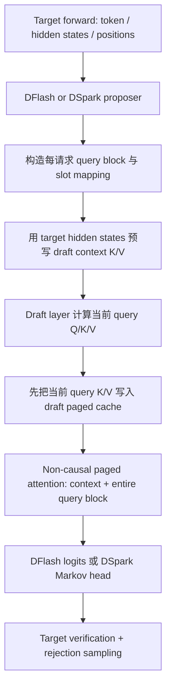

# DFlash/DSpark 在 Ascend 310P 上的适配分析

> 本文范围固定为 **Qwen3/Qwen3.6 dense target + Qwen3 DFlash/DSpark drafter + Model Runner V1**。
>
> - 目标设备：Ascend 310P；下文不再区分“310”和“310P”
> - 工作分支：`dflash_dspark_310_adapt`
> - vLLM 基线：`9459fc647105f10f754697b3bf136d194564d603`
> - vLLM Ascend 基线：`c0d41984a9b13eb531916a4e0533f4088e312d0d`
> - Ascend_Ops/ADN 基线：`914fa8d9d18e87d2b26031292537a136150eb413`
> - 当前产物：适配分析与实施设计；尚未提交功能代码

## 1. 结论摘要

当前 vLLM/vLLM Ascend 上游已经具备 DFlash 和 DSpark 的 A2/A3 适配，MRV1 中的 proposer、Qwen3 draft
model、context KV 预写入、target verification 和 rejection sampling 主流程都可复用。310P 不能直接复用的部分集中在
Triton、draft attention、310P patch 路由以及 hybrid KV-cache group 处理。

结合 `Ascend_Ops` 中 `adn_fused_infer_attention` 的 Python/PTA、host tiling、AscendC kernel 和 ATK 用例，可以把
attention 侧结论收敛为：

1. **`attn_mask=None` 确实是 non-causal/full attention。** Host 将空 mask 映射为 `NO_MASK`，kernel 在该模式下既不
   搬运 mask，也不向 score 加 mask；每个 query row 都能访问 `actual_seq_lengths_kv[b]` 范围内的全部 KV。
2. **ADN 与 310P paged KV cache 的 shape/address 合同结构兼容。** `kv_cache[0]` 和 `kv_cache[1]` 已经分别是 ADN
   要求的 rank-4 NZ cache，首选方案是直接传入，不做 gather 或 dense materialize；但 vLLM 的 NZ 分配描述符与
   `_npu_reshape_and_cache` 写入结果仍需一次 ADN 端到端真机 smoke test，才能把“可直读”正式闭环。
3. **ADN 的 Python ABI 已明确。** 它返回单个新分配 Tensor，没有 `out=` 参数；必须显式传 `inner_precise=2`，并保持
   `force_call=False`。
4. **最大的数据协议陷阱是 q-len。** 910 FIA 常用 cumulative query endpoint，而 ADN 要每个 request 的原始 query
   长度。对 ragged batch，误传不会只是精度偏差，而会直接造成 batch/token 划分错误。
5. **ADN 本身没有 910 FIA 的 `q_len <= 16` 限制。** 它按 `head_dim` 使用 16 或 32 的 query step，较长 query 会继续
   分块；当前 builder 中的 `decode_threshold <= 16` 是继承自 910 FIA 的约束。

因此，ADN attention adapter 是可实现项，不再是 go/no-go 风险。310P MRV1 的主要 P0 改动为：

- 用无 Triton 的实现替换 DFlash/DSpark 输入展开 kernel；
- 在 310P attention backend 中精确地把 non-causal parallel draft 路由到 ADN；
- 正确生成 raw q-lens、总 KV lengths、draft group block table 和真实 kernel block size；
- 在 310P 加载 DFlash/DSpark patch，并修正 context K RoPE 的 out-of-place 返回值；
- 修正 Qwen3.6 hybrid target 下 drafter KV group/block-size 选择；
- 固定包含 MRV1 DSpark 的 vLLM 版本，并在无 Triton 环境关闭 qknorm+RoPE Triton fusion。

建议第一阶段完成 **MRV1 eager correctness**，再单独验证 MRV1 ACLGraph。本文不讨论 MRV2、MoE、MLA、
DeepSeek-V4、Gemma、GLM、多模态和 mixed-SWA/full-attention drafter。

## 2. 精确支持范围

### 2.1 本期包含

| 维度 | 本期范围 |
| --- | --- |
| hardware | Ascend 310P |
| runner | vLLM Model Runner V1 |
| target | Qwen3 dense；Qwen3.6 dense hybrid target |
| drafter | Qwen3 DFlash；Qwen3 DSpark |
| draft attention | 所有 draft attention layer 均为 non-causal full attention |
| draft Q/K/V 与 KV cache | FP16 |
| attention layout | TND query + NZ paged KV cache |
| execution | eager 为首个完成门槛；ACLGraph 后续验证 |
| sampling | greedy 先完成；random sampling 在正确性闭环后开放 |

Qwen3.6 虽然是 dense model，但 target 是 GDN + full-attention 的 hybrid 架构。本文所说的“Qwen3.6
适配”是让该 target 使用独立的 Qwen3 DFlash/DSpark drafter；ADN 只执行 drafter 新增的 non-causal attention，不替换
target 的 GDN 或 causal full attention。

### 2.2 明确不包含

- MRV2 及 MRV2 full graph；
- mixed sliding-window/full-attention DFlash drafter；
- Qwen3/Qwen3.6 MoE、VL、多模态和 M-RoPE drafter；
- BF16/INT8/C8 draft KV cache；
- MLA、稀疏 attention、DeepSeek-V4 DSpark；
- PCP、DCP、PP、KV transfer 和 PD 分离；
- 将 ADN 替换成 310P 的通用 attention backend。

这些边界是 feature gate，不应依赖“当前 checkpoint 恰好没触发”来隐式满足。

## 3. 910/A2/A3 上游方案及 MRV1 数据流

### 3.1 已合入的上游能力

vLLM Ascend 当前 main 已包含：

| 能力 | 代表提交 | MRV1 可复用内容 |
| --- | --- | --- |
| DFlash 初始适配 | `36b1e0406` | proposer、Qwen3 patch、non-causal draft metadata |
| MRV1 DSpark | `41ff81e1a` | DSpark proposer、Markov head 流程 |
| reduced sampling 修复 | `5b329d545` | draft/target vocab remap 与 sampling |
| 310P spec 通用修复 | `f924703d7` | 310P runner、slot mapping、rejection fallback |

MRV2 相关提交存在，但不属于本文实现基线。

### 3.2 DFlash/DSpark MRV1 调用链



关键顺序是：ADN 被调用前，context K/V 和当前 query block 的 K/V 都必须已经进入同一份 paged cache。当前通用
attention `forward()` 会在 `forward_impl()` 前调用 `reshape_and_cache()`，所以接入点应放在 310P
`forward_impl()` 中，而不是绕过外层 `forward()`。

### 3.3 DFlash 与 DSpark 的输入差异

令 speculative token 数为 `K`：

| 项目 | DFlash | DSpark |
| --- | --- | --- |
| 每请求 query 数 | `K + 1` | `K` |
| 第一个 query token | target bonus/next token | Markov seed/next token |
| 其余 query token | mask token | mask token |
| backbone attention | context + 整个 query block，non-causal | context + 整个 query block，non-causal |
| sample positions | 跳过 anchor，取后续 `K` 个位置 | 从 anchor 起取 `K` 个位置 |
| 后处理 | 直接产生并行 draft logits | 顺序执行 Markov transition bias |

310P 的 input helper 必须保留这些差异，尤其不能把 DSpark 简化成 query 数不同的 DFlash。

## 4. ADN fused infer attention 已确认合同

### 4.1 `attn_mask=None` 的 non-causal 证据链

结论不是从 API 名称推断，而是由 host、kernel 和测试三层源码共同确认：

1. `adn_fused_infer_attention_tiling.cc` 的 `ParseMask()` 在 `attn_mask` 为空时设置 `NO_MASK=0`；非空时才进入
   compressed-mask 模式。
2. `unpad_paged_attention_decoder.h` 只有在 `maskType != 0` 时才搬运 mask。
3. 同一 kernel 也只有在 `maskType != 0` 时才把 mask 加到 attention score。
4. kernel 仍会计算 causal compressed-mask 的行偏移，但 `NO_MASK` 分支不会消费该偏移。
5. `atk_test/fia_common.py` 将 no-mask golden 明确定义为
   `softmax(QK^T * scale) V`，没有逐 query row 的 causal 截断。

所以，对 DFlash/DSpark 应固定：

```python
attn_mask = None
```

此时每个 query row 都访问该 request 的 `[0, actual_seq_lengths_kv[b])`。这正好覆盖 context 与当前完整 query
block。不能传 310P split-fuse 的 compressed causal mask，也不应生成一个“全零 causal mask”来模拟 non-causal。

Ascend_Ops 已定义四个 no-mask ATK case：

- TND，head_dim 128 / block_size 128；
- BSND，head_dim 128 / block_size 128；
- TND，head_dim 256 / block_size 64；
- BSND，head_dim 256 / block_size 64。

这些文件证明已有测试覆盖设计，但仓库没有保存本次硬件运行结果。因此本文只声称“源码实现和 ATK case 已覆盖”，不声称
“当前环境已经真机通过”。

### 4.2 精确 Python ABI

公开 wrapper 位于：

```text
Ascend_Ops/custom_pta/adn_custom_ops/adn_fused_infer_attention.py
```

核心签名为：

```python
adn_fused_infer_attention(
    query,
    key,
    value,
    attn_mask=None,
    actual_seq_lengths_q=None,
    actual_seq_lengths_kv=None,
    dequant_scale1=None,
    quant_scale1=None,
    dequant_scale2=None,
    quant_scale2=None,
    quant_offset2=None,
    antiquant_scale=None,
    antiquant_offset=None,
    block_table=None,
    kv_padding_size=None,
    num_heads=1,
    scale_value=1.0,
    input_layout="BSH",
    num_key_value_heads=0,
    block_size=0,
    inner_precise=1,
    force_call=False,
)
```

310P active path 的注意事项：

- Python wrapper 的 `key`、`value` 参数是单 Tensor；wrapper 内部才包装为 `[key]`、`[value]`。
- 底层 schema 的 lengths 是 `SymInt[]?`，应传 Python `list[int]`，不是 NPU Tensor。
- 返回值是单个 Tensor，shape 与 query 相同；不是 `(attention_out, softmax_lse)` tuple。
- PTA 会新分配 output；当前接口没有 `out=`。
- 必须显式传 `inner_precise=2`，否则不会进入当前 310P custom path。
- `force_call=True` 会绕回 `torch_npu.npu_incre_flash_attention`，310P adapter 必须保持 `False`。
- API 没有 `causal` 或 `sparse_mode` 参数；因果语义由 mask 是否为空决定。
- 必须显式传真实的 `num_key_value_heads`；默认 0 会破坏 Qwen GQA 的 cache 寻址。

### 4.3 Tensor、layout 与属性合同

| 参数 | 310P ADN 合同 | MRV1 映射 |
| --- | --- | --- |
| query | FP16 TND `[sum(q_lens), Nq, D]` | `query[:num_actual_tokens]` reshape 为 TND |
| key | FP16 NZ `[P, Nkv*D/16, Bs, 16]` | `self.key_cache` 直接传入 |
| value | 与 key 相同 | `self.value_cache` 直接传入 |
| output | 与 query shape/dtype 相同 | copy 到 vLLM 预分配 output slice |
| attn_mask | `None` | 固定 `None`，表示 non-causal |
| q lengths | `list[int]`，每请求 raw q-len | 310P `query_lens_cpu` |
| KV lengths | `list[int]`，每请求总 KV-len | `attn_metadata.seq_lens_list` |
| block_table | NPU INT32 `[B, max_blocks]` | draft KV group 的 `block_tables` |
| num_heads | local query head 数 | `self.num_heads` |
| num_key_value_heads | local KV head 数 | `self.num_kv_heads` |
| block_size | cache 物理 page token 数 | `self.key_cache.shape[-2]` |
| scale_value | attention scale | `self.scale` |
| input_layout | `"TND"` | 固定 `"TND"` |
| inner_precise | `2` | 固定 `2` |

### 4.4 Paged NZ cache 的结构兼容性与真机门槛

310P backend 分配的整体 cache shape 是：

```text
[2, P, Nkv * D / 16, block_size, 16]
```

拆分后：

```text
key_cache   = kv_cache[0]  # [P, Nkv * D / 16, block_size, 16]
value_cache = kv_cache[1]  # [P, Nkv * D / 16, block_size, 16]
```

这与 ADN 的 K/V 逻辑 shape 和地址展开公式一致。ADN kernel 的逻辑寻址为：

```text
base = physical_page * block_size * Nkv * D
     + kv_head * block_size * D
```

`block_table[b, logical_page]` 提供实际读取的 `physical_page`。310P block table 在 physical KV block 被拆成 128/64
token 的 kernel page 后，也会把 block id 转成同一逻辑 page 空间。因此 adapter 的首选实现应直接传 draft group 的
block table 与 cache，不应预先增加以下中间层：

- NZ -> ND 转换；
- 按 request gather 成 dense K/V；
- context/query K/V 重新拼接；
- 为 ADN 复制第二份 cache。

这里还不能仅凭 shape 宣布存储兼容已闭环：vLLM 通过 `ACL_FORMAT_FRACTAL_NZ` 分配 cache，并由
`_npu_reshape_and_cache` 写入；Ascend_Ops 示例则显式 reshape/permute 后构造 NZ 物理 Tensor，同时还提供独立的
`adn_reshape_and_cache_nz`。Phase 0 必须用 vLLM 原生写入路径填充定向 page/slot，再让 ADN 读取并与 golden 对比。
若该测试失败，先定位 storage descriptor 或 writer layout 差异；repack 只作为诊断或兜底方案，不应成为默认热路径。

仍建议在 adapter 中补全 shape guard，因为 ADN host 当前主要检查 rank 和末维 16，没有完整检查第二、三维：

```text
key_cache.ndim == value_cache.ndim == 4
key_cache.shape == value_cache.shape
key_cache.shape[-1] == 16
key_cache.shape[-2] == block_size
key_cache.shape[1] == num_kv_heads * head_dim // 16
```

### 4.5 Length 语义：最重要的 P0 陷阱

ADN 的 `actual_seq_lengths_q` 是每请求的原始长度。以 ragged batch 为例：

```text
raw q-lens:             [2, 3, 1]
TND cumulative endpoint:[2, 5, 6]
```

ADN 必须收到前者。它会在 kernel 内部自行累加 q-len，得到每个 request 在 TND query 中的起始 offset，并校验：

```text
len(actual_seq_lengths_q) == batch_size
sum(actual_seq_lengths_q) == query.shape[0]
```

当前通用 `AscendMetadata.actual_seq_lengths_q` 来自 `query_start_loc_cpu[1:]`，值是 cumulative endpoint，不能直接
传给 ADN。310P builder 已经附加了差分后的 host tensor：

```python
q_lens_tensor = get_query_lens_cpu(attn_metadata)
q_lens = q_lens_tensor.tolist()
```

对当前 proposer：

```text
DFlash q_lens = [K + 1] * B
DSpark q_lens = [K] * B
```

`actual_seq_lengths_kv` 是每请求本轮可读的总 KV 长度，**包含当前 query block**。DFlash/DSpark proposer 已把它更新为：

```text
effective_history_len + q_len
```

其中 `effective_history_len` 已扣除上一轮 rejected tail。adapter 应使用 builder 已生成的
`attn_metadata.seq_lens_list`，避免在每层 attention forward 中对 NPU `seq_lens` 调 `.tolist()` 引入重复同步。

建议 310P builder 再缓存一次 Python raw q-len list，供同一步所有 draft layer 共享；这属于性能优化，不是 correctness
前提。

### 4.6 Head、block 与 dtype 限制

当前 active custom path 的源码限制为：

- query/K/V/output 为 FP16；
- `0 < head_dim <= 256`；
- `block_size > 0` 且是 16 的倍数；
- `head_dim * block_size <= 16384`；
- `0 < Nkv <= Nq`、`Nq % Nkv == 0`，且当前无 RoPE 融合的 ADN 路径要求 `Nq / Nkv <= 64`；
- NZ cache 要求 `Nkv * head_dim` 可按 16 对齐；
- 不传 quant/dequant/antiquant/KV-padding 参数。

已定义的主要测试组合是：

```text
D=128, block_size=128
D=256, block_size=64
```

这正好对应 310P backend 当前 `[128, 64]` 的 kernel block-size 选择，但不能根据模型名字硬编码。adapter 和 input helper
必须读取 draft cache/block table 的实际 block size。

### 4.7 ADN 没有 `q_len <= 16` 限制

ADN host 根据 head_dim 设置 query step：

```text
D == 256: q_step = 16
D != 256: q_step = 32
```

较长 query 会被拆成多个 q block，task 数按 `ceil(q_len / q_step)` 计算。当前
`AscendAttentionMetadataBuilder` 中的 `decode_threshold <= 16` 断言来自 910
`npu_fused_infer_attention_score`，不是 ADN kernel 的限制。

本期常见的 DFlash K=8 和 DSpark K=7 不会触发该断言。若要支持更大的 checkpoint block，应在 310P builder 中解耦该
FIA 限制，同时回归 batch classification；不能只删除 assert。

### 4.8 图能力与 package 依赖

ADN 已实现：

- `@torch._dynamo.allow_in_graph`；
- Meta implementation；
- TorchAir FX -> GE converter；
- `torch.compile`/TorchAir 示例。

但这些不能证明 vLLM MRV1 的 ACLGraph capture/replay 已可用：

- converter 会把 Python length list 转成 GE Const；
- PTA 每次动态分配 output；
- 尚无 `torch.npu.NPUGraph` 下动态 batch/length replay 的结果；
- 当前 Ascend_Ops 示例只覆盖 TorchAir 图构建，不等价于 vLLM drafter graph。

另外，`adn_custom_ops/__init__.py` 顶层直接导入 `torchair`。即使只跑 eager，目标镜像也必须能同时导入
`adn_custom_ops_lib` 和 `torchair`。因此 ADN 应 lazy import，但 feature 被启用时必须 fail fast，不能静默回退到 causal
split-fuse attention。

## 5. 310P 当前缺口与适配设计

### 5.1 P0：DFlash/DSpark 输入展开无条件依赖 Triton

当前两个 proposer 都从以下模块导入并直接调用 Triton kernel：

```text
vllm_ascend.ops.triton.spec_decode.utils
copy_and_expand_dflash_and_dspark_inputs_kernel_single_grid
```

310P 无 Triton；而 `_310p/spec_decode/llm_base_proposer_310.py` 只覆盖 proposer 基类的一部分流程。DFlash/DSpark
override 了 `set_inputs_first_pass()`，所以现有 310P patch 不会替换该 kernel。

建议新增：

```text
vllm_ascend/_310p/spec_decode/parallel_drafting_inputs.py
```

其输出必须逐项等价于 Triton 版本：

1. 复制完整的 context positions 和 context slot-mapping buffers；
2. 用 `num_rejected_tokens` 计算 `valid_ctx_end`/`effective_seq_len`，让 rejected tail 不再属于本轮有效 context，并让
   新 query slot 覆盖被拒绝的位置；不需要先物理压缩或删除原 buffer tail；
3. 生成 `K+1` 或 `K` 个连续 query positions；
4. 使用 **draft KV group 的实际 kernel block size** 计算 query slot mapping；
5. 写入 bonus/seed token 和 mask token；
6. 分别生成 DFlash 与 DSpark 的 sampling indices；
7. 更新 query start locations、raw q-lens、总 KV lengths 和 `num_actual_tokens`。

首选实现是 PyTorch NPU vectorized gather/index/copy，CPU/NumPy 版本作为 golden。若 310P 不支持其中某个必要 tensor op，
再把完整输入展开逻辑实现成小型 AscendC custom op。

`Ascend_Ops` 中的 `adn_expand` 只能按 cumulative segment 展开单个 value，并替换 sentinel。它不能计算 context/query
positions、paged slot mapping、rejected tail 和 DFlash/DSpark 不同的 sampling indices，因此不能单独替代现有 Triton
kernel。

### 5.2 P0：把 non-causal parallel draft 精确路由到 ADN

当前 `AscendAttentionBackendImpl310.forward_impl()` 将 `ChunkedPrefill`、`PrefillCacheHit` 和
`SpecDecoding` 都路由到 causal split-fuse。DFlash/DSpark 则设置：

```text
attn_state = ChunkedPrefill
causal = False
attn_mask = None
```

所以现状会静默得到 causal 的错误结果。

建议在现有 split-fuse 分支之前增加窄路由：

```python
spec_config = self.vllm_config.speculative_config
is_parallel_draft = (
    _EXTRA_CTX.is_draft_model
    and spec_config is not None
    and spec_config.method in {"dflash", "dspark"}
)
if (
    is_parallel_draft
    and state == AscendAttentionState.ChunkedPrefill
    and not attn_metadata.causal
):
    return self.forward_parallel_draft_adn(query, attn_metadata, output)
```

初始化阶段仍应校验 speculative method 只能是 `dflash` 或 `dspark`。pooling non-causal 已在基类 `forward()` 提前处理，
普通 causal chunked prefill、MTP verify、decode 和 target attention 必须继续走原 310P 路径。

如果后续范围扩大，应把 `is_parallel_draft` 变成显式 metadata 字段；在本文窄范围内，
`draft context + ChunkedPrefill + causal=False` 已能唯一标识该路径。

### 5.3 推荐 ADN adapter

建议新增：

```text
vllm_ascend/_310p/attention/adn_fused_infer_attention.py
```

示意代码如下；最终实现需要使用仓库的日志、异常和 import 风格：

```python
def forward_parallel_draft_adn(self, query, attn_metadata, output):
    import adn_custom_ops

    num_tokens = int(attn_metadata.num_actual_tokens)
    query_tnd = query[:num_tokens].reshape(
        num_tokens,
        self.num_heads,
        self.head_size,
    )

    q_lens_tensor = get_query_lens_cpu(attn_metadata)
    if q_lens_tensor is None:
        raise RuntimeError("ADN requires raw per-request query lengths")
    q_lens = q_lens_tensor.tolist()
    kv_lens = attn_metadata.seq_lens_list

    key_cache = self.key_cache
    value_cache = self.value_cache
    block_size = key_cache.shape[-2]

    adn_out = adn_custom_ops.adn_fused_infer_attention(
        query=query_tnd,
        key=key_cache,
        value=value_cache,
        attn_mask=None,
        actual_seq_lengths_q=q_lens,
        actual_seq_lengths_kv=kv_lens,
        block_table=attn_metadata.block_tables[: len(q_lens)],
        num_heads=self.num_heads,
        num_key_value_heads=self.num_kv_heads,
        block_size=block_size,
        input_layout="TND",
        scale_value=self.scale,
        inner_precise=2,
        force_call=False,
    )

    output_slice = output[:num_tokens]
    output_slice.copy_(adn_out.reshape_as(output_slice))
    return output
```

adapter 调用前必须校验：

- `sum(q_lens) == num_tokens`；
- `len(q_lens) == len(kv_lens) == block_table.shape[0]`；
- `kv_lens[b] >= q_lens[b] > 0`；
- Q/cache dtype 都是 FP16；
- cache shape 与本 rank 的 `Nkv`、`D`、`block_size` 匹配；
- block table 是 NPU INT32；
- 所有 active block-table entry 对应的 physical page id 均满足
  `0 <= physical_page_id < key_cache.shape[0]`。

最后一项全量检查不应放在每层热路径，可在 debug/test 模式执行。

ADN 暂无 `out=`，MVP 必然多一次 output copy。若 profiling 证明该 copy 明显影响收益，再考虑给 PTA 增加 out/in-place ABI；
这不是首轮 correctness 的前置条件。

### 5.4 metadata 与 mask

现有 DFlash/DSpark proposer 在构造 common metadata 时设置 `causal=False`、`attn_mask=None`，并且通用 proposer 在
builder 返回后再次把 non-causal metadata 的 mask 清空。因此当前流程不需要为了 correctness 重写整个
`AttentionMaskBuilder310`。

仍应确保：

- ADN adapter 不读取 `attn_metadata.attn_mask`，而是固定传 `None`；
- 310P builder 保留 `query_lens_cpu`；
- eager 中使用 `seq_lens_list`，不在每层重新 D2H；
- graph capture metadata 也能提供 raw q-lens，而不是 cumulative endpoint；
- 可选地避免为 non-causal draft 获取 compressed split-fuse mask，减少无意义工作。

### 5.5 P0：310P 必须加载两个 Qwen3 patch

`vllm_ascend/patch/worker/__init__.py` 当前只在 `not is_310p()` 时加载：

- `patch_qwen3_dflash`：context hidden states -> per-layer K/V -> draft cache；
- `patch_qwen3_dspark`：从 DSpark checkpoint 顶层配置读取 `mask_token_id`。

310P 仅加载 `patch_idex_310`，所以应把上述两个 patch 移入 310P 可用路径，并为其设备差异增加 UT。

不能原样启用当前 DFlash patch。该 patch 调用 RoPE 后忽略返回值，依赖 in-place 修改：

```python
self.layers[0].self_attn.rotary_emb(
    positions_repeated,
    all_k_flat,
    tmpv,
)
```

310P `AscendRotaryEmbedding310` 的有效路径返回新的 `(query, key)` Tensor。由于 patch 把待旋转 K 放在 query 参数位置，
应显式接收第一个返回值：

```python
all_k_flat, _ = self.layers[0].self_attn.rotary_emb(
    positions_repeated,
    all_k_flat,
    tmpv,
)
```

随后才能把 `all_k_flat` 写入 cache。必须增加 out-of-place RoPE mock 测试，否则该问题会表现为 acceptance 下降，而不是
明显异常。

### 5.6 P0：Qwen3.6 hybrid KV group 与 block size

Qwen3 target 通常只有 full-attention KV spec；Qwen3.6 dense target 至少包含 GDN state group 和 target full-attention
group。加载 drafter 后，draft attention layer 会被分配到一个 attention KV group：它可能是独立 group，也可能进入同规格的
`UniformTypeKVCacheSpecs` group，但无论哪种情况都不能假定其 `kv_cache_gid == 0`。

当前 `NPUModelRunner.initialize_kv_cache()` 只把 `self.kernel_block_sizes[0]` 传给 drafter：

```python
block_size = self.kernel_block_sizes[0]
self.drafter.initialize_attn_backend(kv_cache_config, block_size)
```

上游 drafter API 的语义却是“每个 KV group 一个 kernel block size”，并会在确定 `kv_cache_gid` 后索引该列表。Qwen3.6
下传 group 0 会导致 draft builder 获得 `None` 或错误 block size。

建议传完整的 per-group **实际已选中** size。`may_reinitialize_input_batch()` 已在 drafter 初始化前创建各 group 的
`BlockTable`，因此直接读取其最终选择结果，避免假设候选列表第一项一定被采用：

```python
selected_kernel_block_sizes = [
    self.input_batch.block_table[gid].block_size
    for gid in range(len(kv_cache_config.kv_cache_groups))
]
self.drafter.initialize_attn_backend(
    kv_cache_config,
    selected_kernel_block_sizes,
)
```

另一个问题是 `AscendSpecDecodeBaseProposer.load_model()` 当前把 `self.kernel_block_size` 固定为 backend 支持列表首项
128。若 draft `head_dim=256`，310P 实际 cache 会选择 block size 64。DFlash/DSpark input helper 若仍用 128，会生成错误
slot mapping。

运行期应以实际 draft group block table/cache 为准：

```python
draft_block_table = runner.input_batch.block_table[self.kv_cache_gid]
kernel_block_size = draft_block_table.block_size
```

ADN 则从 `key_cache.shape[-2]` 读取相同值，并断言两者一致。Qwen3.6/Qwen3Next-style target 的 full-attention
head_dim 常见为 256，但独立 Qwen3 drafter 的 head_dim 可能不同；feature gate 必须读取 draft checkpoint/AttentionSpec，
不能根据 target 模型名硬编码。

### 5.7 P0：Qwen3.6 dtype 继承与 FP16 门槛

ADN 当前 active custom path 只支持 FP16。vLLM 创建 draft `ModelConfig` 时会继承 target model 的 `dtype`，因此
“draft checkpoint 是 Qwen3”并不意味着 draft Q/K/V 和 cache 自动成为 FP16。若 Qwen3.6 target 以 BF16 运行，当前
drafter 很可能也会生成 BF16 attention Tensor，不能直接送入 ADN。

一期必须选择并验证以下策略之一：

1. MVP 固定 target/draft 的实际 attention Q/K/V 与 draft cache 为 FP16，例如使用已验证的 FP16 启动配置；
2. 若必须保留 BF16 target，则实现独立的 draft dtype/cache，或为 ADN 增加 BF16 支持。

本文采用第一种，第二种不在一期范围内。启动 gate 应读取 draft `ModelConfig.dtype`，并在首次绑定 cache 后核对真实
query/K/V/cache dtype；不能只检查 target 权重格式或 checkpoint 名。BF16 场景必须明确拒绝启动，不能静默 cast 整份
paged cache，因为这会引入额外内存、写入路径和数值语义。

### 5.8 P0：版本、MRV1 与无 Triton 配置

当前 `Dockerfile.310p` 默认 `VLLM_TAG=v0.24.0`，而仓库 DSpark E2E 明确说明该社区版本尚未包含 DSpark。功能分支基于
当前 vLLM main API，310P 镜像必须固定到同一验证 commit 或包含等价 backport 的版本。

建议首轮启动显式设置：

```text
VLLM_USE_V2_MODEL_RUNNER=0
enforce_eager=true
ascend_compilation_config.fuse_qknorm_rope=false
```

Ascend 已 patch `use_v2_model_runner`，默认不因 DSpark 强制切到 MRV2；但显式配置能防止环境差异。`fuse_qknorm_rope`
当前默认开启，而其实现可能路由到 Triton `qkv_rmsnorm_rope`，无 Triton 环境必须关闭或由 310P capability gate 自动关闭。

### 5.9 DSpark Markov head 与 sampling

DSpark attention 与 DFlash 共用 non-causal backbone，但额外依赖：

- seed token buffer；
- `mask_token_id`；
- `markov_w1` embedding 和 `markov_w2` vocab bias；
- draft-vocab -> target-vocab remap；
- 每个 block 内按位置顺序的采样。

310P 已有无 Triton rejection sampler，因此不需要重写 target verification。仍需测试：

- checkpoint 的 `mask_token_id` row 存在；
- full-vocab 与 reduced-vocab checkpoint；
- `enable_reduce_sample` 开关；
- DFlash 与 DSpark 的 token indices 不混用；
- greedy 多轮 rejection 后 seed/context 对齐。

## 6. 建议代码改动清单

| 优先级 | 文件/模块 | 改动 |
| --- | --- | --- |
| P0 | `_310p/spec_decode/parallel_drafting_inputs.py` | 新增无 Triton DFlash/DSpark 输入展开 |
| P0 | `spec_decode/dflash_proposer.py` | 按设备 dispatch input helper，310P 不调用 Triton |
| P0 | `spec_decode/dspark_proposer.py` | 同上，并保留 DSpark sampling-index 语义 |
| P0 | `_310p/attention/adn_fused_infer_attention.py` | lazy import、ABI/shape guard、ADN 调用与 output copy |
| P0 | `_310p/attention/attention_v1.py` | non-causal draft 在 split-fuse 前路由 ADN |
| P0 | `_310p/attention/metadata_builder.py` | 保留/缓存 raw q-lens；必要时解耦 FIA q-len 限制 |
| P0 | `patch/worker/__init__.py` | 310P 加载 Qwen3 DFlash/DSpark patch |
| P0 | `patch/worker/patch_qwen3_dflash.py` | 接收 310P out-of-place RoPE 返回值 |
| P0 | `worker/model_runner_v1.py` | 向 drafter 传完整 per-group kernel block sizes |
| P0 | `spec_decode/llm_base_proposer.py` | 使用 draft group 的真实 block size，而非固定 128 |
| P0 | draft model/capability validation | 校验继承后的 draft dtype 与实际 Q/K/V/cache 均为 FP16 |
| P0 | 310P build/Docker | 固定 vLLM、CANN、torch-npu、ADN custom_opp/PTA 版本 |
| P0 | capability validation | MRV1、FP16、TND、head/block、ADN package、无 Triton gate |
| P1 | ACLGraph 相关模块 | 动态 lengths、output 地址和 replay 验证 |
| P1 | ADN PTA | profiling 后评估增加 `out=`，消除一次 copy |
| P1 | 310P builder | 支持大于 15 的 speculative K，并回归 batch classification |

设备差异应尽量收敛到 `_310p`；通用 proposer 只增加小型 dispatch seam，避免改变已工作的 A2/A3 路径。

## 7. Feature gate 建议

启动时应一次性验证并给出可操作错误信息：

| 检查项 | 允许值/行为 |
| --- | --- |
| device | 310P |
| runner | MRV1 |
| method | `dflash` 或 `dspark` |
| target | Qwen3 dense 或 Qwen3.6 dense hybrid |
| draft architecture | `DFlashDraftModel` 或 `Qwen3DSparkModel` |
| draft layer type | all full-attention、non-causal |
| draft query/K/V/cache dtype | 真实运行 dtype 均为 FP16；BF16 明确拒绝 |
| cache rank/layout | rank-4 K/V NZ page，末维 16 |
| head_dim | `0 < D <= 256` |
| GQA | `Nq % Nkv == 0` 且 `Nq / Nkv <= 64` |
| NZ alignment | `Nkv * D` 可按 16 对齐 |
| block size | 16 的倍数且 `D * block_size <= 16384` |
| graph | MVP 必须 eager；ACLGraph 单独开放 |
| Triton | 允许未安装；任何 DFlash/DSpark 路径不得触达 Triton |
| qknorm+RoPE fusion | 无 Triton时关闭 |
| ADN package | OPP、PTA、torchair 都可加载，且小型 smoke test 成功 |

若任一 attention capability 不满足，应拒绝启动 DFlash/DSpark；绝不能回退到 310P causal split-fuse，因为那会产生静默错误。
target 识别应基于 `model_type`/`architectures`、dense/MoE 属性和 KV spec，不应硬编码 checkpoint 路径或模型商品名；
Qwen3.6 hybrid target 可以进入 gate，但 ADN 仍只能绑定独立 drafter 所属的 attention group。

## 8. 测试与验证方案

### 8.1 CPU/Mock 单元测试

#### 无 Triton input helper

用现有 Triton kernel 语义写纯 Python reference，至少覆盖：

- DFlash K+1 与 DSpark K；
- batch 1 和 ragged batch；
- 有/无 rejected tail；
- context 跨页；
- query 跨 64/128 page 边界；
- 非连续 physical block ids；
- bonus/seed、mask token 和 sample indices；
- `HAS_TRITON=False` 时模块导入和执行不触达 Triton。

#### ADN adapter mock

mock `adn_custom_ops.adn_fused_infer_attention`，精确断言：

- `attn_mask is None`；
- `inner_precise == 2` 且 `force_call is False`；
- q-len 使用 raw `[2, 3, 1]`，不是 cumulative `[2, 5, 6]`；
- KV-len 包含本轮 query；
- K/V cache 对象直接传入，没有 clone/gather；
- `num_key_value_heads`、scale、block size 和 draft group block table 正确；
- 单 Tensor 返回值按 output shape copy；
- causal prefill/decode、MTP 和 target attention 不调用 ADN。

#### Patch 与 hybrid group

- 用只返回新 Tensor、绝不原地写入的 RoPE mock，验证 context cache 使用旋转后的 K；
- 验证 DSpark 从顶层 config 读取 `mask_token_id`；
- 构造 group 0 为 GDN、后续 group 为 target/draft attention 的 Qwen3.6 配置；
- 验证 drafter 选择自己的 `kv_cache_gid`、block table 和 kernel block size；
- 覆盖 D=128/Bs=128 与 D=256/Bs=64。
- 验证 Qwen3.6 FP16 配置放行，继承为 BF16 的 draft 在启动阶段给出明确错误。

### 8.2 ADN 310P 单算子测试

先运行 Ascend_Ops 已有 TND no-mask ATK cases，再增加更贴近 DFlash/DSpark 的定向 case：

- B=1 与 ragged B>1；
- MHA、GQA、MQA；
- q-len 为 K、K+1，以及跨 q-step；
- 单页、多页、page tail；
- 非连续和乱序 physical block ids；
- FP16 SDPA/CPU golden 对比；
- current query K/V 已写 cache 后再调用；
- future-token dominance：让未来 query token 的 V 明显占优，确认较早 query 能看到它。

future-token dominance 是排除“结果看似合理但仍是 causal”的必要测试。

### 8.3 310P E2E

#### Qwen3 dense

- DFlash：checkpoint 推荐 K（常见 K=8）；
- DSpark：checkpoint block size（常见 K=7）；
- greedy、单请求、多请求；
- 多轮全接受、部分拒绝、全拒绝；
- context 长度覆盖 63/64/65 和 127/128/129；
- TP=1 起步，再验证目标部署所需 TP。

#### Qwen3.6 dense hybrid

- 使用与 target 匹配的 Qwen3 DFlash/DSpark checkpoint；
- 按 310P 内存需求使用 TP=2/TP=4，不把 TP=1 写成完成条件；
- 验证 target GDN/full-attention group 不经过 ADN；
- 验证 draft group 使用正确 cache/block table；
- 若 draft D=256，强制覆盖 Bs=64；
- 多请求与多轮 rejection。

#### 正确性指标

- greedy 下 speculative on/off 最终 token 序列一致；
- 每个 draft position 的 acceptance rate；
- 首个发生差异的 draft/verify 位置；
- ADN output 与 golden 的绝对/相对误差；
- context KV 和 query KV 的 page/slot 对齐；
- DSpark Markov seed 与各位置 token 对齐。

### 8.4 性能与内存

correctness 通过后记录：

- target-only 与 DFlash/DSpark 的吞吐、TPOT、平均 accepted tokens；
- no-Triton input prep、context KV precompute、ADN、output copy、Markov head 分段耗时；
- target cache、draft cache、hidden-state buffer、ADN workspace/临时 output 的内存；
- 不同 batch、context length 和 K 下的收益拐点。

若 output copy 成为主要瓶颈，再扩展 ADN PTA `out=`；不要在精度闭环前改算子 ABI。

## 9. 分阶段实施计划

### Phase 0：冻结环境并做 ADN smoke test

- 固定 vLLM/vLLM Ascend/Ascend_Ops/CANN/torch-npu/torchair 版本；
- 安装 ADN custom_opp 和 PTA；
- 跑 TND、FP16、no-mask、paged KV 小 case；
- 验证 D128/B128、D256/B64 与 ragged batch。
- 用 vLLM `_npu_reshape_and_cache` 写入非连续 page/slot，再由 ADN 读取并与 golden 对比。

退出条件：ADN 真机结果与 no-mask golden 对齐，并确认当前 vLLM NZ cache 的分配描述符和写入布局可直接读取。

### Phase 1：ADN adapter 与 dispatch

- 实现 lazy adapter 和严格 guard；
- 使用 raw q-lens/总 KV-lens；
- non-causal draft 路由 ADN；
- causal 310P attention 回归 UT。

退出条件：mock UT 全部通过，真机单层 future-token dominance 通过。

### Phase 2：无 Triton输入与 Qwen3 patch

- 实现 DFlash/DSpark input helper；
- 加载两个 Qwen3 patch；
- 修正 out-of-place RoPE；
- 禁用无 Triton qknorm+RoPE fusion。

退出条件：Qwen3 DFlash/DSpark eager 单请求 E2E 通过。

### Phase 3：batch、rejection 与 DSpark

- ragged batch；
- 多轮 rejection；
- reduced-vocab DSpark；
- greedy 完整回归，随后验证 random sampling。

退出条件：Qwen3 dense E2E 达到正确性与 acceptance 门槛。

### Phase 4：Qwen3.6 hybrid target

- 修复 per-group kernel block-size 传递；
- 验证 draft gid、block table 和 cache；
- 验证 target/draft 的 dtype 继承结果，首期仅放行真实 FP16 draft attention/cache；
- 覆盖 TP=2/TP=4 和 D256/B64；
- 确认 target hybrid attention 不回归。

退出条件：Qwen3.6 dense MRV1 eager E2E 通过。

### Phase 5：MRV1 ACLGraph

- 验证 ADN capture/replay；
- 处理 Python length const、output 动态分配和静态地址；
- 为 K/K+1、batch bucket 建立 graph key；
- 对比 eager 数值与性能。

该阶段仍是 MRV1，不扩展到 MRV2。

## 10. 风险台账

| 状态 | 风险/问题 | 结论或措施 |
| --- | --- | --- |
| 已闭环 | `None` 是否 non-causal | 是；host/kernel/ATK 三层源码确认 |
| 已闭环 | ADN Python signature | 已确认，返回单 Tensor、无 `out=` |
| 结构闭环 | 310P NZ cache shape/address | 与 ADN 合同一致，首选直接传入 |
| 已闭环 | ADN 是否限制 q<=16 | 不限制；按 16/32 q-step 分块 |
| 待真机 | vLLM NZ descriptor/writer 与 ADN 端到端读取 | `_npu_reshape_and_cache` page/slot 定向测试 |
| 待实现 | 无 Triton input expansion | PyTorch NPU helper；必要时 custom op |
| 待实现 | 310P RoPE out-of-place | 接收返回值并做 mock UT |
| 待实现 | Qwen3.6 draft KV group | 传完整 per-group size，运行期取真实 block size |
| 待验证 | Qwen3.6 draft dtype 继承 | 一期仅放行实际 FP16 Q/K/V/cache；BF16 fail fast |
| 待环境 | ADN OPP/PTA/torchair 版本 | 镜像固定并启动 smoke test |
| 待验证 | MRV1 ACLGraph | eager 后独立阶段验证 |
| 待评估 | ADN output copy 开销 | profiling 后决定是否扩 PTA ABI |
| 待验证 | 目标 checkpoint dtype/head/block | 启动 feature gate，不按模型名猜测 |
| 待验证 | DSpark reduced vocab/Markov sampling | 单测与 E2E 覆盖 |

## 11. 一期完成标准

只有同时满足以下条件，才能宣布本范围适配完成：

- 无 Triton 环境中 DFlash/DSpark 可加载并完整运行；
- 310P 已加载正确的 DFlash/DSpark patch，context K 使用旋转后的 Tensor；
- non-causal draft attention 只走 ADN，且始终传 `attn_mask=None`；
- causal target/prefill/decode/MTP 路径不回归；
- raw q-lens、总 KV-lens、block table、GQA 和 cache shape 有自动测试；
- vLLM 原生 cache writer -> ADN reader 的 page/slot 真机测试通过；
- ADN TND no-mask 真机精度与 future-token dominance 测试通过；
- Qwen3 dense DFlash 和 DSpark MRV1 eager E2E 通过；
- Qwen3.6 dense hybrid 的 draft dtype、KV group/block size 与 TP E2E 通过；
- greedy speculative on/off 最终输出一致，acceptance 达到 checkpoint 合理水平；
- 镜像固定了可复现的 vLLM/ADN/CANN/torch-npu/torchair 版本。

ACLGraph 不作为 eager MVP 的完成前提；若对外声明 graph 支持，则必须额外完成 Phase 5。

## 12. 参考源码

### 12.1 Ascend_Ops / ADN

- `skills/adn_fused_infer_attention/references/architecture.md`
- `skills/adn_fused_infer_attention/references/host-tiling.md`
- `skills/adn_fused_infer_attention/references/kernel-functions.md`
- `skills/adn_fused_infer_attention/references/development-guide.md`
- `custom_pta/adn_custom_ops/adn_fused_infer_attention.py`
- `custom_pta/adn_custom_ops/__init__.py`
- `custom_pta/csrc/registration.cpp`
- `custom_pta/csrc/adn_fused_infer_attention.cpp`
- `custom_opp/src/adn_opp/adn_fused_infer_attention/ophost/adn_fused_infer_attention_tiling.cc`
- `custom_opp/src/adn_opp/adn_fused_infer_attention/ophost/adn_fused_infer_attention_tiling_check.cc`
- `custom_opp/src/adn_opp/adn_fused_infer_attention/ophost/adn_fused_infer_attention_tiling_data.h`
- `custom_opp/src/adn_opp/adn_fused_infer_attention/unpad_paged_attention_decoder.h`
- `atk_test/fia_common.py`
- `atk_test/adn_fia_tnd_nocausal_hd128_bs128_api.py`
- `atk_test/adn_fia_tnd_nocausal_hd256_bs64_api.py`
- `example/adn_fused_infer_attention/aicc_run_adn_fia.py`

### 12.2 vLLM Ascend

- `vllm_ascend/spec_decode/dflash_proposer.py`
- `vllm_ascend/spec_decode/dspark_proposer.py`
- `vllm_ascend/spec_decode/llm_base_proposer.py`
- `vllm_ascend/attention/attention_v1.py`
- `vllm_ascend/_310p/attention/attention_v1.py`
- `vllm_ascend/_310p/attention/metadata_builder.py`
- `vllm_ascend/_310p/block_table.py`
- `vllm_ascend/_310p/model_runner_310p.py`
- `vllm_ascend/worker/model_runner_v1.py`
- `vllm_ascend/patch/worker/__init__.py`
- `vllm_ascend/patch/worker/patch_qwen3_dflash.py`
- `vllm_ascend/patch/worker/patch_qwen3_dspark.py`
- `vllm_ascend/_310p/ops/rotary_embedding.py`
- `Dockerfile.310p`

### 12.3 vLLM

- `vllm/model_executor/models/qwen3_dflash.py`
- `vllm/model_executor/models/qwen3_dspark.py`
- `vllm/v1/spec_decode/dflash.py`
- `vllm/v1/spec_decode/llm_base_proposer.py`
- `vllm/config/speculative.py`
- `vllm/config/vllm.py`
