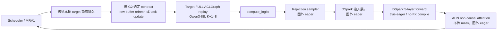

# Qwen3-8B + DSpark K7 在 Ascend 310P 上的 Target-only ACLGraph 适配计划

> **文档权威性：** 本文是 Qwen3-8B + DSpark K7 在 310P 上进入 ACLGraph
> 阶段后的规范性设计、实施顺序和验收依据。
>
> - [2026-07-22 eager 计划](2026-07-22-dflash-dspark-310p-qwen3-8b.md)
>   仍然是 eager 适配的权威文档；该阶段已经完成。
> - [HANDOFF.md](HANDOFF.md) 的日志、复现记录和已通过项目仍然有效，但其中关于
>   ACLGraph 根因和下一步的判断只作为历史证据；若与本文冲突，以本文为准。
> - `docs/source/developer_guide/Design_Documents/dflash_dspark_310p_adaptation_analysis.md`
> 仍是早期背景分析，不定义本阶段范围和完成标准。

**目标：** 仅适配以下场景：

- target：`Qwen/Qwen3-8B` dense；
- drafter：`deepseek-ai/dspark_qwen3_8b_block7`，K=7；
- Ascend 310P / Atlas 300I Duo；
- Model Runner V1；
- target 使用 `FULL_DECODE_ONLY` 的原生 ACLGraph；
- DSpark drafter 完全 eager；
- rejection sampler、输入展开和 ADN attention 都在图外 eager 执行。

本文不把“capture 成功”等价为“支持 ACLGraph”。只有本轮 runtime metadata
能按 G2 证明过的契约生效——固定地址 buffer 内容由 raw graph 直接读取，或显式
task update——且 replay 与 eager 结果一致，才算支持。

---

## 1. 结论先行

### 1.1 310P 支持的是哪一种图

310P 不应照搬 910/A2/A3 的整套图方案。

| 能力 | 310P 本阶段结论 |
| --- | --- |
| 原生 ACLGraph runtime | 使用 `torch.npu.NPUGraph` / `torch.npu.graph` |
| `npugraph_ex` | **显式关闭** |
| static kernel / SuperKernel | 不使用 |
| target FULL graph | 目标方案，但必须先通过 splitfuse replay-contract 门禁 |
| draft ACLGraph | 不做 |
| draft FX/torch.compile | P0 也关闭，确保是真正的 eager |
| ADN FIA 入图 | 不做；现有 ABI 不 graph-safe |

CANN 9.0 的 Runtime API 已把 Atlas inference product 列为 ACLGraph capture
支持产品，但该 API 仍标记为试用能力；旧版 CANN 8.5 的同一接口不支持 Atlas
inference product。因此，**实际 runtime/CANN 版本是功能门禁，不只是环境记录**：

- [CANN 9.0 `aclmdlRICaptureBegin` 支持矩阵](https://www.hiascend.com/document/detail/en/CANNCommunityEdition/900/API/runtimeapi/aclcppdevg_03_1782.html)
- [vLLM Ascend graph mode 指南](https://docs.vllm.ai/projects/ascend/en/main/user_guide/feature_guide/graph_mode.html)

官方 graph mode 指南明确指出 Atlas inference products 不支持
`enable_npugraph_ex`。上游 [PR #10874](https://github.com/vllm-project/vllm-ascend/pull/10874)
也已经在 310P 上关闭它。

### 1.2 当前卡住不是一个问题，而是两个设计问题

#### 问题 A：310P splitfuse 的 replay contract 尚未被证明

Qwen3-8B + DSpark K7 的 target verification 每请求一次处理 K+1=8 个 token：

```text
AscendAttentionState.SpecDecoding
  -> forward_chunked_prefill_310
  -> torch_npu._npu_paged_attention_splitfuse_v2
```

当前 `vllm_ascend/_310p/attention/attention_v1.py` 直接 capture 这个算子，
没有像 910 路径那样：

1. capture 时用 `graph_task_group_begin/end` 取得 task handle；
2. 保存 event、workspace 和可更新参数；
3. replay 前用 `graph_task_update_begin/end` 重新下发当前 attention 参数；
4. 用 update stream/event 保证 update 先于 replay。

这也不会由父类补上：通用
`attention/utils.py::using_paged_attention()` 在存在 `speculative_config` 时直接返回
`False`，Qwen3 dense 又不走 sinks/FIA 分支，因此继承来的
`AscendAttentionBackendImpl.update_graph_params()` 在这个场景会确定性空转。

但“没有 task update”本身还不能判错。CANN 的规则是条件式：**只有 captured task
或 task parameter 需要更新时**，才需要 TaskGrp/TaskUpdate。这里存在两个都合法、
但必须由 G2 实测判定的 contract：

```text
Path A: raw graph 每次直接读取固定地址 buffer 的新内容
Path B: raw graph 固化了 host/task 参数，replay 前显式 task update
```

官方 vLLM Ascend ACLGraph 设计文档说明，**某些** attention operator 需要
backend `update_graph_params()`，这时仅 capture 不足以正确 replay；它不能反向证明
所有 310P splitfuse 都必须走 Path B：

- [ACL Graph: Host-side attention parameter update](https://docs.vllm.ai/projects/ascend/en/main/developer_guide/Design_Documents/ACL_Graph.html#host-side-attention-parameter-update-for-full-graph-replay)
- [CANN task group/update 约束](https://www.hiascend.com/document/detail/en/CANNCommunityEdition/900/API/runtimeapi/aclcppdevg_03_1782.html)

现有材料**不能对 Path A / Path B 做概率排序**。两次复现已经稳定给出以下直接
观测：

- 首个已报告 AICore fault 是动态 `int64` Add bundle 的 `_223000000` variant；
- 故障 launch 记录为 `blockDim=1`、`tilingKey=0`、`argsSize=104`；
- 配套 JSON 的 compile bundle 声明 unknown-rank/dynamic shape、
  `_has_all_unknown=true`、`_is_const_shapes=false`、`opParaSize=152` 和
  32-byte global workspace；
- target-only/no-spec 的 `_npu_paged_attention` 图路径通过，而 speculative
  target 的 splitfuse 路径失败。

这些证据需要严格按边界解释：

1. JSON 顶层的 `blockDim=-1` 是 binary metadata 的默认/占位字段，不能把它当成本次
   launch 的运行时 blockDim；plog 中的 `blockDim=1` 才是本次 task 的直接观测。
2. `blockDim=1` 不能反推出 element 数量，也不能据此断言这个 Add 位于 attention
   内部或外部。
3. `tilingKey=0` 出现在 compile-info 的合法 key 空间中，不能单独视为脏值；现有材料
   也还不能解释它与 `_223000000` suffix 的映射关系。
4. `opParaSize=152`、32-byte workspace 和 launch `argsSize=104` 属于不同层次的
   字段；在 host/device ABI 未解析前，不能据此断言参数截断，也不能把
   `arg12=0xa5...` 钉死为 workspace、悬垂指针或特定 runtime poison。
5. 对全动态 compile family，陈旧/错误的 tiling 指针或内容**可以**进一步产生退化
   launch 和非法地址，因此“hard fault”并不能排除 Path B；反过来，dynamic metadata
   只证明这种机制可能存在，并不证明 stale TaskUpdate 就是根因。
6. 该 Add 可能来自 target graph 内的残差/RoPE lowering，也可能来自图外
   sampler/input expansion，或 ATB/算子内部子 task。在完成阶段同步和 dump/host.o
   映射前，不能按名字认调用点。

`BLOCK_DIM` 在 binary metadata 中当前只打印默认 `0xFFFFFFFF`、`FUNCTION_ENTRY` 才表示
TilingKey 的依据见
[AscendC `msobjdump` 字段说明](https://www.hiascend.com/document/detail/en/canncommercial/850/opdevg/Ascendcopdevg/atlas_ascendc_10_0103.html)。

因此先做 G0.5，把“target replay 还是后续图外阶段”和“draft compiled path 是否参与”
的歧义尽快结束；随后由 G2 单算子 probe 判定 raw replay 与 TaskUpdate 的正式 contract。
“暂不排序”只能是短暂诊断状态：若 G0.5 和 dump 映射仍无法给出下一条可证伪分支，
该轮结果应标为诊断不完整，而不是长期同时保留两套根因叙事。

#### 问题 B：当前 drafter 并不是真正 eager

`AscendDSparkProposer.__init__()` 在父类完成初始化之后才执行：

```python
self.use_cuda_graph = False
```

这只阻止 `_run_merged_draft` 被 ACLGraph 包装。父类决定
`maybe_eager_context` 时，`use_cuda_graph` 仍可能为 `True`；而在当前 310P TP4
配置下 `enable_sp=False`，原来的临时 `CompilationMode.NONE` context 也不会建立。

这里有两种需要拆开记录的配置：

1. 已知故障 E2E 未设置 speculative `enforce_eager`：父类初始化时
   `use_cuda_graph=True`，不会建立 eager context；
2. 本文最终 P0 CLI 设置 `enforce_eager=true`：此时 `use_cuda_graph=False`，但
   `enable_sp=False` 仍会让旧实现跳过 eager context。

现有故障日志中有第二次 `eagle_head` compile，证明 draft 初始化/首次执行路径仍产生
FX/torch.compile callable；日志本身不足以把 compile 的精确时刻钉在
`load_model()` 内。该 compiled draft callable 在 speculative step 中执行，但**没有被捕获
进 target ACLGraph**。它可能参与 buffer 生命周期/时序问题，现阶段不把它写成已证实
根因。下列两个概念必须分开：

```text
draft 不进 ACLGraph  !=  draft 完全 eager
```

上游已合并
[PR #12704](https://github.com/vllm-project/vllm-ascend/pull/12704)，用独立复制的
draft `CompilationConfig` 进入 `CompilationMode.NONE`，同时保留 target 原配置和必要
registry。当前功能分支尚未包含该修复。

P0 必须同时满足：

```text
draft use_cuda_graph = False
draft model creation/load 期间 CompilationMode = NONE
draft runtime 不持有 FX-compiled callable
draft runtime 不使用 ACLGraphWrapper
target CompilationConfig 不被 draft 原地修改
```

---

## 2. 仓库同步状态与开发基线

以下是 2026-07-25 本文定稿时重新 fetch 后的已审计快照。为了保留已经验证通过的
eager 基线和 nightly 镜像 ABI，没有把数百个上游提交直接合入当前功能分支。

| 仓库 | 当前开发 HEAD | 已检查的最新 upstream | 本次处理 |
| --- | --- | --- | --- |
| vllm | `752a3a504485790a2e8491cacbb35c137339ad34` | `d1a8ba63d9d2bb51ebf60dd5ea1463cf61c70cea` | fetch，仅对照 |
| vllm-ascend | `f7c460f6edfbce53e82739860f06c3da31f079b5` | `2b1ac612496e8306c6d7d95d175e93fad90057b1` | fetch，仅对照 |
| Ascend_Ops | `86f61cc0444fcc2052b81c27862da9ccae31d58a` | `origin/main` 同 HEAD | fast-forward |

当前开发分支：

```text
dflash_dspark_310p_adapt_20260723
```

当前 vllm-ascend 功能分支相对所检查的官方 main 快照有自己的 51 个提交，并落后
51 个提交。直接 merge 会同时改变 vLLM/main2main 依赖、torch_npu 预期和已经跑通的
eager 基线，不适合作为 ACLGraph 根因定位的第一步。

本阶段采用以下策略：

1. 保持当前可复现分支不动；
2. 只移植与本方案直接相关的最小上游修复，例如 #12704 的 config isolation；
3. 图路径跑通后，再单独创建 upstream integration 分支处理整体 rebase/merge；
4. 每次真机结果都记录镜像 digest、三个仓库 commit 和软件栈。

---

## 3. 上游实现和 PR 复盘

### 3.1 910/A2/A3 真正可借鉴的部分

910 路径可借鉴的是**运行契约**，不是具体 attention 算子：

```text
固定地址的 graph input/output
  + capture 时注册 attention task
  + replay 前刷新 task 参数
  + update stream/event 排序
  + 只用实际 BatchDescriptor 作为图 key
```

主线 `vllm_ascend/attention/attention_v1.py` 的 full graph attention 会保存：

- task handle；
- event；
- workspace；
- query/KV cache/block table/output 等固定地址 tensor；
- 每次 replay 会变化的 sequence metadata。

然后在 runner replay 前调用 backend `update_graph_params()`。310P runner 已经有
`_update_full_graph_params_if_needed()` 和 update-stream 等待骨架；缺的是
`splitfuse_v2` backend 的 capture/update 实现。

### 3.2 相关 PR 的有效结论

| PR | 与本方案的关系 | 结论 |
| --- | --- | --- |
| [#2128](https://github.com/vllm-project/vllm-ascend/pull/2128) | FULL_DECODE_ONLY 基础 | `ACLGraphWrapper` 假定 caller 保持 tensor 地址并更新内容 |
| [#10309](https://github.com/vllm-project/vllm-ascend/pull/10309) | 310P MTP graph 初始实现 | 引入“310P 直接 capture NPU op、不注册 task”的独立契约；这正是本次需重新验证的假设 |
| [#11408](https://github.com/vllm-project/vllm-ascend/pull/11408) | 310P MTP graph 修复 | 处理 dummy padding/GDN 等问题，不等价于 splitfuse task-update 支持 |
| [#11918](https://github.com/vllm-project/vllm-ascend/pull/11918) / [#11920](https://github.com/vllm-project/vllm-ascend/pull/11920) | 把 310P spec graph 从 MTP 扩到通用 method | #11918 是 main 实现，#11920 是 release backport；强制 spec capture 走 `SpecDecoding`/splitfuse，但只有单测，没有 target splitfuse graph E2E |
| [#11765](https://github.com/vllm-project/vllm-ascend/pull/11765) | Qwen/GLM DSpark MRV1 | 确认 K=7、target verify K+1；PR 最初只声明 EAGER/PIECEWISE |
| [#11431](https://github.com/vllm-project/vllm-ascend/pull/11431) | 当前 DSpark proposer | 明确 `DSpark runs eager only`，但只关闭 ACLGraph，不保证无 FX compile |
| [#12704](https://github.com/vllm-project/vllm-ascend/pull/12704) | eager draft config 隔离 | P0 借用其 config-copy helper；它原本修的是 PIECEWISE shared-config 问题，单独 cherry-pick 不会让当前 TP4 DSpark true eager |
| [#12777](https://github.com/vllm-project/vllm-ascend/pull/12777) | 最新 DSpark SP 修复 | 修的是 FlashComm/SP 下 MarkovHead shape；要求更多卡，不解决 310P splitfuse graph |
| [#10895](https://github.com/vllm-project/vllm-ascend/pull/10895) | FIA replay metadata | 证明 runtime KV length 若不刷新会产生 stale graph state |
| [#11774](https://github.com/vllm-project/vllm-ascend/pull/11774) | dummy capture slot mapping | 证明 capture 前残留 metadata 也属于 graph ABI |
| [#11895](https://github.com/vllm-project/vllm-ascend/pull/11895) / [#12017](https://github.com/vllm-project/vllm-ascend/pull/12017) | MRV2 DFlash/DSpark full graph | 只借鉴 actual descriptor 和 update-stream 管理；MRV2 和 draft graph 不进入本期 |
| [#12296](https://github.com/vllm-project/vllm-ascend/pull/12296)（open draft） | Qwen3-8B DSpark MRV1 FULL | 重点是把 drafter 也入图并拆分 K/K+1 dispatcher；代码仍用 Triton/FIA，未改 `_310p` attention，也未证明 310P target splitfuse replay contract |
| [#12414](https://github.com/vllm-project/vllm-ascend/pull/12414)（open） | GLM-5.2 DSpark full graph | PR 明确只覆盖 A2/A3、310P out of scope，且目标是 draft/context-KV graph |

截至所检查的官方 main `2b1ac6124`：

- `_310p/attention/attention_v1.py` 仍只有直接
  `_npu_paged_attention_splitfuse_v2` 调用；
- `_310p/` 下仍没有 `graph_task_group_begin`；
- 没有可直接 cherry-pick 的 310P splitfuse replay-contract 修复。

因此，不能把“官方已经修过 310P MTP full graph”外推为“DSpark K7 的 target
splitfuse full graph 已验证”。

---

## 4. 冻结范围

| 维度 | P0 唯一支持值 |
| --- | --- |
| Target | `Qwen/Qwen3-8B`，dense `Qwen3ForCausalLM` |
| Drafter | `deepseek-ai/dspark_qwen3_8b_block7` |
| Drafter revision | 建议冻结 `03326e5043815da1f81b109078b2889737c26017` |
| Spec method | `dspark` |
| K | 7 |
| Runner | MRV1，`VLLM_USE_V2_MODEL_RUNNER=0` |
| dtype | FP16 runtime；ADN 当前 scope 保持不变 |
| KV block size | 128 |
| Target graph | raw ACLGraph，`FULL_DECODE_ONLY` |
| Target capture sizes | P0 仅 `[8]` |
| Draft | 无 ACLGraph、无 FX/torch.compile |
| Sampling | greedy，`temperature=0` |
| Prefix cache | 关闭 |
| Async scheduling | P0 首轮关闭；通过后做单请求 async smoke；多请求 soak 属于 P1 |
| 并行 | 算子门禁单 rank；模型 E2E 使用当前已验证的 TP=4 单机配置 |

DSpark checkpoint 的关键静态配置：

```text
architecture          Qwen3DSparkModel
block_size            7
num_hidden_layers     5
head_dim              128
attention heads       32
KV heads              8
target_layer_ids      [1, 9, 17, 25, 33]
mask_token_id         151669
checkpoint dtype      BF16（本阶段 runtime 仍按既有 FP16 scope）
```

### 明确不做

- DFlash；
- Qwen3.6、Qwen3.5、MoE、VL、MLA、GDN 或 hybrid attention；
- MRV2；
- drafter graph；
- ADN graph-safe ABI 改造；
- `npugraph_ex`、static kernel、SuperKernel；
- PIECEWISE 作为默认方案；
- BF16、量化、prefix cache、随机采样；
- 多机 TP、跨节点 HCCL；
- capture size 自动扩到默认全集；
- 性能调优。

---

## 5. 最终执行架构



### 5.1 Target 契约

Target 只捕获 uniform speculative decode：

```text
num_tokens = num_reqs * (K + 1) = num_reqs * 8
attention state = SpecDecoding
attention op = _npu_paged_attention_splitfuse_v2
```

P0 只允许一个真实请求和一个图：

```text
capture descriptor: num_tokens=8, num_reqs=1
```

这样先排除：

- graph size 切换；
- dummy request padding；
- 多 descriptor 共享 host metadata；
- event-id 资源膨胀；
- batch condense。

### 5.2 Draft 契约

Draft 必须满足三个独立断言：

```text
use_cuda_graph == False
draft model creation/load 期间 effective compilation mode == NONE
draft runtime: fx_compiled == False, aclgraph == False
```

实现不得原地修改 target 的 `vllm_config.compilation_config`。临时 draft config
需要复制，并保留模型层注册依赖的：

- `static_forward_context`；
- `static_all_moe_layers`；
- 其他经实测必须共享的 registry。

`_maybe_eager_context` 只包围 draft model creation/load。退出后必须恢复 target
`CompilationConfig`；因此 runtime forward 看到 target 的 `VLLM_COMPILE` /
`FULL_DECODE_ONLY` 是正确行为，**不得**在 forward 中断言共享
`self.vllm_config.compilation_config.mode == NONE`。退出 draft model load 后，
target config 的对象 identity、mode、capture sizes 和 cudagraph mode 必须全部恢复。

日志/测试至少要区分：

```text
during draft load: compilation=NONE
after draft load: target compilation=<resolved target mode>,
                  target aclgraph=FULL_DECODE_ONLY
draft runtime: fx_compiled=false, aclgraph=false
```

### 5.3 Sampler 和 ADN 契约

- rejection sampler 本来就在 target model graph 之后，不需要“从图中移出”；
- 310P 的 vectorized PyTorch sampler fallback 保持 eager；
- ADN non-causal FIA 继续使用不传 mask的语义；
- ADN 的 `_EXTRA_CTX.capturing` fail-loud guard 保留；
- 不为本阶段修改 Ascend_Ops 的 SymInt[] lengths 或 output allocation ABI。

### 5.4 Static buffer ABI

每个 target graph descriptor 至少要有一个逻辑上的 `TargetGraphState`：

```text
descriptor / num_tokens / num_reqs
captured_num_actual_tokens / captured_num_input_tokens
本轮 live_num_actual_tokens / live_num_input_tokens
固定地址 input_ids / positions / hidden/output buffers
固定地址 block_table / context_lens / query_start_loc / slot_mapping
固定地址 compressed mask
capture-time query view / output_slice view manifest
metadata-builder 实例持有、生命周期覆盖 graph 的 pinned host qLens
Path B 才需要的每层 splitfuse task handle / event / workspace
每层名称或稳定 backend key
```

每次 replay 前对所有承重 tensor 记录并可选校验：

```text
data_ptr
shape
stride
storage_offset
dtype
device
```

只检查 `data_ptr` 不够。view 的 shape/stride/storage offset 变化也会破坏 graph ABI。

ACLGraph replay 不会重新执行 Python slicing。当前
`attention_v1.py` 中由 `num_actual_tokens` 产生的 `query[:N]` /
`output[:N]` view 会在 capture 时冻结，所以 P0 必须在 capture 和每轮 replay 侧分别
校验：

```text
descriptor = (num_tokens=8, num_reqs=1)
captured_num_actual_tokens == captured_num_input_tokens == 8
live_num_actual_tokens == live_num_input_tokens == descriptor.num_tokens == 8
capture-time query/output_slice view shape == descriptor padded shape
```

断言落在 replay 侧：比较本轮 live metadata 与该 descriptor 已冻结的 capture-time
值，而不是期待冻结值自己变化。后续引入 dummy padding 时，
`live_num_actual_tokens < descriptor.num_tokens` 可以是合法状态，但必须证明 tail
输入具有确定性填充值，并被 attention/sampler 正确忽略；不得用 live actual 值动态
缩小已捕获 view，也不得把 intentional padding 误判为 manifest 漂移。

target qLens 已是 metadata-builder 实例长期持有的 pinned base buffer 的 view，地址
稳定性本身不是当前主要疑点。仍需由 G2 分别证明两个独立契约：

1. raw replay 是否在消费时重新读取该固定地址上的 host 内容；
2. 异步 launch 下，该 buffer 是否会在 runtime 真正消费 A 之前被下一轮 B 覆盖。

P0 的真实 qLens 恒为 `[8]`，重复写同一个值会掩盖第 2 类错误，所以单算子 probe 必须
构造输出可区分的合法 A/B host metadata。只有 probe 证明共享 buffer 的读取和异步
生命周期安全，P0/P1 才继续共享 builder-owned buffer；否则采用写入前同步、双缓冲/
descriptor-owned buffer，或 G2 已证明的 TaskUpdate 参数复制契约。

---

## 6. 实施阶段与硬门禁

严格执行顺序：

```text
G0
-> G0.5 Snapshot A（旧代码，sync off/on）
-> G1 true-eager
-> G0.5 Snapshot B（同条件，sync off/on）
-> [仅当 B 改变故障结果] G0.5 Snapshot A'（关闭/回退 true-eager）
-> G2 replay-contract probe
-> G3 按 probe 分支实现
-> G4 模型集成
-> G5 扩 descriptor/async
```

### G0：冻结真机环境和私有算子 ABI

**目的：** 先确认当前 nightly 真的具备本文依赖的 runtime API。

必须记录：

```text
镜像 repository:tag + immutable digest
npu-smi info
板卡产品名、每卡芯片数、TP rank 到芯片映射、互联拓扑
driver / firmware
CANN runtime / toolkit / OPP / ATB
torch / torch_npu
HCCL_OP_EXPANSION_MODE 及其他 HCCL deterministic 配置
vllm / vllm-ascend / Ascend_Ops commit
target 与 drafter 的本地 snapshot revision
```

服务器命令模板：

```bash
npu-smi info

python - <<'PY'
import torch
import torch_npu

print("torch:", torch.__version__)
print("torch_npu:", torch_npu.__version__)
print("device:", torch.npu.get_device_name(0))
print("splitfuse_v2:", getattr(torch_npu, "_npu_paged_attention_splitfuse_v2", None))
print("NPUGraph:", getattr(torch.npu, "NPUGraph", None))
print("graph:", getattr(torch.npu, "graph", None))
print("graph_task_group_begin:", getattr(torch.npu, "graph_task_group_begin", None))
print("graph_task_group_end:", getattr(torch.npu, "graph_task_group_end", None))
print("graph_task_update_begin:", getattr(torch.npu, "graph_task_update_begin", None))
print("graph_task_update_end:", getattr(torch.npu, "graph_task_update_end", None))
print("ExternalEvent:", getattr(torch.npu, "ExternalEvent", None))

for ns in ("npu", "torch_npu"):
    packet = getattr(getattr(torch.ops, ns, None), "_npu_paged_attention_splitfuse_v2", None)
    if packet is not None:
        print(ns, packet)
        print(getattr(getattr(packet, "default", None), "_schema", None))
PY

python - <<'PY'
import torch

for name in sorted(torch._C._dispatch_get_all_op_names()):
    if "paged_attention_splitfuse" in name:
        print(name)
PY
```

还需要从故障机器取回：

```text
exception_info.373.19945.20260725080027851
Add_41dadce325b0f810d03359af2a38990b_high_performance_223000000_host.o
```

plog 已直接点名故障 variant `_223000000`；JSON 只能证明该 suffix 存在于 compile
bundle，不能单独完成故障映射。上述 exception dump、带 suffix 的 host.o（以及可取得
时的 device.o）用于解析 13 个参数槽、tilingKey/suffix 对应关系和 Add 调用点，
但**不能替代下面的 splitfuse 单算子门禁**。

**G0 通过条件：**

- CANN runtime 属于支持 Atlas inference ACLGraph 的版本；
- raw `torch.npu.NPUGraph` API 存在；
- 能取得 splitfuse_v2 的实际 schema；
- TP4 是 Atlas 300I Duo 的节点内通信。

若 G2 需要测试 Path B，还必须满足：

- `graph_task_group_begin/end`、`graph_task_update_begin/end` 和
  `ExternalEvent` 全部存在；
- driver/HDK 至少为 `26.0.RC1`。CANN 9.0 对 Atlas inference product 的
  TaskUpdate 明确有此门槛，否则会返回 `ACL_ERROR_RT_FEATURE_NOT_SUPPORT`：
  [TaskUpdateBegin 支持矩阵](https://www.hiascend.com/document/detail/en/CANNCommunityEdition/900/API/runtimeapi/aclcppdevg_03_1825.html)；
- TaskGrp 内只包含一个 splitfuse 单算子 task：
  [TaskGrpBegin 限制](https://www.hiascend.com/document/detail/en/CANNCommunityEdition/900/API/runtimeapi/aclcppdevg_03_1823.html)；
- capture 与 update 的 task 数量和类型完全一致；
- `TaskUpdateEnd` 是异步的，必须用 event/wait 或 capture 外 synchronize
  证明 update 已完成：
  [TaskUpdateEnd 语义](https://www.hiascend.com/document/detail/en/CANNCommunityEdition/900/API/runtimeapi/aclcppdevg_03_1826.html)。

HCCL 9.0 文档只证明 Atlas 300I Duo 在 **HOST 展开模式**下，表中列出的特定节点内
算子可以参与 ACLGraph；它不证明所有 collective、其他展开模式或
PyTorch ProcessGroupHCCL 路径都可用。节点间不支持，graph AllReduce 也不保证
deterministic：

- [Atlas inference HCCL ACLGraph 支持表](https://www.hiascend.com/document/detail/zh/CANNCommunityEdition/900beta1/commlib/hcclug/hcclug_000137.html)
- [HCCL 产品范围](https://www.hiascend.com/document/detail/zh/CANNCommunityEdition/900beta1/commlib/hcclug/hcclug_000001.html)
- [310P/Atlas 300I Duo 的 HCCL expansion mode 支持与默认值](https://www.hiascend.com/document/detail/zh/canncommercial/900/API/hcclug/hcclenvref_07_0009.html)
- [communicator config 高于环境变量的优先级](https://www.hiascend.com/document/detail/zh/canncommercial/900/API/hcclug/hcclcpp_07_0047.html)

所以 G0 要把 P0 的 **effective expansion mode 钉死为 HOST**，G4 前还要按 Qwen3-8B
target 实际用到的 collective 做一个 TP4 raw-graph microtest，不能只根据支持表放行。
Atlas 300I Duo 的通用 HCCL 配置表没有 AIV 支持项，而且不支持值可能静默回退默认值，
不能依赖 HCCL 自己 fail-fast。P0 的启动前检查必须在 communicator 初始化前完成：

- 未设置时显式设置并记录 `HOST`；
- `HOST` 放行；
- 检测到 `AIV` 时由测试/启动配置主动 fail-fast；
- `AI_CPU`、`HOST_TS` 等其他模式不在本 P0 支持范围，同样拒绝；
- 检查是否存在优先级高于环境变量的 `HcclCommConfig.hcclOpExpansionMode` override，
  并记录最终 effective mode，不能只打印环境变量。

仓库中的 MiniMax-M2 AIV patch 有模型级 gate，Qwen3 不会进入，既不是 310P 正向先例，
也不构成 Qwen3 串扰风险。

### G0.5：在任何行为修复前保存故障边界

**这是最先执行的真机实验。** 已知单 prompt 两次复现的 args 0–12、tilingKey、PC 和
task id 逐字节相同，是不可再生的诊断资产。必须先在当前故障代码上保存 Snapshot A，
再修改 true-eager；不得修完后反推旧故障。

Snapshot A 固定：

```text
代码：已知故障基线 SHA f7c460f6edfbce53e82739860f06c3da31f079b5
配置：HANDOFF 中已复现的单 prompt / capture [8] 配置
speculative enforce_eager：保持故障复现时的原值（未设置）
预期日志：出现第二次 eagle_head compile
允许的唯一代码差异：环境开关控制的 test-only synchronize seam
```

不得拿 §8 的最终 P0 CLI（其中已有 `enforce_eager=true`）冒充 Snapshot A。镜像 digest、
模型 revision、prompt/token ids、seed、TP/rank-device 映射、HCCL、async/prefix-cache
配置、算子包和 compile cache 状态都必须存档。

每次 instrumented run **只启用一个** capture 外同步边界，并按顺序移动：

```text
target ACLGraph replay 后
-> compute_logits 后
-> rejection sampler 后
-> DSpark input expansion 后
-> draft model/ADN 后
```

一次打开全部同步点会改变后续时序，不能作为分段定位。每个边界至少重复两次，并保留
无同步的 control；每个矩阵格使用隔离且同为 cold 的 compile cache，并记录 cache
路径/摘要。同步导致故障消失时只能记为
`NOT_REPRODUCED_UNDER_INSTRUMENTATION`，继续用单边界移动或 event/dump 定位，不能
记成 PASS。

在 G1 true-eager isolated commit 完成后，使用完全相同条件保存 Snapshot B：

| draft 初始化 | staged sync OFF | staged sync ON（每次一个边界） |
| --- | --- | --- |
| old，日志有 `eagle_head` compile | 复现原 fault | 定位最早失败边界 |
| true-eager，日志无 `eagle_head` compile | 观察 fault 是否仍在 | 用同一组边界复跑 |

判读规则：

- Snapshot A 在同一 pinned 环境不能复现：先判环境/算子 cache 漂移，不解释 B；
- A/B 都在 target replay 后立即失败：draft compile 不是当前 fault 的直接触发条件，
  优先查 target graph，并进入 G2；
- A 较晚失败而 B 的边界移动或通过：证明 draft compiled path **参与**故障，不等于已
  证明唯一根因；
- B 不再崩，但没有通过 toggle/revert 做出 A-B-A 复现：记录
  `UNEXPLAINED_DISAPPEARANCE_AFTER_TRUE_EAGER`，不得宣称 root cause solved；
- 即使 B 稳定通过，G2 replay-contract probe、数值 oracle 和 soak 仍是放行门禁。

若 B 相对 A 改变了故障边界或不再崩，进入 G2 前必须条件性补跑 Snapshot A′：只关闭
或回退 G1 true-eager isolated change，其余代码、test seam、环境、输入和 cold-cache
条件与 B 一致。A′ 恢复 A 的故障，才证明 G1 change 与触发条件具有可重复因果关系；
A′ 不恢复则仍按环境/时序漂移处理。即使完成 A-B-A，也只证明 draft compiled path
参与触发，不能替代 G2 对 latent target replay contract 的验证。

同时解析 exception dump 和 `_223000000_host.o`。G0.5 结束时必须给出“最早失败阶段 +
Add 参数/调用点映射状态 + 下一条可证伪分支”；不能让 Path A/B 的无排序状态变成长期
对冲。

### G1：让 DSpark drafter 真正 eager

实施内容：

1. 移植 #12704 的独立 `CompilationConfig` copy 模式；
2. `AscendDSparkProposer.__init__()` 在 `super()` 返回并设置
   `use_cuda_graph=False` 后，显式把 `maybe_eager_context` 重绑到隔离版 draft eager
   context，不能依赖 `enable_sp(vllm_config)`；
3. draft model creation/load 使用 `CompilationMode.NONE`；
4. 不改变 target graph mode/capture sizes；
5. 日志明确打印 load-time 和 runtime 两组事实：

```text
during draft load: compilation=NONE
after draft load: target compilation=<resolved target mode>,
                  target aclgraph=FULL_DECODE_ONLY
draft runtime: fx_compiled=false, aclgraph=false
```

第 2 步是本项目自己的必要补充。只 cherry-pick #12704 不够：该 PR 没有改变
`if not use_cuda_graph and enable_sp(vllm_config)` 的 context 选择条件，而当前
Qwen3/310P/TP4 日志显示 `enable_sp=False`。

单测至少断言：

- context 内是新的 compilation config 对象；
- draft load 期间 mode 为 `NONE`；
- target config identity 不变；
- exception 后也恢复；
- capture sizes 不被清空；
- DSpark 不建立 `ACLGraphWrapper`；
- DSpark load/forward 不产生 `eagle_head` compile。

最后一条需要真机日志或 compile hook 证明，不能只检查 `use_cuda_graph`。完成后立即按
G0.5 生成 Snapshot B；故障消失仍按 G0.5 的规则处理。

### G2：`splitfuse_v2` 单算子 ACLGraph probe

**这是整个方案最重要的 go/no-go 门禁。先写测试，不先改 model runner。**

新增一个手工硬件测试，使用 Qwen3-8B 每 rank 的真实 shape、真实 NZ KV cache、
compressed mask 和 caller-owned `out=`，至少覆盖：

1. eager golden；
2. raw NPUGraph capture + 同参数 replay；
3. raw replay 前原地改变 device `context_lens` 和 block table 内容；
4. P0 qLens 固定为 `[8]` 的 raw replay；
5. 额外改变 host qLens 的 raw replay，确认 host 参数是否被固化；
6. host qLens async-overwrite probe；
7. 只有 raw changed-metadata 失败或 stale 时，才测试 task group capture/update；
8. 连续 100 次 replay；
9. 每次与当轮 eager 输出比对；
10. 每次校验所有 static buffer manifest。

建议分成四个彼此独立的用例：

```text
case A: raw + 固定 metadata，证明最基本的 capture/replay
case B: raw + changed metadata，证明固定地址 buffer 的新内容是否直接生效
case C: task group/update + changed metadata，仅在 case B 失败/stale 后运行
case D: raw host qLens async-overwrite，证明 host buffer 的消费时刻/复用安全
```

case B/C 必须构造“旧 metadata 与新 metadata 输出明显不同”的输入，避免 stale 参数
也能误过精度阈值。case C 还必须验证 TaskUpdate 的 event/wait；只调用异步
`TaskUpdateEnd` 后立刻读结果不构成有效测试。

case D 不受 P0 单请求 shape 限制。优先在单算子测试中使用 2 requests、总 token=8、
相同地址/shape 的两组状态，例如 qLens A=`[3, 5]`、B=`[5, 3]`，并分别同步更新
`query_start_loc` 等耦合 metadata，先证明完整 A/B 都 eager-valid 且输出可区分。随后
在 async lifetime 子用例中固定完整状态 A，执行：

1. 写入 A 并发起 replay；
2. `replay()` 返回后、`synchronize()` 前，用同步 CPU store 立即把同一 pinned qLens
   buffer 改为 B，但不改本轮已下发的其他 A metadata；
3. synchronize；
4. 本轮结果必须与 eager(A) 对齐，不能被 B 污染；
5. A/B 交替至少 100 次。

step 2 故意只覆盖 host qLens，用来隔离 runtime 的 host-read 时刻；B 必须来自已单独
证明合法的完整状态，但不要求“B qLens + A device metadata”构成合法新一轮输入。若
runtime 观察到了这次过早覆盖，无论表现为数值污染还是 fault，都说明复用不安全。

P0 的真实 qLens 恒为 `[8]`，连续写相同值无法覆盖这个风险。若实际 schema 禁止上述
同 shape 的 A/B 构造，应新增等价的 host-parameter consumption ABI probe，并把模型级
结论保持为未证明；不得拿 `[8] -> [8]` 宣称通过。若 B 污染 A 或触发 fault，共享 host
buffer 没有 async lifetime 保证，必须在 host 写入前同步、双缓冲/descriptor-owned
buffer，或使用已由 case C 验证的参数复制契约。

当前 `ACLGraphWrapper` 的 replay 前 synchronize 不能自动证明安全：下一轮 metadata
builder 可能在进入 wrapper、执行这次 synchronize **之前**就覆盖共享 host buffer，
而上一轮 runtime 仍在消费它。case D 和后续 async soak 必须覆盖这个真实时序。

临时同步点放在 capture 外：

```text
graph replay 返回后 synchronize
```

不要设置 `ASCEND_LAUNCH_BLOCKING=1`；vLLM Ascend 会在 graph mode 下拒绝它，而且
capture stream 内同步非法。

**G2 判决：**

| 结果 | 判决 |
| --- | --- |
| raw changed-metadata replay 通过 | 选择 Path A；保留 raw capture，**不实现** task-update bridge |
| raw 固定参数通过，但 changed metadata stale/失败；task-update 通过 | 选择 Path B；实现 update bridge |
| raw changed-metadata 通过，但 task-update API 不支持 | 仍选择 Path A，不能误判 BLOCKED |
| raw changed-metadata stale/失败，task-update 不支持或也失败 | 当前栈的 target FULL graph 阻塞，转 torch_npu/ATB |
| raw 固定参数 replay 就失败 | 先判算子/runtime graph-safety 或版本问题，不进入 model runner |
| 单算子通过但模型仍失败 | 再查 static metadata、HCCL 或其他 graph op |

如果 G2 不通过，P0 的正式状态应是：

```text
BLOCKED: _npu_paged_attention_splitfuse_v2 lacks a working ACLGraph
replay contract (raw or task-update) on the pinned 310P software stack.
```

可选的 PIECEWISE + attention graph-break 只能作为另一个实验方案，不能冒充
target FULL graph 已完成。

### G3：按 G2 结果落实 310P splitfuse replay contract

只有 G2 完成判支后才实现。不能先写 Path B，再用它证明 Path B 必要。

#### Path A：raw fixed-address contract

如果 G2 case B 通过：

1. 保留 `_npu_paged_attention_splitfuse_v2` 的直接 raw capture；
2. 不创建 task handle，也不调用 TaskUpdate；
3. 为每个实际 descriptor 明确绑定持久 qLens、context_lens、block table、mask 和 output；
4. replay 前只原地刷新这些 buffer 的内容；
5. static manifest 变化立即 fail-fast；
6. 用 debug counter 证明一个 `[8]` graph capture 经过 Qwen3-8B 的 36 个 attention
   layer，但**不得**断言存在 36 个 task handle。

此路径是当前 310P 设计的最小修复方向。若单算子 raw changed-metadata 已通过，
不应为了与 910 形式一致而引入额外 TaskUpdate。

#### Path B：task-update contract

只有“G2 case B stale/失败、case C 通过”时，才在
`_310p/attention/attention_v1.py` 增加 typed state，例如：

```text
SplitFuseGraphParam
  layer_name
  query / key_cache / value_cache
  mask / block_table / context_lens
  host_q_lens
  num_kv_heads / num_heads / scale / mask_type
  output
  workspace（若实际 ABI 要求）
```

##### Capture

对 target、`SpecDecoding`、compressed splitfuse 路径：

1. 取得当前 graph descriptor 的实际 `num_tokens`；
2. 创建/绑定 descriptor state；
3. `graph_task_group_begin(capture_stream)`；
4. 在 task group 内只调用一次
   `_npu_paged_attention_splitfuse_v2(..., out=output)`；
5. `handle = graph_task_group_end(capture_stream)`；
6. 保存 handle、event、workspace 和 typed params；
7. 从 `forward(layer, ...)` 的 `layer.layer_name` 显式传递并保存 layer name，
   不依赖 dict 偶然顺序或只在特殊模型启用的 `_use_layer_aware_fia_graph_replay`。

##### Replay 前 update

在 310P backend 的 `update_graph_params()` 中：

1. 用实际 descriptor 找到 state；
2. 读取本轮 forward context；
3. 把本轮 qLens 写入该 descriptor 的 pinned host buffer；
4. 确认 block table/context_lens 等仍是捕获时地址，只更新内容；
5. 在 `update_stream` 上：
   - `graph_task_update_begin(update_stream, handle)`；
   - 按 G2 证明过的完全相同单算子 ABI 重新调用 splitfuse_v2；
   - `graph_task_update_end(update_stream)`；
6. record event；
7. replay stream wait event/update stream。

当前 `NPUModelRunner310._model_forward()` 已经有 speculative FULL graph 的
update-before-replay 和 wait-stream 骨架，优先复用，不另造第二套全局同步协议。

##### Path B 强校验

Qwen3-8B 有 36 个 target attention layer。对 P0 `[8]` descriptor：

```text
captured splitfuse task count == 36
handle count == 36
event count == 36
update count per replay == 36
layer names unique and complete
```

任一计数为 0 或不匹配时必须在第一次 replay 前报错，不能静默空转。

### G4：逐层集成验证

按以下顺序执行，禁止跳级：

#### G4.1 回归原故障边界

G3 生产实现完成后，用 G0.5 的同一 prompt、输入和 test-only seam 再跑一次。每次运行
仍只放一个 capture 外同步点：

1. target graph replay 后；
2. `compute_logits` 后；
3. rejection sampler 后；
4. DSpark input expansion 后；
5. draft model/ADN 后。

第一个报错的同步点才是故障所属阶段。当前 Python 栈停在 `NonzeroV2`，只说明它是
第一个隐式同步点，不能证明 sampler 是根因。若故障只是在 G1 或 G3 后“消失”，但
G0.5 没有完成边界解释/A-B-A 对照，本节仍要把它标为未解释消失，而不是改写历史根因。

#### G4.2 no-spec、真实 graph size 8

先在相同 TP4/`HCCL_OP_EXPANSION_MODE` 下跑
`matmul -> target 实际 collective -> add` 的 raw graph microtest，再进入模型。

用 8 个并发请求、no-spec、capture `[8]`，确保真实 replay descriptor 是 8。
这是独立隔离实验，需临时设置 `max_num_seqs >= 8`，不使用 §8 的单请求
`--max-num-seqs 1`。

它仍走 `_npu_paged_attention`，不能证明 splitfuse 正确，但可隔离：

- 同 token dimension 的模型 Add/Norm/MatMul；
- TP4/HCCL；
- graph size 8 本身。

测试必须读取 replay metric/log，不能因未命中图而静默 eager 后判 PASS。

#### G4.3 target graph + DSpark true eager，单请求

固定：

```text
capture sizes = [8]
prompts = 1
max_num_seqs = 1
async_scheduling = false
prefix cache = false
TP = 4
```

baseline 必须是：

```text
target eager + DSpark true eager
```

被测组必须是：

```text
target ACLGraph + 同一个 DSpark true eager
```

不能再用“target-only eager”作为唯一 baseline，因为那同时改变了 speculative
execution 和 verify batch shape。

测试必须同时读取 capture/replay metric 或带 descriptor 的 debug counter，证明
`[8]` graph 实际 replay；`max_num_seqs=1` 只能阻止第二个请求组成 16-token batch，
不能单独证明没有 silent eager fallback。

#### G4.4 async scheduling

只有 G4.3 稳定通过后，才开启 async scheduling。单 prompt 不能排除确定性的
update-order/use-before-update；必须在 G2 选定的 replay contract 正确后单独验证
async on。P0 先在 `max_num_seqs=1` 下做 async-on smoke；多请求、不同 qLens/descriptor
交替和“下一轮覆盖上一轮 host buffer”压力测试放到 G5，并与 G2 case D 的结论对应。

### G5：扩 capture sizes

P0 完成标准只要求 `[8]`。

后续顺序：

1. `[8, 16]`；
2. `[8, 16, 24]`；
3. transition：`8 -> 16 -> 24 -> 16 -> 8`；
4. batch finish/condense；
5. 长序列跨 KV page 边界；
6. async on soak；
7. 合法 A/B qLens/metadata 交替，验证 host buffer 不会在 runtime 消费前被下一轮覆盖。

所有 graph state 必须从：

```python
cudagraph_dispatcher.get_capture_descs()
```

返回的**实际 descriptor**初始化，而不是从用户原始
`cudagraph_capture_sizes` 猜 key。dispatcher 可能 round/pad capture size。

`[24]` 单最大桶加 dummy request 的方案只有在 dummy row 的以下值被明确定义并验证后
才能尝试：

- context_lens；
- qLens；
- block table；
- slot mapping；
- positions；
- KV write 目标；
- sampler mask。

310P TP4 的 event-id/stream 资源有限，不能一开始恢复默认几十个 capture size。

---

## 7. 预计代码改动

### 7.1 必要生产代码

| 文件 | 预计改动 |
| --- | --- |
| `vllm_ascend/spec_decode/llm_base_proposer.py` | 移植 #12704 的 isolated eager draft config |
| `vllm_ascend/spec_decode/dspark_proposer.py` | 在父类初始化后明确设置 true-eager context；增加执行模式断言/日志 |
| `vllm_ascend/_310p/attention/attention_v1.py` | Path A：raw static-state 断言；或 Path B：splitfuse typed task state 与 `update_graph_params()` |
| `vllm_ascend/_310p/attention/metadata_builder.py` | 明确 qLens 的 descriptor 生命周期和原地更新契约 |
| `vllm_ascend/_310p/model_runner_310p.py` | 复用 update-before-replay；增加 task count/static manifest fail-fast，必要时提供 test-only sync seam |

G2 若证明当前私有算子还需要显式 workspace getter，文件清单再按实际 schema 调整。
在取得 schema 前，不预先发明 `_get_workspace` API。

### 7.2 测试

| 文件 | 目标 |
| --- | --- |
| `tests/e2e/_310p/aclgraph/smoke_splitfuse_aclgraph.py`（新增） | G2 单算子 go/no-go，含 host async-overwrite |
| `tests/ut/spec_decode/...` | draft config copy/restore、DSpark true eager |
| `tests/ut/_310p/attention/test_attention_v1_310.py` | capture/update 参数、计数、layer key、fail-fast |
| `tests/ut/_310p/attention/test_metadata_builder_310.py`（新增） | pinned qLens 地址和 descriptor 生命周期 |
| `tests/e2e/pull_request/four_card/_310p/test_qwen3_8b_parallel_draft_graph_310p.py` | 重写 baseline、显式 config、replay/verify-logits 断言和分阶段用例 |
| `tests/e2e/pull_request/four_card/_310p/verify_logits_oracle.py`（新增） | qualification manifest、TP-rank0 full-logits dump 与首次分叉比较 |

P0 不修改 `Ascend_Ops`。只有 raw changed-metadata 失败且 task-update 也不可用/失败时，
才在 torch_npu/ATB 对应组件提需求；不能因为 TaskUpdate 不可用就忽略一个已经通过的
raw contract，也不要改 ADN 来替代 target causal attention。

---

## 8. P0 运行配置

概念配置：

```bash
export VLLM_USE_V2_MODEL_RUNNER=0
export VLLM_WORKER_MULTIPROC_METHOD=spawn
export HCCL_OP_EXPANSION_MODE=HOST

vllm serve /opt/foundation_model/Qwen3-8B \
  --dtype float16 \
  --tensor-parallel-size 4 \
  --max-num-seqs 1 \
  --no-async-scheduling \
  --block-size 128 \
  --no-enable-prefix-caching \
  --speculative-config '{
    "method":"dspark",
    "model":"/opt/foundation_model/dspark_qwen3_8b_block7",
    "num_speculative_tokens":7,
    "draft_tensor_parallel_size":4,
    "enforce_eager":true
  }' \
  --compilation-config '{
    "cudagraph_mode":"FULL_DECODE_ONLY",
    "cudagraph_capture_sizes":[8]
  }' \
  --additional-config '{
    "ascend_compilation_config":{
      "enable_npugraph_ex":false,
      "fuse_norm_quant":false
    }
  }'
```

注意：

- speculative config 的 `enforce_eager=true` 只表达“不捕获 draft”；在 G1 修复前，
  它不一定能阻止 draft FX compile，所以不能单靠 CLI 判定 true eager；
- `--max-num-seqs 1` 是 P0 单请求诊断约束，不是性能配置；第二个请求必须排队，否则
  两个 K+1 verification batch 会形成 16 tokens，而 capture 只有 `[8]`，可能静默
  回退 `CUDAGraphMode.NONE`；
- `enable_npugraph_ex=false` 必须显式写出，不能只依赖 platform 自动改写；
- P0 测试首轮用 `--no-async-scheduling` 显式关闭，不能依赖自动解析；
- target graph 只需要 8，不要加入 draft K=7；
- `HCCL_OP_EXPANSION_MODE` 必须与 G4 collective microtest 完全一致；
- 测试必须输出最终生效的 target/draft execution mode。

---

## 9. 验收标准

### 9.1 功能门

- eager 现有回归继续通过；
- draft 日志/hook 证明无 ACLGraph 且无 FX compile；
- target config 未被 draft load 修改；
- graph capture 后实际发生 replay，不允许 silent eager fallback；
- Path A：证明 36 层 raw attention 使用固定地址且 changed metadata 生效；
- Path B：每次 replay 前更新 36 个 splitfuse task；
- 单算子 metadata 变化用例与 eager 对齐；
- model 级 verify logits 通过 §9.2 的共同历史数值门；
- 所有预注册、可比的 high-margin graph-origin position 的 top-1 一致；
- 达到 §9.2 的最低有效覆盖，否则只能报 `INCONCLUSIVE`；
- acceptance 保存原始 numerator/denominator/per-position counts/rates；eager calibration
  的冻结 prompt 集在聚合后必须非 zero-accept、非 all-accept，作为覆盖前置条件而非
  target 数值正确性的独立证明；
- 无 AICore exception、hang 或 rank divergence。

“至少一个 prompt 与 target-only eager 相同”、全序列 token 完全一致、或 acceptance
曲线看起来合理，都不能单独作为 correctness oracle。一个系统性偏移的 target graph
仍可能保持相似 acceptance，因此必须以相同 target 输入上的 logits 对比为主门。

### 9.2 数值门

P0 明确选择 **共同历史 / 首次分叉 oracle**，不在本阶段实现 teacher-forcing。理由是：
真正的 speculative teacher-forcing 不只要强制最终 token，还必须固定 draft token、
K+1 verify grouping、accept/reject 边界、KV cache、block table 和 scheduler state；
简单 logits processor 会直接改变被测 rejection-sampling 分布。teacher-forcing 作为
P1/`INCONCLUSIVE` 后的独立诊断工具。

P0 分为 calibration 和 qualification 两次运行。

**Calibration（只能冻结基线，不能给 PASS）：**

1. 使用 `target eager + DSpark true eager`，同一进程至少重复 3 次；
2. 在看到 graph qualification 输出前冻结 oracle manifest：
   prompt/token-id hash、target/draft/tokenizer revision、K、max tokens、seed、TP/HCCL、
   async/prefix/cache 配置、代码 SHA、top-K、重复次数、阈值公式和最低覆盖数；
3. test-only hook 按 target verification batch 保存 verification ordinal（graph 组另存
   replay ordinal）、输入 token ids/位置、本轮 logical output 映射和 full verify logits；
   公开 top-20 raw logprob 另作交叉检查；
4. 由 eager-only 重复误差预先冻结 `max_abs_limit`、`mean_abs_limit` 和
   `per_logit_atol`，例如
   `max(predeclared_floor, safety_factor * max_eager_repeat_diff)`；具体 floor/factor 必须
   写入 manifest，不能看见 graph 失败后放宽；
5. high-margin 用公式预注册而不是事后手挑：
   `min_eager_top2_margin > 2 * per_logit_atol + guard`，其中 guard 也预先冻结。

**Qualification：**

eager 与 graph 必须都是 `target + 同一个 DSpark true eager`。只比较 target 输入
fingerprint 和可见 prefix 相同的 verification batch/position：

插桩位置固定在
`vllm_ascend/worker/model_runner_v1.py::_sample()` 中 speculative 分支完成
`lmhead_tp` slicing 之后、调用 `self.rejection_sampler(...)` 之前。实现为 test-only
recorder，不在正常热路径启用：

1. P0 明确断言 `lmhead_tp` 关闭，且 logits shape 为完整
   `[verify_rows, target_vocab_size]`；否则先实现正确 gather，不能导出 shard 后冒充
   full logits；
2. 只由 TP rank 0 导出；其他 rank 记录同一 verification/replay ordinal 和 shape，
   用 barrier/counter 证明各 rank 对齐；
3. recorder 对 logits 做显式 synchronize 后
   `detach().float().cpu().clone()`，并保存 target-input fingerprint。fingerprint 至少覆盖
   input ids、positions、logits indices、descriptor、query start/context lengths 和
   对应 block-table rows；
4. eager baseline 和 graph qualification 使用同一 recorder/schema，以
   `verification ordinal + input fingerprint` join，不按输出 token 下标猜对应关系；
5. full logits tensor 与 JSON metadata 使用唯一 run/ordinal 文件名并生成 SHA256；
6. recorder 的 D2H/synchronize 会改变时序，所以 numeric qualification 必须与
   G0.5、async 和 soak 分开运行；无 recorder 的运行仍要独立通过稳定性门。

- 第一个输出 token/prefill 只能作 control，不计入 graph 覆盖；
- 在首次 token 分叉前，两个轨迹历史相同，可以比较；
- 首次分叉位置本身仍由相同 prefix 产生，也可以比较；
- 首次分叉之后 prefix 已不同，禁止继续比较 logits 或 margin；
- 每个可比 verify-logit row 记录并校验：

```text
max_abs
mean_abs
eager/graph top-1 与 top-2 token
eager/graph top-2 margin
双方 top token 在对方 top-20 中的 raw logprob
```

所有 full-logit 误差必须落在预冻结阈值内。预注册 high-margin 位置 top-1 不一致直接
FAIL。首次分叉若属于 low-margin，只有双方 top token 都在对方 top-20、cross-logprob
差也在阈值内时，才能标为 `BORDERLINE_DIVERGENCE`，随后停止该 prompt 的比较；这不
允许忽略此前任何超阈值误差。

最低有效覆盖冻结为：至少 3 个 prompt、累计至少 16 个 graph-origin high-margin
position，且每个 prompt 至少覆盖 2 次 target graph replay。low-margin 过早分叉导致
覆盖不足时结果是 `INCONCLUSIVE`，不是 PASS；增加 prompt 后必须重新生成 manifest 和
qualification，不能从失败结果中挑位置。任何模型/软件栈、HCCL mode、代码 SHA 或
prompt 变化都会使 manifest 失效。

HCCL graph AllReduce 不保证 deterministic，因此 eager self-repeat、graph self-repeat
和 top-2 margin 都必须保存；这解释 borderline，但不允许任意 token divergence。

### 9.3 稳定性门

P0 `[8]`：

- 100 次单算子 replay；
- 至少 256 个 model decode step；
- 连续运行三次；
- G4.3 通过后，在 `max_num_seqs=1`、无 logits recorder 下完成 async-on smoke；
- 四个 TP rank 的 descriptor、task count 和 update 次序一致；
- graph output 在下一次 replay 覆盖前已被消费或复制；
- graph self-repeat 的 logits 误差不超过 manifest 中的重复性阈值。

P1 `[8,16,24]`：

- graph-size transition；
- request finish/condense；
- page boundary；
- multi-request/multi-descriptor async scheduling soak；
- 至少 1000 decode step soak。

### 9.4 环境门

测试报告必须附：

- 镜像 digest；
- 三仓 commit；
- torch/torch_npu/CANN/driver/firmware/ATB；
- 产品/拓扑；
- capture descriptors；
- capture/replay metric；
- 所有失败日志和 dump 路径。

---

## 10. 风险与 fallback

| 风险 | 处理 |
| --- | --- |
| raw changed-metadata 不生效 | 仅在 task-update probe 通过后选择 Path B |
| splitfuse_v2 不支持 task update | 若 Path A 通过则不影响；Path A 也失败才阻塞 |
| raw/TaskUpdate API 版本不匹配 | pin 整套 driver/firmware/CANN/torch_npu/OPP/ATB；仍不支持则 BLOCKED 并回退 eager |
| TP4 HCCL graph 问题 | 固定 HOST 展开模式，按实际 collective 做 TP4 microtest，再跑模型 |
| event-id/stream 不足 | P0 只捕获 `[8]` |
| host qLens stale/异步覆盖 | G2 case D；失败则写前同步、双缓冲/descriptor-owned state 或已证明的 TaskUpdate copy |
| graph output 被下一次 replay 覆盖 | replay 后在同流消费或显式复制 |
| async error 栈误导 | capture 外分阶段 synchronize，仅用于定位 |
| draft 仍被 compile | compile hook/日志断言，不只看 `use_cuda_graph` |
| nightly 漂移 | 固定 digest，不用 tag 作为唯一版本标识 |

raw capture 和 TaskUpdate API 都仍标记为 trial，且不面向 commercial product。
不能承诺只换某一个 CANN 镜像就一定可用；软件、driver、firmware 和硬件必须作为整体
兼容组合固定。

如果 FULL graph 被底层 ABI 阻塞，可以另开实验验证：

```text
PIECEWISE target graph + splitfuse eager graph break
```

但 310P 的 PIECEWISE 会捕获更多子图，资源压力更高，而且不满足本文“target FULL
ACLGraph”的验收定义。是否接受该 fallback 需要另行决策。

---

## 11. 建议提交边界

G0.5 Snapshot A 归档后，再按门禁拆分生产提交：

1. `[Bugfix] Make MRV1 DSpark draft truly eager`
2. `[Test][310P] Add splitfuse ACLGraph replay-contract probe`
3. Path A：`[Bugfix][310P] Stabilize splitfuse raw-graph metadata`；或
   Path B：`[Feature][310P] Add splitfuse full-graph parameter updates`
4. `[Test][310P] Validate Qwen3-8B DSpark target-only ACLGraph`
5. `[Docs][310P] Document target-only DSpark ACLGraph contract`

test-only synchronize seam 可以单独临时提交或由环境开关保护，但 Snapshot A/B 必须
记录其精确 diff。不要把环境日志、大型 dump 和生产修复混在同一个提交。异常 dump
若需要保留，应说明大小、来源和是否适合进入 Git 历史。

---

## 12. 当前需要补充的信息

以下信息不阻塞本文完成，但会阻塞 G0/G2 和 TP4 的最终判决：

1. `npu-smi info` 完整输出；
2. Atlas 300I Duo 的 rank/card 映射和互联拓扑；
3. nightly 镜像 immutable digest；
4. torch、torch_npu、CANN runtime/toolkit、driver/HDK、firmware、OPP、ATB 版本；
5. `_npu_paged_attention_splitfuse_v2` 实际 schema；
6. graph task group/update API 的存在性；
7. `HCCL_OP_EXPANSION_MODE` 和其他 HCCL 环境变量；
8. `exception_info.373.19945.20260725080027851`；
9. 对应 `Add_*_223000000_host.o`（以及可取得时的 device.o）。

拿到 1–7 后可以决定 G2 的实现形态；拿到 8–9 后可以补完现有 Add 故障的证据链，
但不应等待它们才开始单算子门禁。
